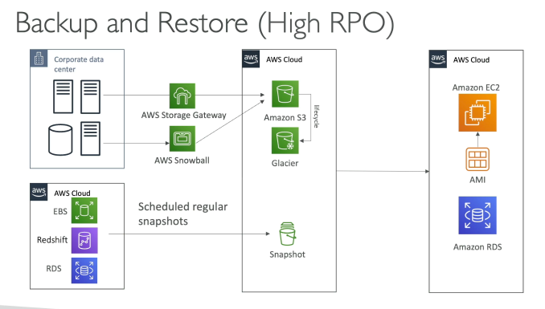
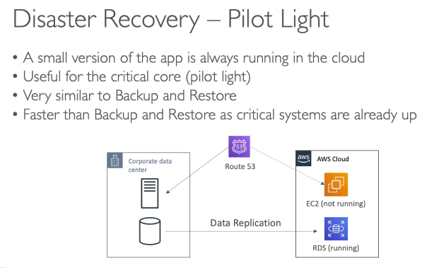
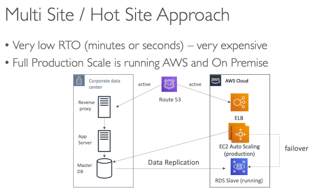
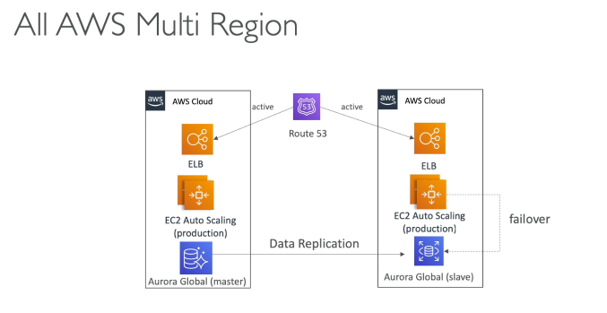
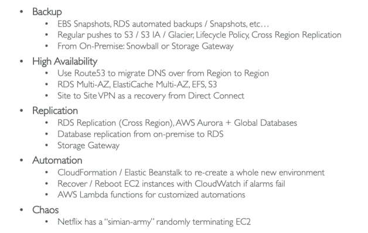
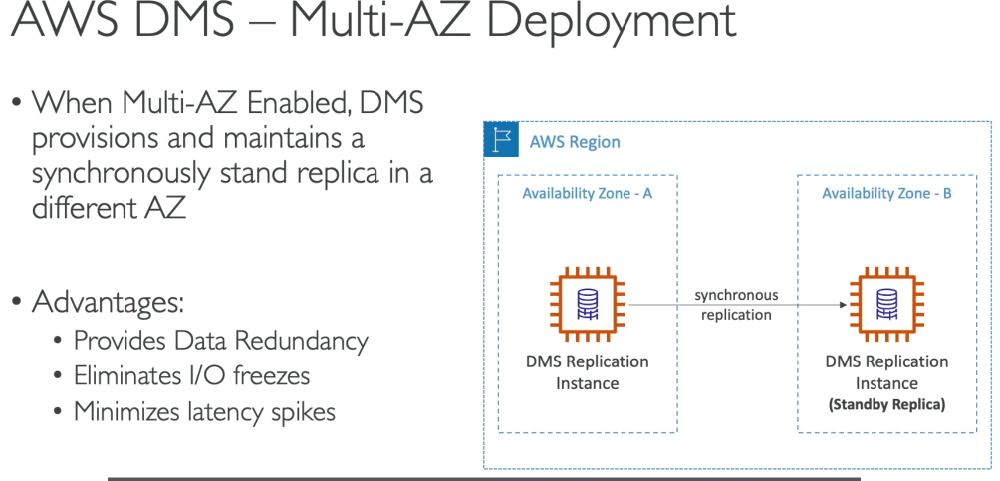
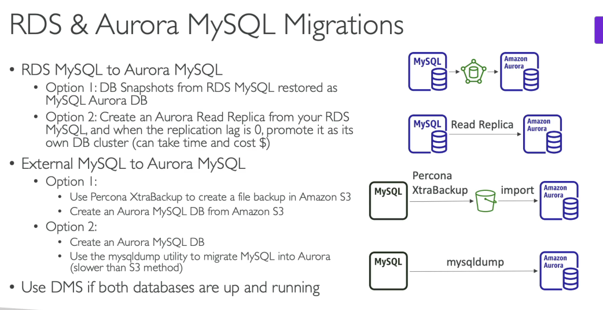
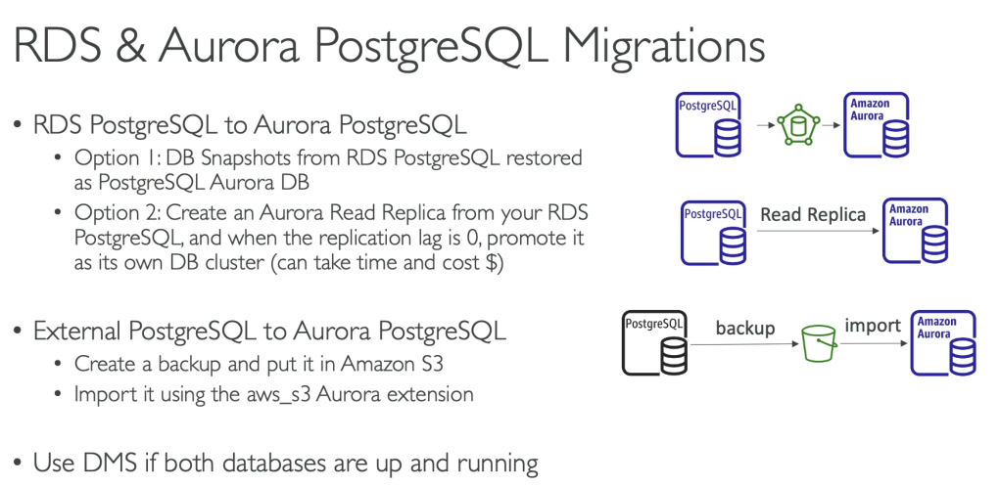

# 355. Disaster Recovery
### **RPO (Recovery Point Objective)**
- **RPO** xác định thời gian tối đa mà dữ liệu có thể mất đi mà không gây ảnh hưởng nghiêm trọng đến hoạt động của doanh nghiệp. Ví dụ, nếu sao lưu dữ liệu mỗi giờ, RPO của bạn sẽ là 1 giờ.
- Trong trường hợp thảm họa xảy ra, **dữ liệu bị mất** là dữ liệu được tạo ra giữa lần sao lưu gần nhất và thảm họa.

### **RTO (Recovery Time Objective)**
- **RTO** là khoảng thời gian tối đa mà một ứng dụng có thể ngừng hoạt động trước khi gây tổn thất nghiêm trọng. Ví dụ, nếu hệ thống phải phục hồi trong vòng 1 giờ, RTO của bạn là 1 giờ.

## Các chiến lược Disaster Recovery trên AWS
- So sánh RTO: B&R > Pilot Light > Warn Standby > Multi Site
### 1. **Backup and Restore**
- **Chiến lược:** Dữ liệu được sao lưu định kỳ và khi có thảm họa, dữ liệu sẽ được phục hồi từ bản sao lưu. Đây là một phương án đơn giản và chi phí thấp.
- **RPO và RTO:** Có **RPO cao** (dữ liệu mất đi có thể là vài ngày hoặc một tuần, tùy thuộc vào tần suất sao lưu), và **RTO cao** (thời gian phục hồi khá lâu).
- Ưu điểm: Chi phí thấp.
- Nhược điểm: Thời gian phục hồi lâu, có thể mất nhiều thời gian để khôi phục lại tất cả dữ liệu.

### 2. **Pilot Light**
- **Chiến lược:** Chạy một phiên bản nhỏ của ứng dụng quan trọng trên AWS, đảm bảo rằng các hệ thống quan trọng luôn sẵn sàng. Trong trường hợp xảy ra thảm họa, các hệ thống còn lại sẽ được khởi động lại.
- **RPO và RTO:** RPO và RTO thấp hơn so với Backup and Restore vì các hệ thống quan trọng đã được khởi động sẵn.

### 3. **Warm Standby**
- **Chiến lược:** Full system running nhưng với minimum size -> có thể slace to production khi disaster
- **RPO và RTO:** RPO và RTO thấp hơn, và chi phí cao hơn so với Backup and Restore.
- **Công cụ sử dụng:** AWS Auto Scaling, Elastic Load Balancer (ELB), Route 53 để thay đổi lưu lượng truy cập giữa các vùng (failover).

### 4. **Hot Site / Multi-Site**

- **Chiến lược:** Chạy hai môi trường hoạt động song song, một trên AWS và một trên cơ sở hạ tầng on-premise. Đây là chiến lược phức tạp và tốn kém nhất.
  - VD: Route 53 active-active cho phép route request to aws/onpremese
- **RPO và RTO:** RTO cực kỳ thấp (phút hoặc giây), đảm bảo phục hồi gần như ngay lập tức.

## Tips
### 1. **EBS Snapshots, RDS Automated Snapshots**
- Sử dụng **EBS snapshots** và **RDS automated snapshots** để sao lưu dữ liệu và phục hồi khi có sự cố.

### 2. **AWS Storage Gateway, Snowball**
- **AWS Storage Gateway** cho phép chuyển dữ liệu từ môi trường on-premise lên cloud. **AWS Snowball** là công cụ để chuyển dữ liệu từ cơ sở hạ tầng vật lý vào cloud, phù hợp cho những trường hợp cần sao lưu dữ liệu lớn hoặc di chuyển dữ liệu trong các khu vực không có kết nối internet ổn định.

### 3. **Route 53**
- **Route 53** là dịch vụ DNS của AWS, giúp bạn dễ dàng chuyển hướng lưu lượng mạng giữa các khu vực (region) khi cần thiết, đặc biệt hữu ích trong các tình huống failover.

### 4. **Multi-AZ, Multi-Region**
- Triển khai hệ thống **Multi-AZ** (Nhiều khu vực sẵn sàng) cho các dịch vụ như RDS, ElastiCache, và S3 giúp hệ thống luôn sẵn sàng trong trường hợp có sự cố xảy ra ở một khu vực.
- **Multi-Region** đảm bảo rằng ứng dụng và dữ liệu của bạn có thể hoạt động liên tục trong các khu vực khác nhau.

### 5. **CloudFormation, Elastic Beanstalk, AWS Lambda**
- **CloudFormation** và **Elastic Beanstalk** giúp bạn tái tạo nhanh chóng một môi trường AWS mới trong trường hợp có thảm họa.
- **AWS Lambda** giúp bạn tự động hóa quá trình phục hồi và quản lý các công việc như reboot EC2 instances hoặc khởi động lại dịch vụ.

## Các mẹo Disaster Recovery thực tế
### 1. **Sao lưu và lưu trữ dữ liệu**
- Sử dụng **EBS snapshots**, **RDS automated snapshots** và chuyển các bản sao lưu vào **S3, S3IA, Glacier**.
- Áp dụng **lifecycle policies** để tự động chuyển dữ liệu vào các dịch vụ lưu trữ tiết kiệm chi phí như Glacier.

### 2. **Tăng cường khả năng sẵn sàng**
- Sử dụng **Route 53** để chuyển đổi DNS từ một khu vực này sang khu vực khác khi xảy ra thảm họa.
- Triển khai **Multi-AZ** cho các dịch vụ như RDS, ElastiCache, S3 để đảm bảo khả năng hoạt động liên tục.

### 3. **Đảm bảo tính sẵn sàng mạng**
- Nếu bạn sử dụng **Direct Connect** để kết nối từ trung tâm dữ liệu tới AWS, có thể triển khai **Site-to-Site VPN** như một phương án dự phòng khi kết nối chính bị gián đoạn.

### 4. **Kiểm tra tính khả dụng với Chaos Testing**
- Để đảm bảo rằng hạ tầng của bạn có thể chịu đựng các thảm họa, hãy thử nghiệm với **Chaos Testing**.
- Ví dụ, **Netflix** sử dụng **Simian Army** để ngẫu nhiên tắt các EC2 instances trong môi trường sản xuất nhằm kiểm tra khả năng chịu lỗi của hệ thống.

# 356. DMS 
- Sử dụng thêm AWS SCT (Schema Conversion Tool)Nếu source database và target database sử dụng khác engine
  - Ví dụ:
    - OLTP: Di chuyển từ SQL Server hoặc Oracle sang MySQL, PostgreSQL hoặc Aurora.
    - OLAP: Chuyển từ các hệ thống phân tích như Teradata hoặc Oracle sang Amazon Redshift.
  - Không cần SCT khi di chuyển giữa các cơ sở dữ liệu cùng loại, như di chuyển từ PostgreSQL (on-premise) sang PostgreSQL (RDS).

# 358. RDS & Aurora Migrations

