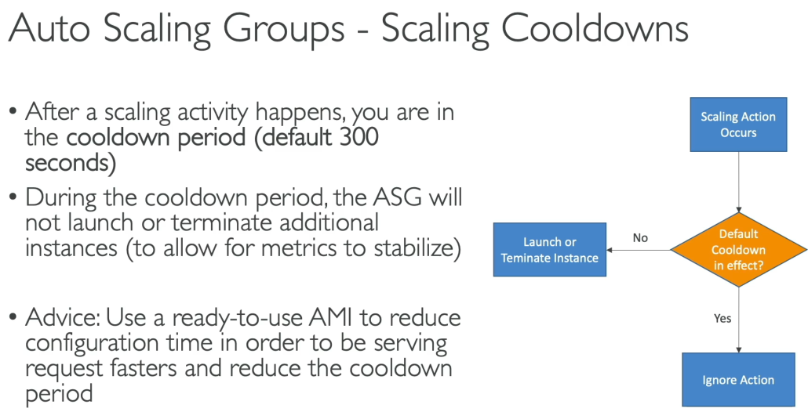

# 74. ALB
- **ALB** là một loại load balancer ở **layer 7**, hoạt động chủ yếu với giao thức **HTTP**.
- ALB giúp định tuyến **các ứng dụng HTTP** trên nhiều EC2 instances, và **các máy chủ có thể nằm ở nhiều Availability Zones khác nhau**.
- ALB có thể xử lý nhiều ứng dụng trên cùng một EC2 instance, đặc biệt hữu ích cho các ứng dụng **microservices** và **containers**.

- **Hỗ trợ HTTP/2 và WebSockets**.
- **Redirect tự động** từ HTTP sang HTTPS.
- **Routing** dựa trên:
    - **Path của URL**: Ví dụ: `/users` và `/posts` có thể đi đến các target group khác nhau.
    - **Hostname**: Dựa vào tên miền (ví dụ: `one.example.com` và `other.example.com`).
    - **Query string và headers**: Ví dụ: `?Platform=Mobile` sẽ chuyển hướng tới target group khác so với `?Platform=Desktop`.

- use case:
  - ALB phù hợp cho các ứng dụng **microservices** và **container-based applications** (ví dụ như Docker và ECS).
  - ALB có thể hoạt động trước các **EC2 instances**, **ECS tasks**, **Lambda functions** và **Private IP addresses** (các máy chủ trong hệ thống của bạn).

- ALB cũng có **fixed hostname** giống như classic load balancer.
- **IP thực tế của client** sẽ được chèn vào trong header **X-Forwarded-For**, giúp EC2 instances nhận được địa chỉ IP của client thực sự.
---

# NLB 
### Network Load Balancer (NLB)

Network Load Balancer là một **load balancer lớp 4**, nghĩa là nó xử lý **TCP** và **UDP** traffic.

- **Layer 4**: So với Application Load Balancer (Lớp 7 - HTTP), NLB hoạt động ở mức thấp hơn và xử lý các giao thức TCP và UDP.
- **Hiệu suất cao**: NLB có thể xử lý hàng triệu yêu cầu mỗi giây với độ trễ cực thấp.

### Tính năng
- NLB chỉ có một static IP mỗi vùng khả dụng (AZ). Bạn có thể gán **Elastic IP** cho mỗi AZ (helpful for whitelist specific IP)
- Nếu bài thi yêu cầu ứng dụng chỉ có thể được truy cập qua một vài địa chỉ IP, bạn sẽ cần sử dụng Network Load Balancer.

### Sử dụng Network Load Balancer
NLB hoạt động tương tự như Application Load Balancer (ALB). Bạn sẽ tạo các **target groups**, và NLB sẽ điều hướng lưu lượng tới các nhóm này.

- **Target groups** có thể là **EC2 instances**, **IP addresses** (chỉ có thể là private IP), hoặc các **Elastic IP**.
- Bạn cũng có thể sử dụng NLB phía trước một ALB, kết hợp lợi thế của IP tĩnh từ NLB và các quy tắc routing HTTP của ALB.

### Health Checks
NLB hỗ trợ ba loại giao thức cho health check:
- **TCP**
- **HTTP**
- **HTTPS**
---

# GLB
Gateway Load Balancer là một loại load balancer mới được thiết kế để **triển khai, mở rộng và quản lý** các ứng dụng mạng của bên thứ ba trong AWS.

- **Mục đích sử dụng**: GLB chủ yếu được sử dụng khi bạn muốn **giám sát và xử lý lưu lượng mạng** trước khi nó đến với ứng dụng của bạn. Điều này rất hữu ích khi bạn cần các **tường lửa** (firewall), **hệ thống phát hiện và ngăn chặn xâm nhập** (IDP), hoặc **kiểm tra gói dữ liệu** (deep packet inspection).

### Cách thức hoạt động của Gateway Load Balancer

1. **Lưu lượng đi qua GLB**: Khi người dùng truy cập vào ứng dụng của bạn, thay vì đi trực tiếp vào ứng dụng, tất cả lưu lượng sẽ đi qua **Gateway Load Balancer** trước tiên.

2. **Chuyển hướng lưu lượng đến các thiết bị ảo**: GLB phân phối lưu lượng đến một **target group** chứa các thiết bị ảo của bạn (ví dụ: EC2 instances). Các thiết bị này có thể là firewall, IDP, hoặc các thiết bị bảo mật khác.

3. **Kiểm tra và phân phối lưu lượng**: Các thiết bị ảo sẽ kiểm tra lưu lượng. Nếu lưu lượng không bị từ chối (như trong trường hợp firewall), nó sẽ được gửi trở lại GLB và sau đó được chuyển tiếp đến ứng dụng của bạn.

### Mô hình hoạt động

- **Lớp 3 (Network Layer)**: Gateway Load Balancer hoạt động ở **lớp 3**, tức là lớp mạng (IP packets).
- **Tính năng của GLB**:
    - Là một **cổng mạng** minh bạch, lưu lượng trong VPC của bạn sẽ đi qua một điểm vào và ra duy nhất, đó chính là GLB.
    - Là một **load balancer** phân phối lưu lượng đến các thiết bị ảo trong **target group**.

### Các Target Groups

- **EC2 Instances**: Các thiết bị ảo có thể là EC2 instances mà bạn đăng ký theo **instance ID**.
- **Private IPs**: Bạn cũng có thể đăng ký các **IP riêng** nếu các thiết bị ảo của bạn đang chạy trong mạng riêng hoặc trung tâm dữ liệu của bạn.

### GENEVE Protocol

- Một điểm đặc biệt cần lưu ý là Gateway Load Balancer sử dụng giao thức **GENEVE** trên cổng **6081**. Nếu bạn thấy GENEVE hoặc cổng này trong câu hỏi của bài thi, đó là dấu hiệu rõ ràng để sử dụng **Gateway Load Balancer**.

### Tóm tắt

Gateway Load Balancer rất hữu ích cho việc kiểm tra và xử lý lưu lượng mạng của bạn bằng các thiết bị ảo trước khi nó đến với các ứng dụng trong AWS. Tuy nhiên, thực hiện thực hành trên GLB sẽ phức tạp hơn, vì vậy nó sẽ không được đi sâu trong phần thực hành này.

---

# 80. Sticky Sessions
- Work for: Classic/Application/Network LB. 
- Type:
  - Application-base cookies:
    - Các custom cookie không được trùng với: AWSALB, AWSALBAPPOR hoặc AWSALBTG
  - Duration-based cookies:
    - Được tạo bởi LB
    - Name: AWSALB for ALB, AWSELB for CLB 

# 81. Cross zone 
### ALB 
- Enabled by default
- No charges 

### NLB & GLB
- Disabled by default
- charges

# 82. SSL/TLS 
- SNI: Server name indication 
  - Work with ALB & NLB 
  - allows you to expose multiple HTTPS applications each with its own SSL certificate on the same listener
  - allows you to load multiple SSL certificates on one listener
# 84. Connection Draining 
- Tên gọi with LB:
  - Classic Load Balancer: gọi là **Connection Draining**.
  - Application Load Balancer hoặc Network Load Balancer: gọi là **Deregistration Delay**.

- Giúp các EC2 instances có thời gian hoàn thành các inflight requests khi bị deregistered hoặc đánh dấu là unhealthy.
  - Khi một instance vào trạng thái draining, Elastic Load Balancer (ELB) sẽ ngừng gửi yêu cầu đến EC2 instance đó.
  - Người dùng đang kết nối với EC2 instance trong trạng thái draining sẽ có đủ thời gian để hoàn thành yêu cầu hiện tại.
  - Các kết nối mới sẽ được chuyển đến các EC2 instances khác thay vì instance đang draining.

- Thời gian draining có thể được cấu hình từ 1 đến 3,600 giây.
- Mặc định là 300 giây.
- Có thể tắt tính năng draining nếu thiết lập giá trị là 0 giây.
  - Yêu cầu ngắn: Nếu yêu cầu rất ngắn (dưới 1 giây), có thể thiết lập Connection Draining ở mức thấp (ví dụ: 30 giây) để EC2 instance tắt nhanh.
  - Yêu cầu dài: Nếu yêu cầu kéo dài (ví dụ: tải lên hoặc yêu cầu lâu dài), cần thiết lập thời gian draining lâu hơn, nhưng EC2 instance sẽ không bị tắt ngay lập tức.

# 87. ASG Policies 
### Scaling Cooldowns 

