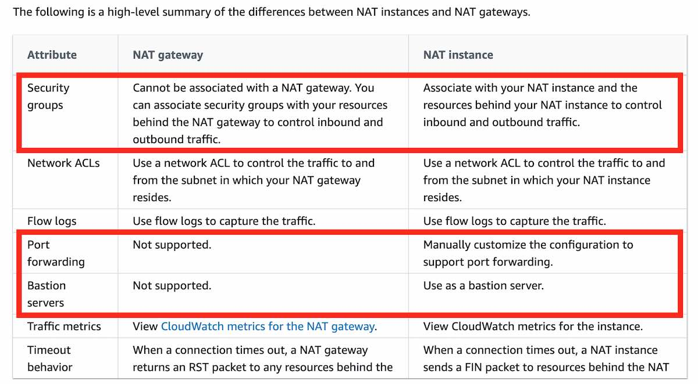

# Cost
## Cost Explorer
- chi tiết về chi tiêu và mức sử dụng của bạn theo định dạng đồ họa, có thể lọc và nhóm theo các tham số như region, instance type, tag
- không đưa ra rcm
## Compute Optimizer
- Tính toán và rcm tối ưu cho những service cụ thể aws như: EC2, EBS, lambda,...

## Cost and Usage Report
- báo cáo rất chi tiết về chi tiêu và mức sử dụng nhưng không đưa ra rcm

# VPC
- **cannot** specify URLs in security group rules
- VPC Flow Logs: capture thông tin IP traffic
- Security groups are stateful. All inbound traffic is blocked by default in custom security groups.
-  security group: không có deny rule; NACL: có thể deny -> setup with IP,..

#API Gateway
- resource policy of AG cho phép restrict access to APIs với các specifying conditions như IP. Permit traffigc only from 

# Firewall
- AWS Network Firewall:
  - allows you to protect and control traffic in your VPC from layer 3 to layer 7?

## WAF:
- Web Application Firewall, Web API Protection -> not for VPC
  - chống lại các cuộc tấn công SQL injection và cross-site scripting
    - combination with AWS Firewall Manager this solution protects both Regions and requires the least administrative effort

  
  - TH1: client -> ALB -> EC2
    - EC2 Sg cần allow ALB
    - All request -> ALB => NACL deny ko còn work được => sử dụng WAF với các filtering IP để deny các IP theo rule
  - TH2: client -> cloudfront -> ALB -> EC2
    - All request -> cloudfront => ALB sg cần allow cloudfront
    - Tại cloudfront có thể có 2 mong muốn:
      - Restrict request từ các quốc gia => sử dụng cloudfront geo restriction
      - restrict các IP cụ thể => lại sd WAF 
  

- AWS Shield protects web services from DDoS attacks at layer 3 and 4 of the OSI reference model

# Global Accelerator
- By default, Global Accelerator provides you with two static IP addresses that you associate with your accelerator (Cloudfront thì ko, ip động)

# CloudFront
- Cho phép Create a custom error page for specific HTTP status codes 4xx 5xx
- CloudFront signed cookies are a method to control who can access your content.

# LB  
- Chỉ có NLB cung cấp cả static DNS name và static IP
- ALB cung cấp 1 static DNS name. Reason: AWS muốn ELB có thể được access như một static endpoint ngay cả khi infra của AWS thay đổi 
- cookie names are reserved by the ELB (AWSALB, AWSALBAPP, AWSALBTG).
## ALB  
- sử dụng WAF gắn vào ALB để deny IP sử dụng các filtering -> tốn kém hơn 
## NLB  
- Hoạt động ở layer 4 có thể xử lý hàng triệu req/s 
- 
# ECS
- Amazon ECS uses manual or the AWS Application Auto Scaling service to scales tasks. This is configured through Amazon ECS using Amazon ECS Service Auto Scaling.  
Có 3 chỉ số: avg CPU Utilization | avg Ram | ALB request count per target (metric tới từ ALB)
  - **Target Tracking** Scaling policy increases or decreases the number of tasks that your service runs based on a target value for a specific metric.
    - For example, the tasks will be scaled when the average CPU breaches 80% (**as reported/breached by CloudWatch**)
    - Step Scaling: Bạn có thể cấu hình một số mức scale khác nhau với các ngưỡng rõ ràng (ví dụ: nếu CPU usage vượt quá 70%, scale thêm 2 task).
    - Simple Scaling: Dựa vào ngưỡng đơn giản để tăng hoặc giảm số lượng task, không có các bước hoặc điều kiện phức tạp.
- ECS task role: mỗi task cần có 1 specific role được defind trong task defination để truy cập tới các aws service ...
  - task execution tole: cho ecs agent quant lý và thức thi các ecs task như pull image, qly log vào cloudwatch
- mount EFS onto ECS task to share data multi AZ
  - S3 không thể mount như 1 file system vào ECS

# S3
- Object-base storage 
- Cannot transition to REDUCED_REDUNDANCY from any storage class.

# RDS
- Use case: RDBMS/OLTP, perform SQL queries, transactions
- magnetic storage: outdated
- Change the class of the instance of your database to allow more connections => some downtime
- Amazon RDS MySQL databases: 
  - authentication is handled by AWSAuthenticationPlugin—an AWS-provided plugin that works seamlessly with IAM to authenticate your IAM users
  - AWS Security Token Service: không thể configure trực tiếp sử dụng cho rds 
### security 
- Data at rest: use  KMS
- Data in transit: SSL
  - RDS tạo 1 SSL cert and install cert trên DB instance 
  - Đối với MySQL, bạn khởi chạy máy khách mysql bằng tham số --ssl_ca để tham chiếu khóa công khai nhằm mã hóa các kết nối. 
  - Đối với SQL Server, tải xuống khóa công khai và nhập chứng chỉ vào hệ điều hành Windows của bạn. 
  - RDS dành cho Oracle sử dụng mã hóa mạng gốc Oracle với phiên bản CSDL. Bạn chỉ cần thêm tùy chọn mã hóa mạng gốc vào một nhóm tùy chọn và liên kết nhóm tùy chọn đó với phiên bản CSD

# Aurora 

# Storage 

# Route53

# Queue

# EFS 
- Amazon Elastic File System (Amazon EFS) provides a simple, scalable, fully managed elastic **NFS** file system for use with AWS Cloud services and on-premises resources.
- EFS is not a block device, it is a filesystem that is accessed **using the NFS protocol.**
- **No support for Windows**
- used with AWS Backup for automated and centralized backup **across AWS services**, and supports replication to **another region**
# NAT
  

# DataSync 
- AWS DataSync can be used to automate and accelerate the replication of data to AWS storage services
- 

# Kinesis 
- Amazon Kinesis is a fully managed, scalable service that can ingest, buffer, and process streaming data in real-time.

# AWS Gateway 
- A Gateway Endpoint is a gateway that you specify as a target for a route in your route table for traffic destined to a supported AWS service. This cannot help in throttling or buffering of requests

# IAM 

# FSx
- Amazon FSx for Lustre provides a high-performance file system optimized for fast processing of workloads such as machine learning, high-performance computing (HPC), video processing, financial modeling, and electronic design automation (EDA).
- FSx hoạt động trực tiếp với S3: S3 object được biểu diễn giống 1 file trong file system và có thể write back to S3 
- FSx for window easy to use with linux by installation a A package 
- FSx for window: integration with user quotas, end-user file restore, and Microsoft Active Directory (AD) integration
  - SMB: Server Message Block (SMB) protocol.
  - doesn't support cross-Region data replication
- FSx for Lustre is not suitable for migrating a Microsoft Windows File Server implementation.
# EMR (Amazon Elastic MapReduce)
- Amazon EMR is a cloud **big data platform** for running large-scale distributed data processing jobs, interactive SQL queries, and machine learning applications
- Easily run and scale Apache Spark, Hive, Presto, and other big data workloads
- Not real-time streaming

# SQS
- maximum message size of 256 KB so the message body

# Redshift
- Redshift is designed for batch analytics, not real-time streaming analytics (cannot provide millisecond responsiveness.)
- RedShift Spectrum is not serverless as it requires a RedShift cluster which is based on EC2 instances.
- RedShift Spectrum query data có cấu trúc + không ctruc từ S3 file mà ko cần load vào 

# AWS Batch 
- AWS Batch is designed to run jobs across multiple instances
- For HPC chạy trên nhiều node (EC2??)...

# Private Link
- Nên đc tạo ở consumer VPC, not provider VPC (example: VPC access ECS => VPC is consumer)

# EKS
- Kubernetes network policies are used to control traffic flow between pods, not to configure subnet usage for pods.
  - Amazon VPC CNI plugin allows EKS pods to receive IP addresses from the specified custom subnets within the VPC

# SWF
- simple workflow service: using case decouple 

# Rekognition 
- Detect image 
# Amazon Detective 
- 

# KMS
- Can multi region -> Primary + replica
  - use case: global client side, dynamo global, aurora global 
  - 

# STS 
- Security token service: cho phép tạo và cung cấp trusted user với temporary sec credential
- Configure the MySQL databases to use the AWS Security Token Service (STS)" is incorrect. You cannot configure MySQL to directly use the AWS STS.

# Storage Gateway
- Tape Gateway: use for backup and archival purpose 
- Volume Gateway: block storage -> block level access, frequently accessed data
- S3 Gateway: file-based workloads
- AWS Storage Gateway is not designed for high-availability block storage in AWS-native workloads

# Lake Formation
With AWS Lake Formation, you can import data from MySQL, PostgreSQL, SQL Server, MariaDB, and Oracle databases running in Amazon Relational Database Service (RDS) or hosted in Amazon Elastic Compute Cloud (EC2). Both bulk and incremental data loading are supported.

# AWS Batch
- Phù hợp với batch workload như edit video

# Amazon Security Lake
- automatically collect, normalize, and store security data in Amazon S3 for analysis.
- collection and centralization of security data across **multiple AWS accounts and Regions**

# AWS Compute Optimizer
-  AWS Compute Optimizer can suggest a more appropriate EC2 instance type with adequate resources

# Glue
-  extract, transform, load (ETL) service that **automates the time-consuming** steps of data preparation for analytics.
-  AWS Glue is a managed data transformation service.
# Macie
-  Amazon Macie is used with Amazon S3 to detect sensitive PII data, which has nothing to do with tracking configuration changes.

# RAM
AWS RAM does not apply to Reserved Instances. It is used to share other resources like Subnets, Transit Gateways, etc.

# Snow
- Snowcone device as it is not optimized for compute operations.
- 

# SMS - AWS Server Migration Service
- SMS service is used for migrating virtual machines, not data

# AWS Systems Manager
- AWS Systems Manager Run command: được thiết kế để chạy lệnh trên một nhóm lớn các phiên bản mà không cần phải SSH vào tất cả các phiên bản của bạn và chạy cùng một lệnh nhiều lần
- AWS Systems Manager Patch Manager: được thiết kế để áp dụng các bản vá cho các phiên bản EC2 
- AWS Systems Manager Maintenance Windows được thiết kế để chọn một khoảng thời gian xác định mà các phiên bản EC2 của bạn sẽ được vá

# EFA 
- Amazon Elastic Fabric Adapter: optimize network performance for HPC (high-performance computing)
- Elastic Fabric Adapter is an AWS Elastic Network Adapter (ENA) with added capabilities

# CloudFormation - IAC on AWS
- Regional service: định nghĩa và tự động tạo cơ sở hạ tầng AWS dưới dạng code 
- saving strategy: auto create delete schedule; Repeat kiến trúc với nhiều env trên nhiều region, nhiều account

# Pinpoint 
- khả năng scale 2 chiều cho các dịch vụ marketing toàn diện hỗ trợ nhiều kênh: email, sms,push noti, voice, in-app messaging 
- 

# HPC 
#### 1. **Data Management và Transfer**:
- **Direct Connect**: Di chuyển dữ liệu gigabytes mỗi giây vào đám mây qua mạng riêng và bảo mật.
- **Snowballs và Snowmobile**: Di chuyển dữ liệu PetaBytes vào đám mây qua các phương thức vật lý, thường dùng cho các lần chuyển dữ liệu lớn.
- **Data Sync**: Cài đặt các agent để di chuyển dữ liệu lớn giữa hệ thống tại chỗ và các dịch vụ như S3, EFS, hoặc FSX cho Windows.

#### 2. **Compute và Networking**:
- **EC2 Instances**: Sử dụng các instance EC2 tối ưu CPU hoặc GPU tùy thuộc vào loại tính toán cần thực hiện.
- **Spot Instances và Spot Fleets**: Giúp tiết kiệm chi phí đáng kể.
- **Auto Scaling**: Tự động mở rộng số lượng instances dựa trên nhu cầu tính toán.
- **EC2 Placement Group (Cluster type)**: Cung cấp hiệu suất mạng tốt nhất khi EC2 instances cần giao tiếp với nhau trong môi trường phân tán, với mạng độ trễ thấp, 10 Gb/s.

#### 3. **Cải thiện hiệu suất EC2 Instances**:
- **EC2 Enhanced Networking (ENA)**: Cung cấp băng thông cao, gói tin mỗi giây (PPS) cao và độ trễ thấp.
- **Elastic Network Adapter (ENA)**: Đạt tốc độ mạng lên đến 100 Gb/s.
- **Intel 82599 VF**:(LEGACY) Phiên bản cũ của ENA, hỗ trợ tốc độ lên đến 10 Gb/s.
- **Elastic Fabric Adapter (EFA)**: improve ENA, Được thiết kế cho HPC, tối ưu cho Linux và giúp cải thiện hiệu suất mạng cho các workload liên kết chặt chẽ, sử dụng MPI (Message Passing Interface) để giảm độ trễ và tăng độ tin cậy.

#### 4. **Storage**:
- **Instance-attached Storage**: Dùng EBS (Elastic Block Store) có thể đạt đến 256,000 IOPS với io2 Block Express hoặc sử dụng Instant Store với hàng triệu IOPS, gắn liền với instance EC2.
- **Network Storage**:
  - **Amazon S3**: Lưu trữ dữ liệu lớn (objects).
  - **EFS**: Hệ thống tệp phân tán với khả năng mở rộng IOPS dựa trên kích thước tệp hệ thống, work with Farget.
  - **FSX for Lustre**: Hệ thống tệp tối ưu cho HPC, hỗ trợ hàng triệu IOPS và được hỗ trợ bởi S3.
- Fargate: 
  - work with EFS
  - not work with EBS, FSx for lustre??

#### 5. **Automation và Orchestration**:
- **AWS Batch**: Dịch vụ giúp thực hiện các job song song trên nhiều EC2 instances, dễ dàng lập lịch và quản lý.
- **AWS ParallelCluster**: Công cụ quản lý cluster mã nguồn mở để triển khai HPC trên AWS, giúp tự động hóa việc tạo VPC, subnet, loại cluster và instance.
  - enable EFA on the cluster cải thiện network performance 

# WS Well-Architected Tool
- là một công cụ giúp bạn kiểm tra, đánh giá và cải thiện kiến trúc của các ứng dụng và hệ thống đang chạy trên AWS
- AWS Trusted Advisor là một dịch vụ của Amazon Web Services (AWS) cung cấp các khuyến nghị và thực hành tốt nhất (best practices) để giúp tối ưu hóa các tài nguyên AWS, cải thiện hiệu suất, bảo mật, độ tin cậy và giảm chi phí cho hệ thống AWS của bạn.

I would recommend option C: Use AWS Network Firewall to create the required rules for traffic inspection and traffic filtering for the production VPC.

AWS Network Firewall is a managed firewall service that provides filtering for both inbound and outbound network traffic. It allows you to create rules for traffic inspection and filtering, which can help protect your production VPC.

Option A: Amazon GuardDuty is a threat detection service, not a traffic inspection or filtering service.

Option B: Traffic Mirroring is a feature that allows you to replicate and send a copy of network traffic from a VPC to another VPC or on-premises location. It is not a service that performs traffic inspection or filtering.

Option D: AWS Firewall Manager is a security management service that helps you to centrally configure and manage firewalls across your accounts. It is not a service that performs traffic inspection or filtering.

# QuickSight
- Amazon QuickSight only support users(standard version) and groups (enterprise version). users and groups only exists without QuickSight. QuickSight don't support IAM. We use users and groups to view the QuickSight dashboard

# MQ
- NMS, AMQP, STOMP, MQTT, and WebSocket

# Data exchange 
- AWS Data Exchange để truy cập dữ liệu đo từ xa của bên thứ ba

# CloudWatch 
- A CloudWatch Events rule can be used to set up automatic email notifications for Medium to High Severity findings to the email address of your choice. You simply create an Amazon SNS topic and then associate it with an Amazon CloudWatch events rule.

# Inspector: 
Inspector is more about identifying vulnerabilities and evaluating against security best practices. It does not detect compromise
# 
