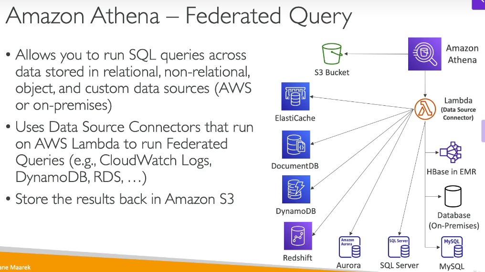
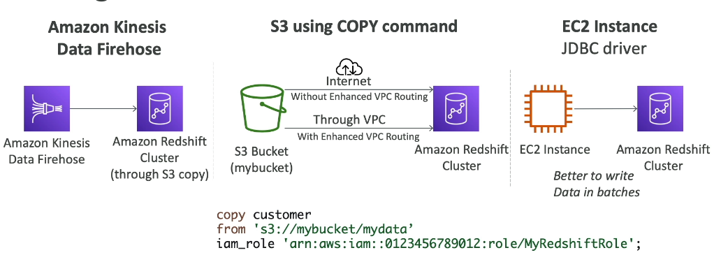
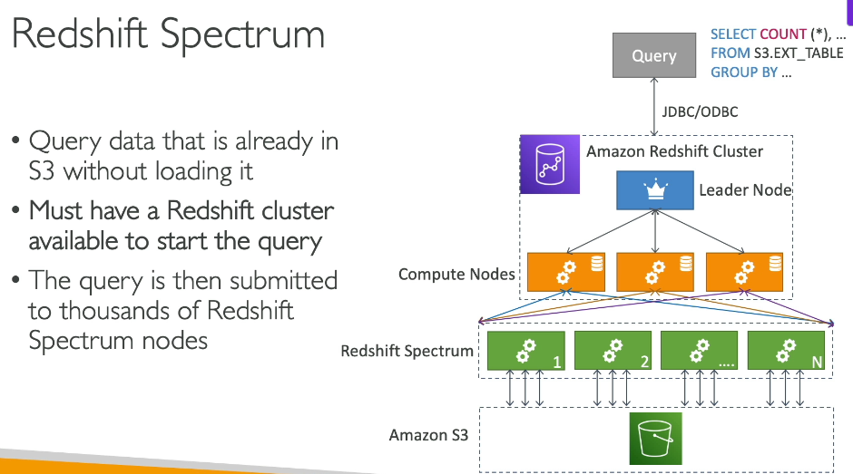
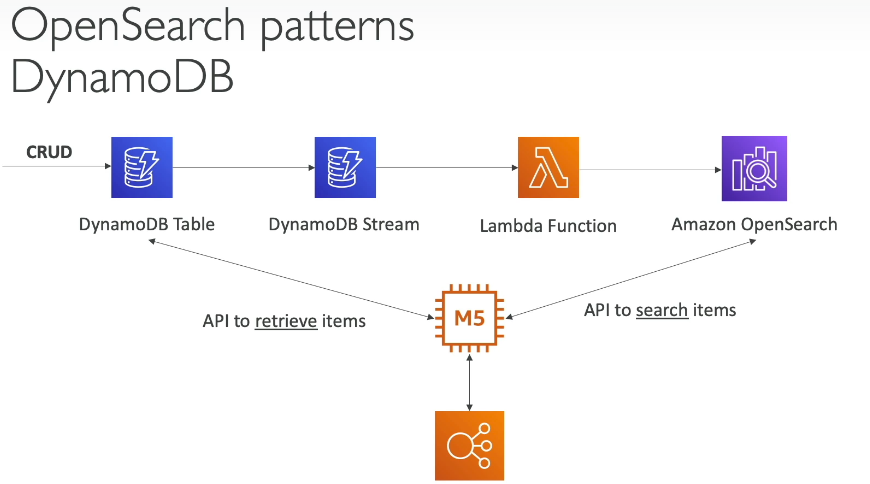
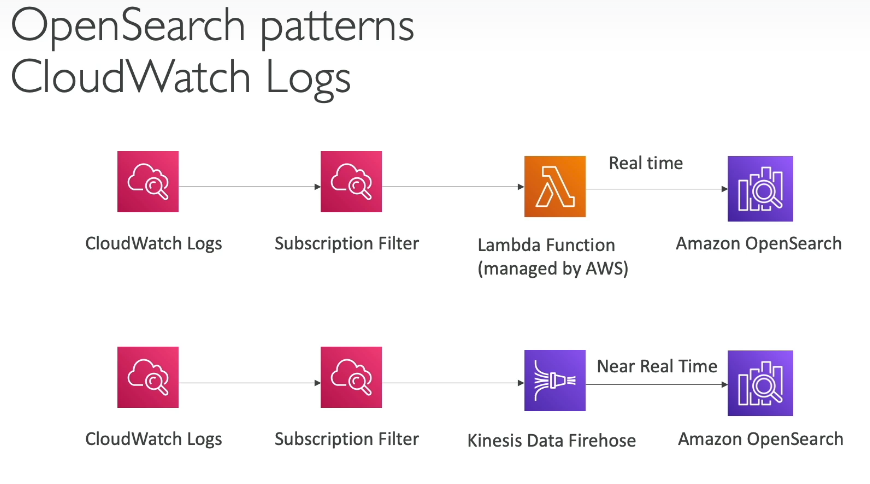
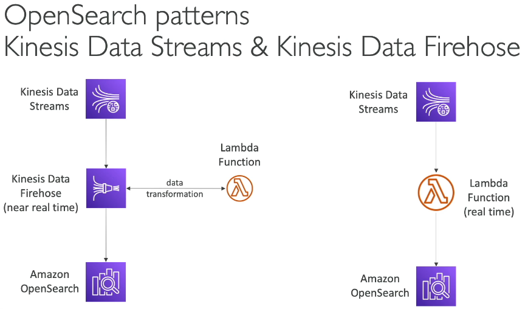
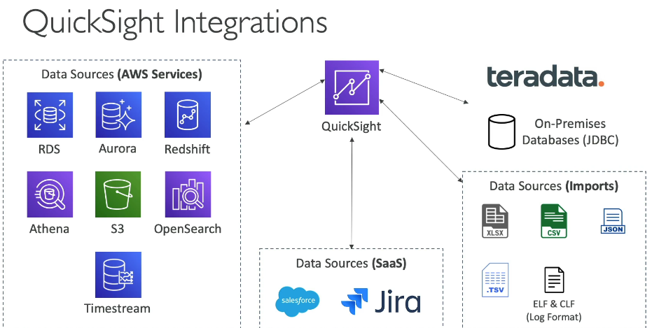

# 246. Amazon Athena
Amazon Athena là một dịch vụ query không máy chủ giúp bạn phân tích dữ liệu được lưu trữ trong **S3**. Với Athena, bạn có thể sử dụng ngôn ngữ **SQL** tiêu chuẩn để truy vấn các file trong **S3** mà không cần di chuyển dữ liệu.

### Tính Năng và Cách Hoạt Động

- **Serverless**: Athena không yêu cầu bạn phải cung cấp máy chủ hay cơ sở hạ tầng, mọi thứ đều được quản lý tự động.
- **Data formats supported**: CSV, JSON, ORC, Avro, và Parquet.
- **Pricing**: Bạn chỉ cần trả tiền theo số lượng dữ liệu quét được tính trên mỗi terabyte. Athena tính phí dựa trên lượng dữ liệu bạn quét, không phải số lượng query hay cơ sở hạ tầng.
- **Works with Amazon QuickSight**: Athena thường được sử dụng cùng với Amazon **QuickSight** để tạo báo cáo và dashboards.

### Các Use Cases

- **Ad hoc queries**: Phân tích dữ liệu tạm thời mà không cần phải tạo ra các hệ thống database phức tạp.
- **Data analysis**: Business intelligence, reporting và phân tích logs từ các AWS services như **VPC flow logs**, **CloudTrail**, v.v.

### Cải Thiện Performance cho Athera 

1. **Data formats**: 
- sử dụng các data formats kiểu cột như **Apache Parquet** và **ORC**. 
- Các định dạng này chỉ quét những columns cần thiết, giúp tiết kiệm cost và time.
- Sử dụng Glue để convert data sang các định dạng trên 

2. **Data compression**: 
- Compress data giúp giảm kích thước của dữ liệu khi truy xuất, làm cho việc quét dữ liệu nhanh hơn.

3. **Partitioning data**: 
- Bạn có thể partition dữ liệu trong **S3** theo các columns để khi query, Athena chỉ cần quét dữ liệu trong các folder cụ thể thay vì toàn bộ dữ liệu. Ví dụ, partition theo **year**, **month**, và **day** sẽ giúp query nhanh chóng hơn.

4. **Large files**: 
- Sử dụng các large files (từ 128MB trở lên) để tối ưu performance. Các small files làm tăng chi phí và làm chậm quá trình quét dữ liệu.

### Federated Query

Athena không chỉ có thể query dữ liệu trong **S3**, mà còn có thể query dữ liệu từ nhiều nguồn khác nhau, bao gồm relational và non-relational databases, objects, hoặc các custom data sources, cả trên **AWS** và **on-premises**.

- **Data Source Connector**: Để thực hiện Federated Query, bạn sử dụng một Lambda function gọi là **Data Source Connector**. Lambda function này sẽ kết nối Athena với các services khác như **DynamoDB**, **RDS**, **CloudWatch Logs**, hoặc cơ sở dữ liệu **on-premises**.

- **Process**: Athena sẽ chạy query qua các data sources như **ElastiCache**, **DynamoDB**, **RDS**, **Redshift**, **Aurora**, và nhiều services khác, bao gồm cả **S3**. Query results có thể được lưu lại trong **S3** để phân tích sau này.

---

# 248. Amazon Redshift 

Amazon Redshift là một dịch vụ kho dữ liệu do Amazon Web Services (AWS) cung cấp, được xây dựng trên nền tảng **PostgreSQL**. Tuy nhiên, Redshift không phải là một hệ thống **online transaction processing** (OLTP) mà được thiết kế để xử lý **online analytical processing** (OLAP), chủ yếu phục vụ cho **analytics** và **data warehousing**.

Redshift đặc biệt mạnh mẽ trong việc xử lý khối lượng dữ liệu lớn và thực hiện các phép toán phân tích phức tạp, nhờ vào khả năng mở rộng mạnh mẽ và hiệu suất cao. Điều này làm cho Redshift trở thành lựa chọn tuyệt vời cho các ứng dụng cần xử lý và phân tích dữ liệu quy mô lớn như dữ liệu báo cáo, phân tích thị trường, và kho dữ liệu doanh nghiệp.

### Kiến Trúc

Redshift sử dụng kiến trúc **massively parallel processing** (MPP), nghĩa là các truy vấn được phân chia và xử lý song song trên nhiều nút (node). Kiến trúc của một **Redshift cluster** bao gồm hai loại nút chính:
- **Leader node**: Chịu trách nhiệm nhận truy vấn từ người dùng, lên kế hoạch và phân phối công việc tới các **compute nodes**.
- **Compute nodes**: Thực hiện các truy vấn, tính toán và lưu trữ dữ liệu.

Khi bạn gửi một truy vấn, **leader node** sẽ lập kế hoạch truy vấn và phân phối công việc tới các **compute nodes**. Sau khi các nút tính toán xong, kết quả sẽ được gửi về **leader node** để trả về cho người dùng.

### Các Chế Độ Của Redshift Cluster

1. **Provisioned cluster**: Trong chế độ này, người dùng phải chỉ định trước số lượng và loại **instances** mà họ muốn sử dụng. Điều này mang lại sự kiểm soát lớn hơn về cấu hình, nhưng cũng yêu cầu bạn phải quản lý tài nguyên và chi phí.

2. **Serverless cluster**: AWS sẽ tự động quản lý tài nguyên máy chủ và người dùng không cần phải lo lắng về việc cung cấp hoặc quản lý **instances**. Bạn chỉ cần trả tiền cho tài nguyên sử dụng thực tế mà không cần phải dự báo trước.

### Snapshots và Disaster Recovery

Redshift cung cấp khả năng sao lưu dữ liệu qua **snapshots**. Có hai loại chế độ **availability zone** (AZ) trong Redshift:
- **Single AZ**: Dữ liệu chỉ được sao lưu trong một khu vực AZ duy nhất. Trong trường hợp này, bạn có thể tạo **snapshots** để sao lưu và phục hồi dữ liệu.
- **Multi AZ**: Các Redshift clusters có thể được triển khai trong nhiều khu vực AZ, mang lại khả năng chịu lỗi và khả năng phục hồi cao hơn mà không cần sử dụng **snapshots**.

**Snapshots** là bản sao của **Redshift cluster** vào một thời điểm cụ thể. Các bản sao này chỉ lưu lại các thay đổi dữ liệu (incremental), giúp tiết kiệm không gian lưu trữ. **Snapshots** có thể được tự động tạo ra mỗi 8 giờ hoặc khi kích thước dữ liệu thay đổi (ví dụ: mỗi khi dữ liệu đạt 5GB). Người dùng cũng có thể tạo **snapshots** thủ công và giữ chúng cho đến khi xóa đi.

Một tính năng rất hữu ích của Redshift là khả năng tự động sao chép **snapshots** vào một **AWS region** khác, hỗ trợ kế hoạch **disaster recovery**. Điều này đảm bảo rằng dữ liệu của bạn có thể được phục hồi ngay cả khi có sự cố xảy ra ở một khu vực.

### Cách Ingest Dữ Liệu vào Redshift
  
Dữ liệu có thể được nạp vào **Redshift cluster** bằng một số phương pháp:

1. **Kinesis Data Firehose**: Dữ liệu từ các nguồn khác nhau được gửi vào **Amazon S3**, sau đó **Kinesis Data Firehose** tự động phát lệnh **S3 COPY** để tải dữ liệu vào **Redshift**.

2. **S3 Copy Command**: Người dùng có thể tải dữ liệu lên **S3**, sau đó sử dụng lệnh **COPY** từ **Redshift** để nạp dữ liệu vào **Redshift cluster**. Điều này yêu cầu phải có **IAM role** để truy cập vào **S3 bucket**.

3. **JDBC Driver**: Đối với các ứng dụng (ví dụ: **EC2 instances**) cần ghi dữ liệu vào **Redshift**, bạn có thể sử dụng **JDBC driver**. Tuy nhiên, khi sử dụng phương pháp này, tốt nhất là nên nạp dữ liệu theo **batch** thay vì từng dòng một, để tối ưu hiệu suất.

### Tối Ưu Hóa Hiệu Suất với Redshift

Để cải thiện hiệu suất khi làm việc với **Redshift**, có một số chiến lược tối ưu hóa:

- **Data compression**: Nén dữ liệu giúp giảm kích thước của tệp, từ đó làm giảm thời gian quét dữ liệu và tiết kiệm chi phí lưu trữ.
- **Partitioning**: Dữ liệu trong **S3** có thể được phân vùng theo các cột (ví dụ: **year**, **month**, **day**). Điều này giúp truy vấn chỉ quét dữ liệu trong các phân vùng cụ thể thay vì toàn bộ dữ liệu, giúp cải thiện tốc độ.
- **Data formats**: Sử dụng các định dạng dữ liệu như **Parquet** hoặc **ORC** giúp giảm lượng dữ liệu quét khi truy vấn. Các định dạng này hỗ trợ việc quét chỉ các cột cần thiết, giúp tiết kiệm chi phí và thời gian.

### Redshift Spectrum
  

**Redshift Spectrum** cho phép bạn phân tích dữ liệu lưu trữ trong **Amazon S3** mà không cần phải tải dữ liệu vào **Redshift** trước. Điều này giúp giảm thiểu chi phí lưu trữ và làm tăng hiệu suất phân tích, vì bạn không phải chuyển dữ liệu từ **S3** vào **Redshift**.

Khi sử dụng **Redshift Spectrum**, truy vấn của bạn sẽ được thực thi trên một số lượng lớn các **Redshift Spectrum nodes**, thay vì các **compute nodes** trong **Redshift cluster**. Các **Redshift Spectrum nodes** sẽ xử lý dữ liệu trực tiếp từ **S3**, thực hiện các phép toán và trả kết quả về **Redshift cluster** để bạn có thể truy xuất kết quả phân tích.

**Redshift Spectrum** cho phép bạn tận dụng tài nguyên tính toán mở rộng và giúp giảm chi phí xử lý dữ liệu mà không cần phải dựa vào bộ tài nguyên có sẵn trong **Redshift cluster**.

### Kết Luận

Amazon Redshift là một giải pháp mạnh mẽ cho các doanh nghiệp muốn xử lý và phân tích dữ liệu lớn. Với khả năng mở rộng linh hoạt, hiệu suất cao, và các tính năng như **snapshots**, **Redshift Spectrum**, và **serverless mode**, Redshift phù hợp cho các ứng dụng **analytics** và **data warehousing** phức tạp. Nó cho phép bạn tối ưu hóa hiệu suất, tiết kiệm chi phí và có kế hoạch phục hồi trong trường hợp có sự cố.

---

# 249. OpenSearch (ElasticSearch)

Khác với DynamoDB, nơi bạn chỉ có thể truy vấn dữ liệu qua primary key hoặc các indexes, OpenSearch cho phép tìm kiếm linh hoạt trên bất kỳ trường dữ liệu nào, kể cả tìm kiếm có phần trùng khớp. Vì vậy, OpenSearch thường được sử dụng để cung cấp chức năng tìm kiếm cho các ứng dụng và có thể kết hợp với các cơ sở dữ liệu khác.

Ngoài tìm kiếm, OpenSearch cũng hỗ trợ thực hiện các query analytics trên dữ liệu của mình.

- **Managed Cluster**: AWS sẽ tự động quản lý các physical instances. Bạn có thể nhìn thấy và quản lý các instances này qua bảng điều khiển AWS.
- **Serverless Cluster**: AWS sẽ tự động xử lý mọi thứ từ việc scaling cho đến operations. Bạn không cần phải quản lý các instances hay servers.

- OpenSearch sử dụng ngôn ngữ truy vấn riêng, không hỗ trợ SQL mặc định, nhưng có thể bật tính năng tương thích SQL qua plugin.
- Dữ liệu có thể được nạp vào OpenSearch từ các nguồn như Kinesis Data Firehose, IoT, CloudWatch Logs, hoặc các ứng dụng tùy chỉnh.
- OpenSearch tích hợp với IAM và Cognito để kiểm soát quyền truy cập.
- Dữ liệu được mã hóa khi lưu trữ và khi truyền tải.
- Sử dụng OpenSearch Dashboards để tạo các biểu đồ và trực quan hóa dữ liệu, giúp phân tích và hiểu rõ hơn về dữ liệu của mình.

### Các Kiến Trúc Thực Tiễn Phổ Biến

1. **Tích hợp với DynamoDB**:
    - DynamoDB lưu trữ dữ liệu chính.
    - DynamoDB Streams gửi thay đổi tới Lambda Function.
    - Lambda Function sẽ nạp dữ liệu vào OpenSearch để hỗ trợ tìm kiếm trong ứng dụng.

2. **Tích hợp với CloudWatch Logs**:
    - CloudWatch Logs có thể được gửi tới Lambda Function, rồi chuyển dữ liệu vào OpenSearch.
    - Hoặc sử dụng Kinesis Data Firehose để chuyển dữ liệu từ CloudWatch Logs vào OpenSearch trong thời gian gần thực.

3. **Tích hợp với Kinesis**:
    - Kinesis Data Streams có thể gửi dữ liệu vào OpenSearch thông qua Lambda Function, giúp xử lý và phân tích dữ liệu trong thời gian thực.

### Kết Luận

Amazon OpenSearch không chỉ cung cấp chức năng tìm kiếm mà còn hỗ trợ phân tích dữ liệu và tạo báo cáo thông qua OpenSearch Dashboards. Bạn có thể lựa chọn giữa managed cluster hoặc serverless cluster, và dễ dàng tích hợp với các dịch vụ khác của AWS như DynamoDB, CloudWatch Logs, và Kinesis.

---

# EMR - Elastic MapReduce

Amazon EMR (Elastic MapReduce) giúp bạn tạo các Hadoop clusters để xử lý dữ liệu lớn trên AWS. Dịch vụ này giúp phân tích và xử lý khối lượng dữ liệu lớn.

Khi nhắc đến các cluster dữ liệu lớn với Hadoop, bạn có thể nghĩ ngay đến Amazon EMR. Những cluster này cần phải được provisioned và có thể bao gồm hàng trăm EC2 instances.

EMR đi kèm với nhiều công cụ mà các chuyên gia dữ liệu lớn sử dụng, như Apache Spark, HBase, Presto, hoặc Apache Flink. Các công cụ này rất khó cài đặt, vì vậy Amazon EMR sẽ lo toàn bộ việc provisioning và cấu hình các dịch vụ này cho bạn.

Bạn cũng có thể auto-scale toàn bộ cluster và tích hợp với spot instances để tiết kiệm chi phí.

### Các Use Cases của Amazon EMR

Các use cases của Amazon EMR trong kỳ thi thường liên quan đến data processing, machine learning, web indexing, và dữ liệu lớn, sử dụng các công nghệ như Hadoop, Spark, HBase, Presto, Flink.

### Cấu Trúc của Amazon EMR

Amazon EMR bao gồm các cluster của EC2 instances, và có ba loại nodes:

1. **Master Node**: Quản lý cluster, điều phối và giám sát sức khỏe của các node còn lại, phải chạy lâu dài.
2. **Core Node**: Chạy các tác vụ và lưu trữ dữ liệu, cũng phải chạy lâu dài.
3. **Task Node**: Chỉ chạy các tác vụ. Thường sử dụng spot instances và có thể không cần thiết.

### Các Tùy Chọn Mua Instance

- **On-demand EC2 instance**: Lựa chọn ổn định, phù hợp với các workload có tính dự đoán cao và sẽ không bị hủy.
- **Reserved Instances**: Có chi phí thấp hơn, nhưng yêu cầu sử dụng ít nhất một năm. EMR sẽ tự động sử dụng reserved instances nếu có thể. Các Master Node và Core Nodes là những ứng viên lý tưởng cho reserved instances.
- **Spot Instances**: Rẻ hơn nhưng có thể bị hủy, phù hợp cho các Task Nodes.

### Các Tùy Chọn Triển Khai

- **Long running clusters**: Phù hợp khi sử dụng reserved instances.
- **Transient temporary clusters**: Dùng cho các tác vụ ngắn hạn và có thể phá hủy sau khi phân tích xong.

### Kết Luận

Amazon EMR là dịch vụ lý tưởng cho việc xử lý dữ liệu lớn và triển khai các công nghệ như Hadoop, Spark, HBase. Bạn có thể lựa chọn giữa long running clusters hoặc temporary clusters và tận dụng các tùy chọn reserved và spot instances để tối ưu chi phí.

---

# 251. QuickSight 

Amazon QuickSight là dịch vụ business intelligence không máy chủ, giúp bạn tạo các bảng điều khiển tương tác để phân tích và trực quan hóa dữ liệu. Khi nhắc đến business intelligence, nghĩa là bạn sẽ tạo các dashboards để thu thập thông tin từ dữ liệu và hỗ trợ ra quyết định.

- **Dễ sử dụng và mở rộng tự động**: QuickSight nhanh chóng, có thể mở rộng tự động mà không cần quản lý cơ sở hạ tầng.
- **Hỗ trợ tính năng nhúng**: Bạn có thể nhúng QuickSight vào website.
- **Giá theo phiên**: QuickSight tính phí theo phiên người dùng thay vì theo số lượng người dùng.

QuickSight chủ yếu được sử dụng trong:
- **Business analytics**: Phân tích kinh doanh và trực quan hóa dữ liệu.
- **Ad-hoc analysis**: Thực hiện các phân tích tạm thời để lấy thông tin nhanh chóng.

QuickSight có thể kết nối với nhiều nguồn dữ liệu như **RDS**, **Aurora**, **Athena**, **Redshift**, **S3**, và nhiều dịch vụ khác.

QuickSight sử dụng **SPICE engine**, một công cụ tính toán trong bộ nhớ. SPICE chỉ hoạt động khi bạn nhập dữ liệu trực tiếp vào Amazon QuickSight. Nó không hoạt động khi QuickSight kết nối với các cơ sở dữ liệu bên ngoài.

QuickSight hỗ trợ các tính năng bảo mật cấp người dùng như **column-level security (CLS)** trong phiên bản Enterprise, giúp ngăn chặn việc hiển thị các cột không có quyền truy cập cho một số người dùng.

QuickSight có thể tích hợp với nhiều nguồn dữ liệu từ **AWS**, bao gồm:
- **RDS**, **Aurora**, **Redshift** (dịch vụ kho dữ liệu tuyệt vời).
- **Athena** để thực hiện các truy vấn ad-hoc trên **Amazon S3**.
- **OpenSearch**, **Timestream** để phân tích dữ liệu thời gian.

Ngoài ra, QuickSight cũng hỗ trợ tích hợp với các nguồn dữ liệu bên ngoài như **Salesforce**, **Jira**, hoặc các cơ sở dữ liệu bên thứ ba qua **JDBC**.

QuickSight có thể nhập dữ liệu từ các tệp **Excel**, **CSV**, **JSON**, **TSV**, hoặc **EFS CLF** (định dạng log). Dữ liệu này sẽ được xử lý qua SPICE engine để tính toán nhanh chóng.

### Dashboards và Analysis

- **Dashboards**: Là các bản sao chỉ đọc của một analysis, có thể chia sẻ với người dùng và nhóm người dùng. Dashboard sẽ lưu lại tất cả cấu hình như filter, tham số, và các lựa chọn sắp xếp.
- **Analysis**: Là bản phân tích đầy đủ, nơi bạn có thể làm việc với dữ liệu và thực hiện các thay đổi chi tiết. Analysis có thể chia sẻ với người dùng hoặc nhóm người dùng.

Trong QuickSight, bạn sẽ tạo và chia sẻ dashboards hoặc analysis với những người dùng hoặc nhóm người dùng được chỉ định.

---

# 252. Glue
AWS Glue là một dịch vụ quản lý ETL (Extract, Transform, Load) không máy chủ, giúp bạn chuẩn bị và chuyển đổi dữ liệu cho mục đích phân tích. Glue rất hữu ích khi bạn cần chuyển dữ liệu từ một nguồn này sang một nguồn khác, đồng thời thực hiện các thao tác chuyển đổi dữ liệu.

- **Serverless**: Glue là dịch vụ hoàn toàn không cần quản lý hạ tầng, bạn chỉ cần chỉ định tác vụ và Glue sẽ thực hiện.
- **ETL**: Glue hỗ trợ quá trình **Extract**, **Transform** và **Load**, giúp bạn chuyển đổi và chuẩn bị dữ liệu để tải vào các hệ thống lưu trữ như **Redshift**.
- **Chuyển đổi định dạng**: Glue có thể chuyển đổi dữ liệu từ định dạng CSV sang Parquet, một định dạng cột giúp tối ưu hóa quá trình phân tích với các dịch vụ như **Athena**.

Ví dụ, khi bạn có dữ liệu trong **S3** dưới định dạng CSV, bạn có thể sử dụng Glue để chuyển đổi nó sang định dạng Parquet, giúp tăng hiệu suất khi truy vấn dữ liệu.

Bạn có thể tự động hóa quy trình ETL bằng cách kích hoạt **Lambda** hoặc **EventBridge** khi có tệp mới được tải lên **S3**. Điều này sẽ kích hoạt một Glue ETL job để xử lý dữ liệu.

### Glue Data Catalog

Glue Data Catalog là dịch vụ dùng để quản lý và lưu trữ thông tin về các bộ dữ liệu. Dịch vụ này sẽ tự động thu thập metadata từ các nguồn dữ liệu như **S3**, **RDS**, **DynamoDB**, và các cơ sở dữ liệu trên-premises thông qua **Glue Data Crawlers**.

- **Data Crawlers**: Quét các nguồn dữ liệu để tạo metadata và lưu trữ trong Glue Data Catalog. Các dịch vụ như **Athena**, **Redshift Spectrum**, và **EMR** đều sử dụng Glue Data Catalog để truy xuất dữ liệu.

### Các Tính Năng Quan Trọng của AWS Glue

- **Glue Job Bookmarks**: Được sử dụng để tránh xử lý lại dữ liệu đã được xử lý trước đó khi chạy một job ETL mới.
- **Glue Elastic Views**: Giúp kết hợp và sao chép dữ liệu giữa nhiều cửa hàng dữ liệu bằng SQL mà không cần viết mã tùy chỉnh.
- **Glue DataBrew**: Dùng để làm sạch và chuẩn hóa dữ liệu với các phép biến đổi có sẵn.
- **Glue Studio**: Giao diện người dùng (GUI) để tạo, chạy và giám sát các job ETL trong Glue.
- **Glue Streaming ETL**: Dịch vụ ETL dòng chảy sử dụng **Apache Spark Structured Streaming**. Glue có thể xử lý dữ liệu theo thời gian thực từ các nguồn như **Kinesis Data Streams**, **Kafka**, hoặc **MSK**.

### Tích Hợp với Các Dịch Vụ AWS Khác

Glue có thể kết nối và sử dụng với nhiều dịch vụ AWS như:
- **Amazon S3**: Để lưu trữ và nhập liệu.
- **Amazon Redshift**: Để tải dữ liệu vào kho dữ liệu.
- **Amazon RDS**: Kết nối với cơ sở dữ liệu quan hệ.
- **Amazon Athena**: Sử dụng Glue Data Catalog để phân tích dữ liệu trong S3.

### Tổng Kết

AWS Glue giúp đơn giản hóa và tự động hóa quy trình ETL trên AWS, với khả năng chuyển đổi dữ liệu từ nhiều nguồn khác nhau và chuẩn bị chúng cho việc phân tích. Glue cũng tích hợp với nhiều dịch vụ AWS khác như **Athena**, **Redshift**, và **EMR** để hỗ trợ phân tích và xử lý dữ liệu quy mô lớn.
