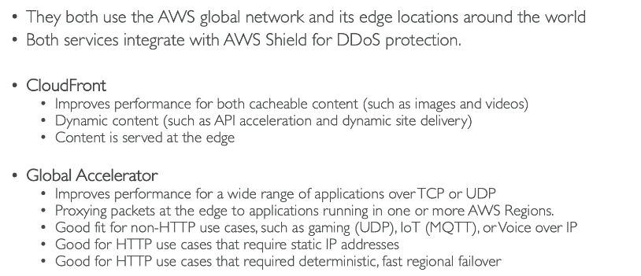

# 165. CloudFront Overview
CloudFront là một **Content Delivery Network (CDN)** của AWS, giúp phân phối nội dung nhanh chóng trên toàn cầu bằng cách cache nội dung tại các edge locations. Mục tiêu của CloudFront là cải thiện hiệu suất tải trang web bằng cách giảm latency và giúp người dùng trên toàn thế giới có trải nghiệm tốt hơn.

- Hỗ trợ DDoS protection, WAF, Shield và các tính năng bảo mật của AWS.
- CloudFront có 216 points of presence (PoPs) trên toàn cầu, gọi là edge locations

CloudFront có thể làm việc với nhiều loại origin khác nhau:
- **S3 bucket**: CloudFront phân phối các file đã được lưu trong S3 và cache chúng ở các edge locations.
- **Custom HTTP server**: CloudFront có thể kết nối với các backend khác như Application Load Balancer (ALB) hoặc EC2 instances.

Để bảo vệ S3 bucket, bạn có thể sử dụng Origin Access Control (OAC). Đây là tính năng giúp đảm bảo rằng chỉ CloudFront có quyền truy cập vào S3 bucket, thay thế cho Origin Access Identity (OAI) cũ.

### So sánh 
- CloudFront: Phân phối nội dung toàn cầu và lưu cache tại các edge locations. Thích hợp cho nội dung tĩnh (static content).
- S3 Cross-Region Replication (CRR): Sao chép dữ liệu giữa các region của S3 mà không sử dụng cache. Thích hợp cho dữ liệu động (dynamic content) cần cập nhật thường xuyên và truy xuất với độ trễ thấp trong một vài region.

# 169. Pricing
CloudFront có các địa điểm edge trên toàn thế giới, vì vậy chi phí dữ liệu truyền ra từ mỗi địa điểm sẽ thay đổi tùy thuộc vào khu vực. Ví dụ, tại Mexico, Mỹ và Canada, 10 terabyte đầu tiên có giá 0.085 USD mỗi gigabyte. Trong khi đó, ở Ấn Độ, chi phí là 0.17 USD mỗi gigabyte, tức là gấp đôi so với Mỹ. Nếu bạn truyền tải hơn 5 petabyte dữ liệu, chi phí sẽ giảm xuống còn 0.02 USD mỗi gigabyte từ Hoa Kỳ.

Ngoài ra, để giảm chi phí, CloudFront cung cấp ba lớp giá:
1. **Price Class All**: Bao gồm tất cả các khu vực và mang lại hiệu suất tốt nhất, nhưng sẽ tốn nhiều chi phí hơn.
2. **Price Class 200**: Bao gồm phần lớn các khu vực, nhưng loại trừ các khu vực đắt đỏ nhất.
3. **Price Class 100**: Chỉ bao gồm các khu vực rẻ nhất.

Với mỗi lớp giá, bạn có thể giảm số lượng địa điểm edge được sử dụng và tiết kiệm chi phí cho phân phối CloudFront của mình.

# 171. AWS Global Accelerator Overview

Khi một ứng dụng được triển khai chỉ ở một khu vực, người dùng toàn cầu sẽ phải truy cập qua internet công cộng, gây độ trễ và giảm hiệu suất. Mỗi lần truy cập có thể phải đi qua nhiều router, làm tăng độ trễ và có nguy cơ mất kết nối.

**Giải pháp của AWS Global Accelerator:**
- Dịch vụ này sử dụng mạng lưới toàn cầu của AWS để giảm độ trễ và tăng tốc độ truy cập bằng cách sử dụng Anycast IP, cho phép người dùng được định tuyến đến máy chủ gần nhất qua các vị trí edge của AWS.
- **Anycast IP:** Khác với Unicast IP, nơi mỗi máy chủ có một địa chỉ IP riêng, Anycast IP cho phép tất cả các máy chủ chia sẻ một địa chỉ IP duy nhất. Lưu lượng sẽ được định tuyến đến máy chủ gần nhất với người dùng.

**Cách thức hoạt động của Global Accelerator:**
- Lưu lượng từ người dùng sẽ được định tuyến qua các vị trí edge gần nhất, sau đó đi qua mạng riêng AWS đến ứng dụng của bạn.
- Điều này giúp giảm độ trễ và đảm bảo kết nối ổn định hơn so với internet công cộng.

**Tính năng nổi bật:**
- **Tốc độ và độ trễ thấp:** Sử dụng Anycast IP và mạng AWS nội bộ giúp giảm độ trễ.
- **Hiệu suất ổn định:** Global Accelerator cung cấp hai địa chỉ IP tĩnh toàn cầu cho ứng dụng.
- **Khả năng mở rộng:** Hỗ trợ Elastic IP, EC2, ALB và NLB, có thể là public hoặc private.
- **Failover nhanh chóng:** Nếu một khu vực gặp sự cố, hệ thống sẽ tự động chuyển hướng lưu lượng sang khu vực khác trong vòng dưới 1 phút.
- **Kiểm tra sức khỏe:** Global Accelerator thực hiện kiểm tra sức khỏe đối với các ứng dụng và tự động chuyển hướng lưu lượng nếu phát hiện lỗi.

- **Bảo mật:** Chỉ cần whitelist hai địa chỉ IP và bảo vệ DDoS tự động qua AWS Shield.

**Khác biệt với CloudFront:**  

- Cả Global Accelerator và CloudFront đều sử dụng mạng lưới toàn cầu và các điểm edge của AWS, nhưng CloudFront chủ yếu tối ưu hóa cho việc phân phối nội dung (tĩnh và động), trong khi Global Accelerator tối ưu hóa cho các ứng dụng sử dụng TCP/UDP, không có cache, và cung cấp địa chỉ IP tĩnh toàn cầu.
- **Global Accelerator** là lựa chọn tốt cho các ứng dụng không phải HTTP, như game, IoT, VoIP, hoặc các trường hợp cần failover nhanh chóng và địa chỉ IP tĩnh toàn cầu.
