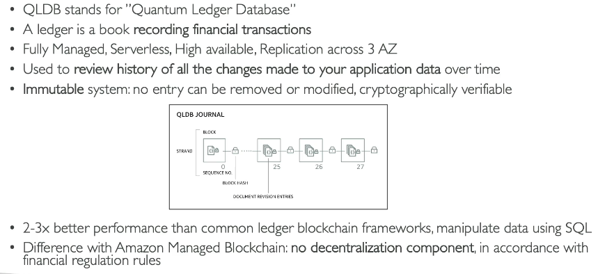
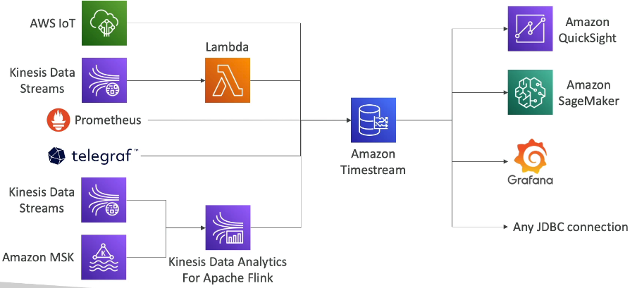

# 235. Overview
**Database Types**
- **RDBMS** (= SQL / OLTP): RDS, Aurora – great for joins
- **NoSQL database** – no joins, no SQL : DynamoDB (~JSON), ElastiCache (key / value pairs), Neptune (graphs), DocumentDB (for MongoDB), Keyspaces (for Apache Cassandra)
- **Object Store**: S3 (for big objects) / Glacier (for backups / archives)
- **Data Warehouse** (= SQL Analytics / BI): Redshift (OLAP), Athena, EMR
- **Search**: OpenSearch (JSON) – free text, unstructured searches
- **Graphs**: Amazon Neptune – displays relationships between data
- **Ledger**: Amazon Quantum Ledger Database

# 236. RDS
- Use case: RDBMS/OLTP, perform SQL queries, transactions

# 237. Aurora
- **Aurora Serverless** – for unpredictable / intermittent workloads, no capacity planning
- **Aurora Global**: up to 16 DB Read Instances in each region, < 1 second storage replication
- **Aurora Machine Learning**: perform ML using SageMaker & Comprehend on Aurora
- **Aurora Database Cloning**: new cluster from existing one, faster than restoring a snapshot
- **Use case**: same as RDS, but with less maintenance / more flexibility / more performance / more features

# 238. ElastiCache
- Managed Redis/Memcached 
- in memory data store 
- Need code change 
- Use case: Key value store, Frequent read, less write, cache result for DB queries, store session, cannot use SQL

# 239. DynamoDB
- TTL feature: set TTL cho row
- Có thể thay thế elastiCache như 1 k-v store
- DAX: read cache, micro second latency 
- Dynamo stream to invoke lambda, kinesis streams 
- Global table feature
- export to S3 without using WCU 
- Use case: serverless, small document, distributed cache 

# 240. S3 
- store big k-v object with max = 5TB

# 241. DocumentDB 
- tương thích với mongoDB 
- concept tương tự aurora
- DocumentDB doesn't have a Serverless option and it doesn't have a global database feature.

# 242. Neptune
- Amazon Neptune là **fully managed graph database**.
- Dùng để xây dựng và vận hành các ứng dụng với **highly connected datasets**, ví dụ như **social networks**.

- Ví dụ về cơ sở dữ liệu đồ thị: mạng xã hội, nơi các **users** có mối quan hệ như **friends**, **likes**, **connections**, **posts**, **comments**, **shares**.
- Mối quan hệ giữa **users**, **posts**, **comments** tạo thành một **graph**.
- Neptune là lựa chọn tuyệt vời khi làm việc với cơ sở dữ liệu đồ thị vì nó tối ưu hóa cho các **complex queries**.

### **Tính năng của Amazon Neptune**
- **Replication**: Sao chép dữ liệu qua **3 AZ** (Availability Zones), hỗ trợ tối đa **15 read replicas**.
- **Khả năng lưu trữ**: Lưu trữ đến **billions of relationships** trong cơ sở dữ liệu đồ thị.
- **Truy vấn nhanh**: Truy vấn đồ thị với độ trễ chỉ trong mili giây.
- **High availability**: Vận hành trên nhiều khu vực khả dụng (Availability Zones).
- **Ứng dụng**: Phù hợp cho các ứng dụng như:
    - **Social networking**.
    - **Fraud detection**.
    - **Recommendation engines**.
    - **Knowledge graphs** (ví dụ: Wikipedia).

### **Neptune Streams**
- **Neptune Streams**: Dữ liệu được sắp xếp theo thứ tự thay đổi trong cơ sở dữ liệu đồ thị.
- Dữ liệu trong stream không có **duplicates** và có thứ tự chặt chẽ.
- Dữ liệu thay đổi trong cơ sở dữ liệu Neptune sẽ ngay lập tức có trong **Neptune Streams**.
- Truy cập stream qua **HTTP REST API**.

### ** Ứng dụng của Neptune Streams**
- **Notification**: Gửi thông báo khi có thay đổi trong dữ liệu đồ thị.
- **Data synchronization**: Đồng bộ dữ liệu giữa Neptune và các dịch vụ khác như **Amazon S3**, **OpenSearch**, **ElastiCache**.
- **Cross-region replication**: Sao chép và đồng bộ hóa dữ liệu qua các khu vực hoặc cụm Neptune khác.

# 243. Keyspaces 
- Cho apache cassandra sử dụng CQL 
- NoSQL 
- Use case: store IOT devices info, time-series data

# 244. QLDB 
- Quantum ledger db -> recording financial transaction 
- 

# 245. Timestream 

- time series db 
-  use case: IOT app, operational app, real time analystics 