# 183. Messaging
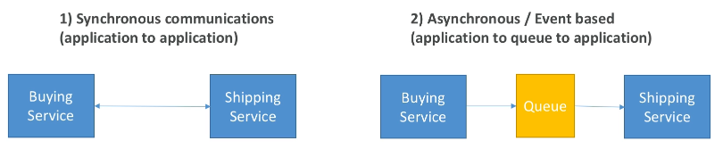

**Giao tiếp đồng bộ (Synchronous)**: Ứng dụng kết nối trực tiếp với nhau. Ví dụ, khi có giao dịch mua hàng, dịch vụ mua hàng sẽ thông báo cho dịch vụ vận chuyển gửi hàng ngay lập tức.

**Giao tiếp bất đồng bộ (Asynchronous)**: Ứng dụng không kết nối trực tiếp mà thông qua middleware như **queue**. Ví dụ, dịch vụ mua hàng sẽ đưa thông tin vào queue, dịch vụ vận chuyển sẽ kiểm tra và xử lý thông tin từ queue.

Giao tiếp đồng bộ có thể gặp vấn đề khi một dịch vụ quá tải, ví dụ như trong trường hợp mã hóa video. Khi đó, tốt hơn là sử dụng mô hình bất đồng bộ để giảm tải, sử dụng các dịch vụ như **SQS** (queue), **SNS** (pub/sub) hoặc **Kinesis** (real-time streaming). Những dịch vụ này giúp các ứng dụng có thể mở rộng và hoạt động độc lập, đồng thời xử lý lưu lượng cao hiệu quả.

# 184. SQS 
- Default: 120000 ms(standard) and 20000ms (fifo)
### **Producer & Consumer**
- **Producer**: Là ứng dụng hoặc dịch vụ gửi thông điệp vào **SQS queue**.
    - Có thể có một hoặc nhiều producer gửi thông điệp vào queue.
    - Ví dụ: Một dịch vụ xử lý đơn hàng gửi thông điệp vào queue để yêu cầu xử lý tiếp.

- **Consumer**: Là ứng dụng hoặc dịch vụ đọc thông điệp từ **SQS queue** và xử lý chúng.
    - Consumer **poll** (kiểm tra) queue để nhận thông điệp.
    - Consumer có thể chạy trên EC2, Lambda hoặc máy chủ tại chỗ.

### **SQS Queue**
- **Mục đích**: Giúp tách biệt các ứng dụng và giúp mở rộng khả năng xử lý.
- **Cơ chế**:
    - Producer gửi thông điệp vào queue.
    - Consumer lấy thông điệp từ queue, xử lý và xóa nó.
    - Hỗ trợ **horizontal scaling** (mở rộng theo chiều ngang) với nhiều consumers.

- **Thông điệp trong SQS**:
    - Tối đa 256 KB mỗi thông điệp.
    - Thông điệp sẽ tồn tại trong queue từ 4 đến 14 ngày, sau đó sẽ bị xóa nếu không được xử lý.

- **Đặc điểm**:
    - **Không giới hạn băng thông**: Bạn có thể gửi và nhận vô số thông điệp mỗi giây.
    - **Độ trễ thấp**: Thời gian phản hồi dưới 10 mili giây.
    - **Dữ liệu trùng lặp hoặc không theo thứ tự**: SQS đảm bảo gửi ít nhất một lần (at least once delivery) nhưng thứ tự không được đảm bảo.

### **Use Case**
- **Quy trình**: SQS rất hữu ích trong các tình huống cần xử lý bất đồng bộ, ví dụ:
    - Xử lý đơn hàng (gửi thông điệp vào queue, consumer lấy thông điệp và xử lý đơn hàng).
    - Xử lý video (gửi thông điệp vào queue để back-end xử lý video).

### **Scaling with SQS**
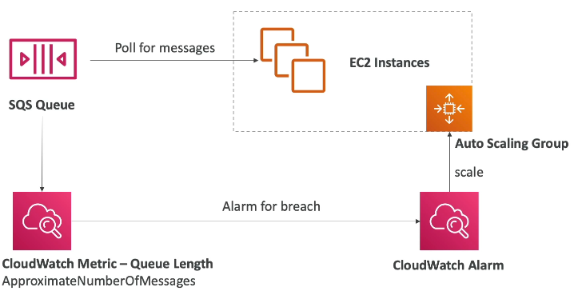  
SQS hỗ trợ **horizontal scaling** với nhiều consumers.
    - Các consumers có thể hoạt động đồng thời, xử lý thông điệp song song, giúp tăng throughput.
    - Nếu có sự gia tăng lưu lượng (ví dụ: lượng đơn hàng tăng đột ngột), có thể mở rộng thêm consumers thông qua **Auto Scaling**.

#### **Security**
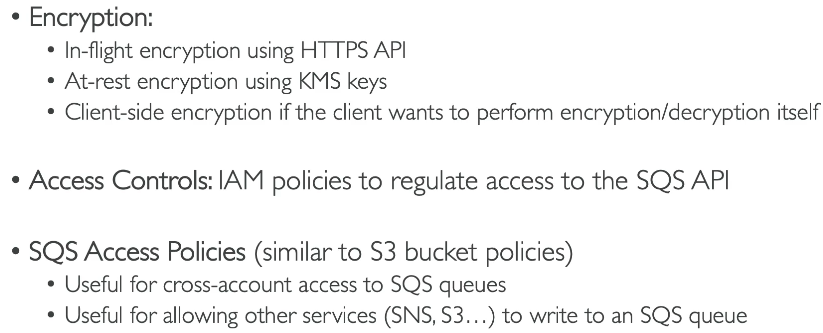
### Visible timeout 
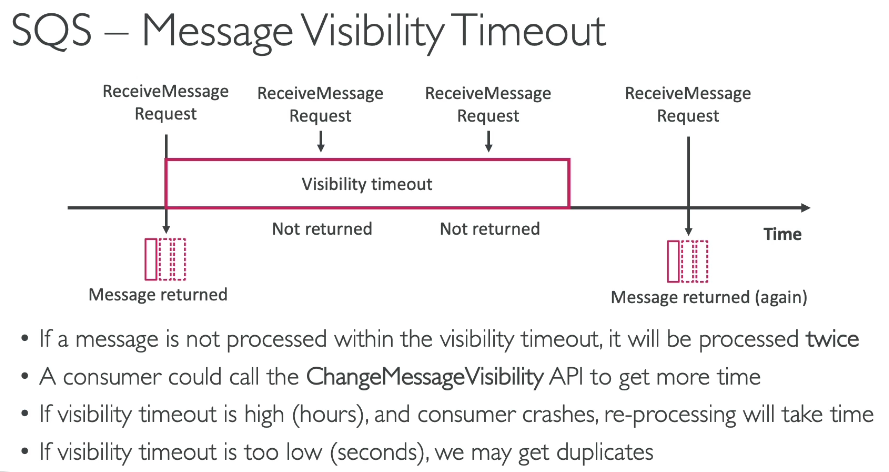
### SQS FIFO Queue
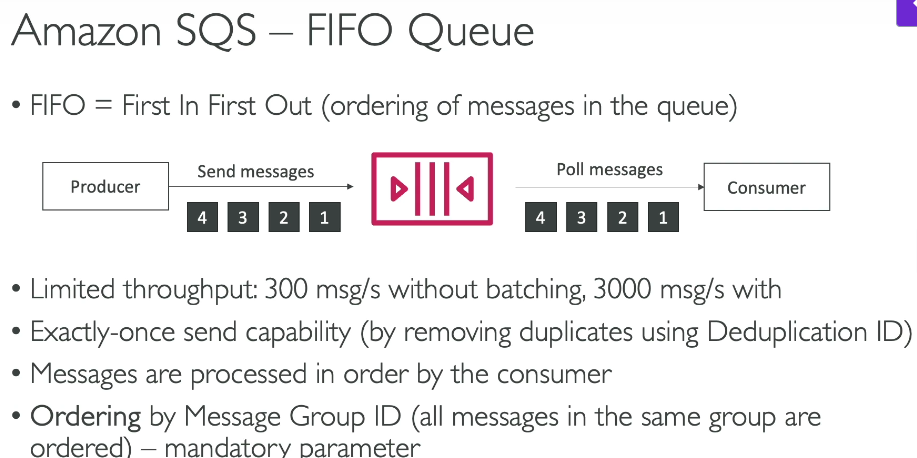

Content-based deduplication: Loại bỏ các message có ID trùng lặp trong khoảng x time (VD trong 5 phút) 

### SQS as a buffer to DB writes
Mô hình này phù hợp khi client không cần confirm rằng việc insert đã thành công ngày lập tức, tuy nhiên sẽ đảm bảo việc insert luôn thành công   
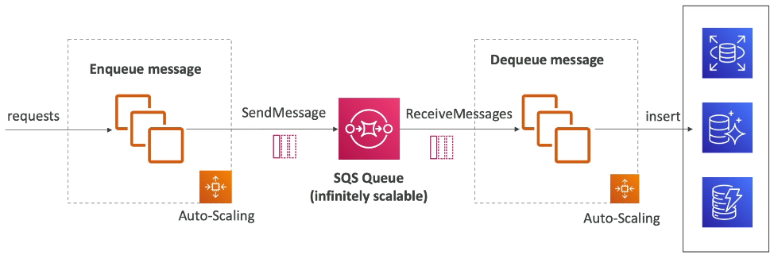

# 190. SNS
- **Amazon SNS** (Simple Notification Service) được sử dụng khi bạn muốn gửi một tin nhắn và có nhiều người nhận khác nhau.
- Thay vì phải tạo tích hợp riêng cho mỗi dịch vụ nhận tin (ví dụ: dịch vụ mua hàng gửi email, gửi tin nhắn cho dịch vụ chống gian lận, dịch vụ giao hàng, hoặc gửi vào **SQS Queue**), **SNS** giúp bạn giảm bớt sự phức tạp này.
- **SNS** hỗ trợ mô hình **Pub/Sub** (Publish/Subscribe), nơi một dịch vụ gửi tin nhắn vào một **SNS topic**, và tất cả các dịch vụ đăng ký (subscribers) sẽ nhận được tin nhắn đó.

### **Mô hình Pub/Sub**

- **SNS** cho phép một dịch vụ (producer) gửi tin nhắn vào một **SNS topic**.
- Các dịch vụ đăng ký (subscribers) nhận tin nhắn từ topic và xử lý chúng.
- Số lượng subscribers tối đa mỗi topic có thể lên đến 12 triệu, và có thể thay đổi theo thời gian.
- Trong tài khoản của bạn, có thể tạo đến 100.000 topics và có thể tăng giới hạn này nếu cần.

### **Sub**

- Các subscribers có thể nhận tin nhắn qua nhiều phương thức:
  - Gửi email trực tiếp từ SNS.
  - Gửi SMS và thông báo trên di động.
  - Gửi dữ liệu vào các **HTTP** hoặc **HTTPS endpoints**.
  - **SNS** tích hợp với các dịch vụ AWS khác như **SQS** (gửi tin nhắn vào hàng đợi), **Lambda** (xử lý tin nhắn bằng hàm), và **Kinesis Data Firehose** (gửi dữ liệu vào các dịch vụ như Amazon Redshift).

### **Nhận thông báo từ các dịch vụ AWS khác**

- **SNS** nhận thông báo từ nhiều dịch vụ AWS, bao gồm:
  - **CloudWatch Alarms**, **Auto Scaling Group notifications**, **CloudFormation state changes**, **S3 buckets**, **DMS**, **Lambda**, **DynamoDB**, **RDS events**, và nhiều dịch vụ khác.
  - Khi có thông báo từ các dịch vụ này, nó sẽ được gửi vào một **SNS topic** đã được chỉ định.

### **Quy trình gửi tin nhắn qua SNS**

- Để gửi tin nhắn vào **SNS**, bạn sẽ:
  - Tạo một **SNS topic**.
  - Tạo các **subscriptions** (có thể có một hoặc nhiều subscriptions).
  - Tin nhắn sẽ được tự động gửi đến tất cả các subscribers của topic.
- Ngoài ra, có thể sử dụng tính năng **direct publish** cho các ứng dụng di động, sử dụng SDK của nền tảng di động (Google GCM, Apple APNS, Amazon ADM).

### **Bảo mật trong SNS**

- **SNS** có các tính năng bảo mật tương tự như **SQS**:
  - **In-flight encryption**  mặc định.
  - **At-rest encryption**  sử dụng **KMS keys**.
  - **Client-side encryption** nếu khách hàng muốn gửi tin nhắn đã mã hóa vào **SNS**.
- Các chính sách **IAM** (Identity and Access Management) được sử dụng để kiểm soát quyền truy cập vào **SNS APIs**.
  - Có thể định nghĩa **SNS access policies**, tương tự như **S3 bucket policies**.
  - Hữu ích khi cần cấp quyền truy cập chéo giữa các tài khoản hoặc cho phép các dịch vụ khác như **S3** gửi thông báo vào **SNS topics**.

---

# 193. Kinesis Data Streams

- **Kinesis Data Streams** là dịch vụ dùng để thu thập và lưu trữ dữ liệu theo thời gian thực.
- Điểm quan trọng cần nhớ là **real-time data** (dữ liệu theo thời gian thực).
- **Real-time data** là dữ liệu được tạo ra và sử dụng ngay lập tức, ví dụ:
  - **Click stream** (dữ liệu từ các lượt nhấp chuột trên website).
  - Dữ liệu từ các thiết bị kết nối Internet (ví dụ: xe đạp thông minh).
  - Dữ liệu từ các server (metrics và logs).

### **Producers và Consumer trong Kinesis**
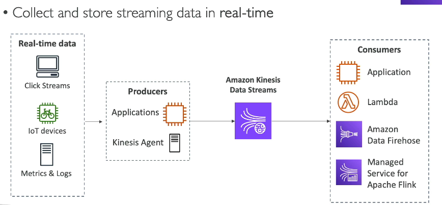  
- **Producers** là các ứng dụng hoặc mã code gửi dữ liệu vào **Kinesis Data Streams**.
  - Ví dụ, bạn có thể cài **Kinesis Agent** trên server để gửi **metrics** và **logs** vào **Kinesis**.
- **Consumers** là các ứng dụng tiêu thụ dữ liệu trong thời gian thực.
  - Các ứng dụng này có thể sử dụng mã code riêng để đọc dữ liệu từ **Kinesis Data Streams**.
  - Các dịch vụ như **Lambda**, **Amazon Data Firehose**, hoặc **Apache Flink** có thể tiêu thụ dữ liệu từ **Kinesis**.

### **Tính năng của Kinesis Data Streams**

- Dữ liệu có thể được lưu trữ trên **Kinesis Data Streams** tối đa 365 ngày.
- Dữ liệu sẽ không thể bị xóa cho đến khi hết thời gian lưu trữ, bạn chỉ có thể chờ nó hết hạn.
- Kích thước dữ liệu tối đa cho mỗi tin nhắn gửi vào là 1MB.
- Dữ liệu sẽ được sắp xếp theo thứ tự nếu bạn sử dụng **Partition ID** cho các điểm dữ liệu liên quan.

### **Bảo mật trong Kinesis Data Streams**

- **Kinesis Data Streams** hỗ trợ các tính năng bảo mật như:
  - **At-rest KMS encryption** (mã hóa khi lưu trữ).
  - **In-flight HTTPS encryption** (mã hóa khi truyền tải).

### **Các thư viện hỗ trợ tối ưu hóa**

- Để viết **producer application** tối ưu cho hiệu suất cao, bạn nên sử dụng **Kinesis Producer Library (KPL)**.
- Để viết **consumer application** tối ưu, bạn nên sử dụng **Kinesis Client Library (KCL)**.

### **Chế độ Capacity trong Kinesis Data Streams**

- **Provisioned mode**:
  - Bạn tự chọn số lượng **shards** cho stream.
  - **Shard** là đơn vị để xác định kích thước của stream. Ví dụ: 1 shard có thể xử lý 1MB dữ liệu mỗi giây hoặc 1.000 bản ghi mỗi giây.
  - Bạn có thể mở rộng hoặc thu nhỏ số lượng **shards** thủ công theo nhu cầu.
  - Mỗi **shard** tính phí theo giờ.

- **On-demand mode**:
  - Bạn không cần quản lý dung lượng, hệ thống tự động điều chỉnh số lượng shards dựa trên lưu lượng dữ liệu trong 30 ngày qua.
  - Mức dung lượng mặc định là 4.000 bản ghi mỗi giây hoặc 4MB mỗi giây.
  - Bạn chỉ phải trả phí theo lượng dữ liệu đi vào và đi ra khỏi stream.

### **Kết luận**

- **Kinesis Data Streams** là một dịch vụ mạnh mẽ giúp thu thập và xử lý dữ liệu theo thời gian thực.
- Với các chế độ **Provisioned** và **On-demand**, bạn có thể linh hoạt điều chỉnh dung lượng và khả năng mở rộng của stream dựa trên nhu cầu thực tế.

--- 

# 195. Amazon Data Firehose 
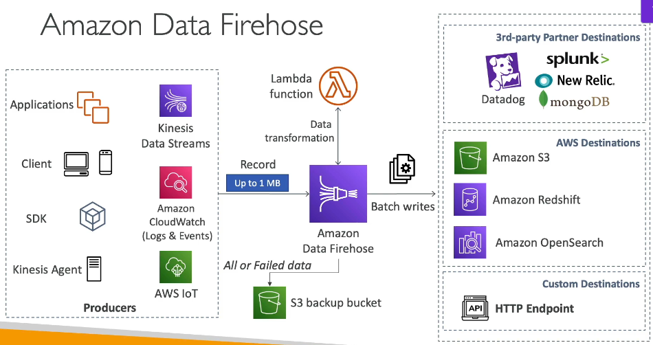  
- Amazon Data Firehose là dịch vụ dùng để gửi dữ liệu từ các nguồn vào các đích đích.
- Các nguồn dữ liệu có thể bao gồm:
  - Applications, clients, hoặc mã code của bạn sử dụng SDK để gửi dữ liệu vào Firehose.
  - Kinesis agents.
  - Các dịch vụ AWS như Kinesis Data Streams, Amazon CloudWatch Logs and Events, và AWS IoT có thể đẩy dữ liệu vào Firehose, hoặc Firehose có thể kéo dữ liệu từ chúng.

### Quy trình xử lý dữ liệu trong Firehose

- Dữ liệu khi được gửi vào Firehose có thể được transformed (biến đổi) thông qua Lambda function. Ví dụ, bạn có thể thay đổi định dạng dữ liệu từ CSV sang JSON.
- Dữ liệu sẽ được tích lũy trong một buffer và được flushed định kỳ (batch writing) vào các đích đích.

### Các đích dữ liệu của Firehose

- AWS Destinations:
  - Amazon S3.
  - Amazon Redshift (để thực hiện phân tích dữ liệu).
  - Amazon OpenSearch.

- Third-party Destinations:
  - Datadog, Splunk, New Relic, MongoDB.

- Nếu đích đích không được hỗ trợ, có thể sử dụng HTTP endpoint để gửi dữ liệu đến bất kỳ đâu.

### Sao lưu dữ liệu trong Firehose

- Bạn có thể lưu toàn bộ dữ liệu hoặc chỉ failed data vào Amazon S3 để sao lưu.

### Tính năng và Quản lý trong Firehose

- Amazon Data Firehose trước đây gọi là Kinesis Data Firehose.
- Đây là dịch vụ fully managed, hỗ trợ các đích đích như Redshift, S3, OpenSearch, và các dịch vụ bên ngoài như Splunk.
- Automatic scaling và serverless: Không cần quản lý cơ sở hạ tầng, chỉ trả phí theo mức sử dụng.

### Near Real-Time Service

- Amazon Data Firehose là một dịch vụ **near real-time**, có khả năng buffer dữ liệu trước khi flush vào đích đích. Điều này dẫn đến một sự chậm trễ nhẹ, nhưng vẫn đảm bảo gần như ngay lập tức.

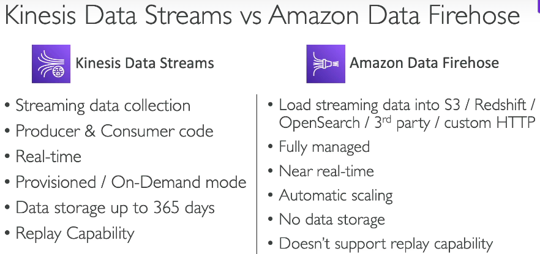

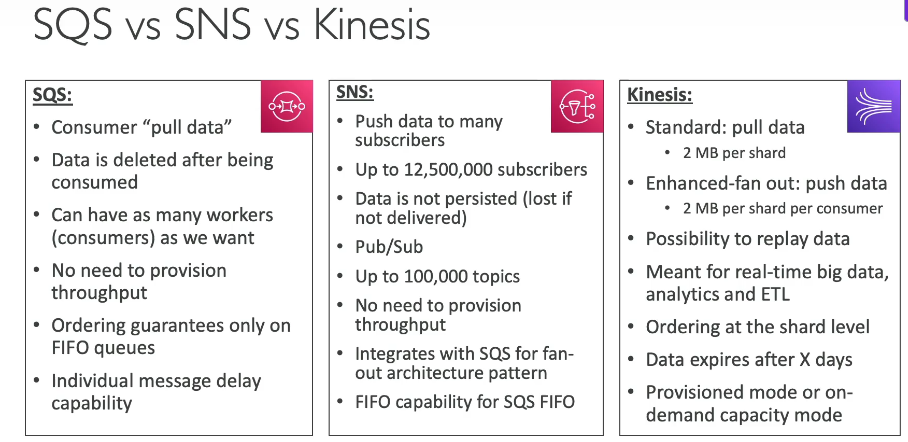

---

# 198. Amazon MQ 
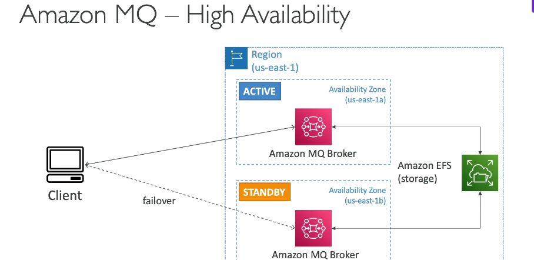  

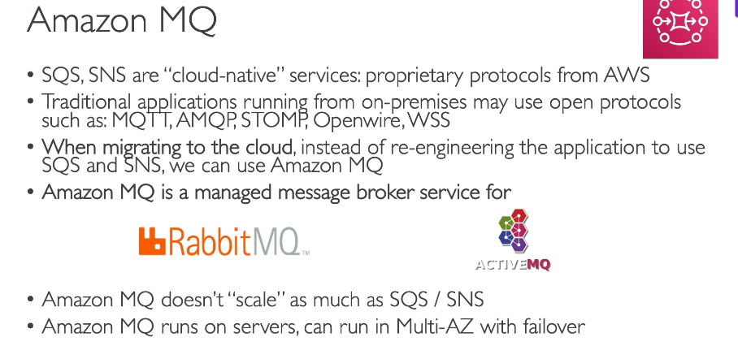

