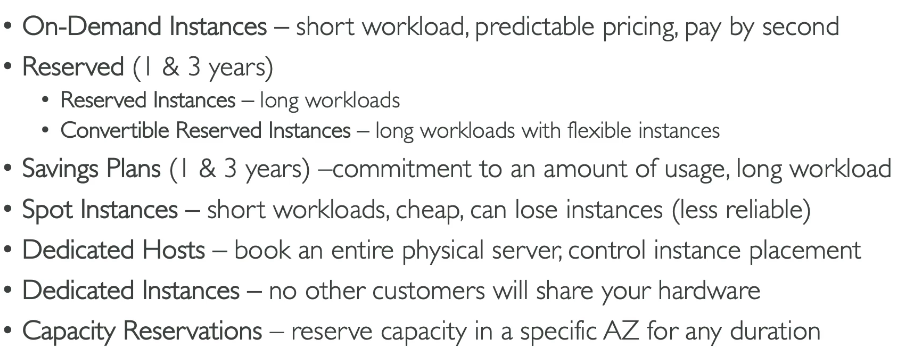

# 34. Instance Types
- **General Purpose**: Cân bằng CPU, bộ nhớ, mạng, phù hợp cho công việc đa dạng như máy chủ web.
- **Compute Optimized**: Tối ưu hóa cho các công việc cần CPU mạnh mẽ, ví dụ: học máy, máy chủ game.
- **Memory Optimized**: Tối ưu hóa bộ nhớ cho các công việc như cơ sở dữ liệu in-memory, BI.
- **Storage Optimized**: Tối ưu hóa cho các công việc yêu cầu truy cập dữ liệu nhanh trên bộ lưu trữ, ví dụ: OLTP.

1. **General Purpose**
   - Cân bằng giữa CPU, bộ nhớ và mạng.
   - Phù hợp cho các công việc đa dạng như máy chủ web, kho mã nguồn.
   - Ví dụ: **T2.micro** (dùng trong khóa học này, nằm trong tầng miễn phí của AWS).

2. **Compute Optimized**
  - Tối ưu hóa cho các tác vụ yêu cầu CPU mạnh mẽ như xử lý dữ liệu theo lô, mã hóa phương tiện, máy chủ web hiệu suất cao, tính toán HPC (High Performance Computing), học máy, máy chủ game chuyên dụng.
  - Tên loại Instance: **C5**, **C6**.

3. **Memory Optimized**
  - Tối ưu hóa bộ nhớ (RAM) cho các tác vụ xử lý dữ liệu lớn trong bộ nhớ.
  - Phù hợp với cơ sở dữ liệu quan hệ hoặc phi quan hệ, cơ sở dữ liệu in-memory, cache quy mô lớn.
  - Ví dụ: **R series**, **X1** (high memory), **Z1**.

4. **Storage Optimized**
  - Tối ưu hóa cho việc truy cập dữ liệu lớn trên bộ nhớ lưu trữ cục bộ.
  - Phù hợp cho các hệ thống xử lý giao dịch trực tuyến (OLTP), cơ sở dữ liệu quan hệ và NoSQL, hệ thống tệp phân tán.
  - Ví dụ: **I series**, **G series**, **H1**.

- **General Purpose**: Cân bằng CPU, bộ nhớ, mạng, phù hợp cho công việc đa dạng như máy chủ web.
- **Compute Optimized**: Tối ưu hóa cho các công việc cần CPU mạnh mẽ, ví dụ: học máy, máy chủ game.
- **Memory Optimized**: Tối ưu hóa bộ nhớ cho các công việc như cơ sở dữ liệu in-memory, BI.
- **Storage Optimized**: Tối ưu hóa cho các công việc yêu cầu truy cập dữ liệu nhanh trên bộ lưu trữ, ví dụ: OLTP.

# 44. Purchasing Options

- **On-Demand Instances**
  - Thanh toán theo mức sử dụng, tính phí theo giây (Linux, Windows) hoặc theo giờ (các hệ điều hành khác).
  - Không yêu cầu thanh toán trước hoặc cam kết dài hạn.
  - Phù hợp với các công việc ngắn hạn và không thể dự đoán được, ví dụ như ứng dụng có hành vi không thể đoán trước.
  - Chi phí cao so với các lựa chọn khác.

- **Reserved Instances**
  - Đặt trước trong 1 or 3 năm với mức giảm giá lên đến 72%.
  - Chọn loại instance, vùng, hệ điều hành và loại hình tenancy.
  - Có thể thanh toán trước, một phần, hoặc không thanh toán trước để nhận giảm giá.
  - Phù hợp với các ứng dụng sử dụng lâu dài như cơ sở dữ liệu.
  - **Convertible Reserved Instances** cho phép thay đổi loại instance, lên đến 66% giảm giá, phù hợp khi bạn cần thay đổi loại instance theo thời gian.

- **EC2 Savings Plans**
  - Kế hoạch linh hoạt với mức giảm giá lên đến 70%.
  - Cam kết sử dụng một mức sử dụng cụ thể ($ mỗi giờ), không cam kết loại instance.
  - Linh hoạt thay đổi kích thước instance, hệ điều hành và loại hình tenancy.
  - Phù hợp với các công việc dài hạn. Ví dụ: bạn có thể cam kết chi tiêu $10 mỗi giờ trong 1-3 năm mà không bị ràng buộc về loại instance.

- **Spot Instances**
  - Giảm giá mạnh, lên đến 90% so với **On-Demand Instances**.
  - Có thể bị mất bất kỳ lúc nào nếu giá vượt qua mức bạn sẵn sàng chi trả.
  - Use case: batch job, data analytics, image process, distributed workload 
  - Not use: crictical job or db 

  - Spot fleets = set of spot instances + optional on-demand instances 

- **Dedicated Hosts**
  - Đặt một máy chủ vật lý riêng biệt cho bạn sử dụng.
  - Phù hợp khi có yêu cầu về tuân thủ quy định hoặc sử dụng phần mềm có giấy phép tính phí theo socket, core hoặc VM.
  - Ví dụ: khi bạn có các phần mềm yêu cầu giấy phép theo số lượng core hoặc socket của máy chủ.

- **Dedicated Instances**
  - Các instance chạy trên phần cứng chỉ dành cho bạn, nhưng có thể chia sẻ phần cứng với các instance khác trong cùng tài khoản.
  - Không có quyền kiểm soát việc đặt các instance trên phần cứng.
  - Khác với **Dedicated Hosts**, nơi bạn có quyền kiểm soát máy chủ vật lý.

- **Capacity Reservations**
  - Đặt trước capacity cho **On-Demand Instances** trong một vùng (AZ) cụ thể.
  - Không có giảm giá, chỉ đơn giản là đảm bảo rằng bạn sẽ có sẵn capacity khi cần.
  - Thanh toán theo mức giá **On-Demand** dù có sử dụng hay không.
  - Phù hợp với các công việc ngắn hạn yêu cầu được thực hiện trong một vùng cụ thể. Ví dụ: bạn muốn đảm bảo rằng luôn có capacity trong một AZ cho công việc cần thiết.

**Tóm tắt nhanh**:
- **On-Demand Instances**: Dành cho công việc ngắn hạn, không thể dự đoán, ví dụ: ứng dụng không thể dự đoán hành vi.
- **Reserved Instances**: Dành cho công việc dài hạn, ổn định, ví dụ: cơ sở dữ liệu.
- **EC2 Savings Plans**: Linh hoạt về mức sử dụng và tiết kiệm dài hạn, ví dụ: cam kết chi tiêu $10 mỗi giờ trong 1-3 năm.
- **Spot Instances**: Giảm giá cao nhưng có thể bị mất bất kỳ lúc nào, ví dụ: phân tích dữ liệu hoặc xử lý hình ảnh.
- **Dedicated Hosts**: Dành cho các yêu cầu đặc biệt về phần cứng, ví dụ: phần mềm tính phí theo số lượng core.
- **Dedicated Instances**: Dành cho các yêu cầu về phần cứng riêng biệt.
- **Capacity Reservations**: Đảm bảo có sẵn capacity nhưng không có giảm giá, ví dụ: đảm bảo capacity cho công việc trong một AZ.

# 50. Placement Groups
Placement Groups là một chiến lược giúp người dùng kiểm soát cách EC2 instances được phân phối trong cơ sở hạ tầng AWS. Mặc dù không thể tương tác trực tiếp với phần cứng của AWS, Placement Groups cho phép chỉ định cách các instance của EC2 được đặt gần nhau.

- **Cluster**: Tối ưu hóa hiệu suất với băng thông cao nhưng có rủi ro cao khi AZ gặp sự cố.
- **Spread**: Giảm thiểu rủi ro mất mát đồng thời, phù hợp cho các ứng dụng quan trọng với yêu cầu khả dụng cao.
- **Partition**: Tối ưu hóa cho các ứng dụng big data với khả năng phân phối qua nhiều partitions và khả năng chịu lỗi cao.

1. **Cluster Placement Group**
     - Tất cả các EC2 instances được nhóm lại trong cùng một Availability Zone (AZ) và có kết nối mạng với băng thông cao (10Gbps).
     - **Ưu điểm**: Cung cấp hiệu suất cao với độ trễ thấp, phù hợp cho các công việc tính toán hoặc ứng dụng yêu cầu mạng với tốc độ truyền tải cao.
     - **Nhược điểm**: Nếu AZ gặp sự cố, tất cả các instance trong nhóm đều bị ảnh hưởng.
     - **Sử dụng**: Các công việc big data hoặc ứng dụng yêu cầu độ trễ cực thấp và băng thông cao giữa các instances.

2. **Spread Placement Group**
     - Các EC2 instances được phân bổ trên phần cứng khác nhau, với giới hạn 7 EC2 instances mỗi Placement Group mỗi AZ.
     - **Ưu điểm**: Giảm thiểu rủi ro mất mát đồng thời vì các instances được phân bổ trên các phần cứng khác nhau, giúp bảo vệ ứng dụng khỏi sự cố phần cứng.
     - **Nhược điểm**: Giới hạn 7 instances mỗi AZ, không phù hợp với ứng dụng quy mô lớn.
     - **Sử dụng**: Ứng dụng cần tính khả dụng cao và giảm thiểu rủi ro mất mát dữ liệu.

3. **Partition Placement Group**
     - EC2 instances được phân bổ qua nhiều partitions trong nhiều AZ khác nhau, mỗi partition được chia thành các racks phần cứng khác nhau.
     - **Ưu điểm**: Tạo khả năng chịu lỗi cao vì mỗi partition được cách ly với các partition khác. Có thể mở rộng tới hàng trăm instances mỗi nhóm.
     - **Nhược điểm**: Cần ứng dụng có khả năng phân phối dữ liệu và server qua nhiều partition.
     - **Sử dụng**: Các ứng dụng big data như HDFS, HBase, Cassandra, hoặc Apache Kafka cần phân tách dữ liệu qua nhiều partitions.

# 52. Elastic Network Interfaces 

Elastic Network Interfaces (ENI) là một thành phần logic trong Amazon VPC, đóng vai trò như một thẻ mạng ảo. ENI cung cấp kết nối mạng cho EC2 instances và có thể được sử dụng không chỉ trong EC2 mà còn cho nhiều mục đích khác trong AWS

### 2. Các thuộc tính của ENI
Mỗi ENI có thể có các thuộc tính sau:
- **Primary private IPv4**: Một địa chỉ IPv4 chính duy nhất cho ENI.
- **Secondary private IPv4**: Một hoặc nhiều địa chỉ IPv4 phụ (có thể thêm vào).
- **Elastic IPv4**: one per private ipv4 
- **Security Groups**: Có thể gắn một hoặc nhiều security groups vào ENI.
- **MAC Address**: Mỗi ENI có một địa chỉ MAC riêng biệt.

Ngoài ra, ENI còn có thể được tạo độc lập với EC2 instance và có thể được gắn hoặc di chuyển giữa các EC2 instance trong quá trình failover.

### 3. Cách sử dụng ENI
ENI giúp EC2 instances kết nối mạng, với mỗi EC2 instance có thể có ít nhất một ENI (ví dụ: eth0 cho ENI chính). Mỗi ENI được gắn vào một Availability Zone (AZ) cụ thể và chỉ có thể hoạt động trong AZ đó.

#### Ví dụ về cách di chuyển ENI:
Giả sử bạn có hai EC2 instances và cả hai đều có ENI được gắn vào. Bạn có thể di chuyển ENI thứ hai (eth1) từ instance thứ nhất sang instance thứ hai để chuyển đổi địa chỉ IP riêng, điều này rất hữu ích trong các trường hợp failover. Khi đó, IP riêng sẽ được chuyển từ EC2 instance đầu tiên sang EC2 instance thứ hai mà không làm gián đoạn dịch vụ.

### 4. Các tình huống sử dụng ENI
- **Failover**: ENI có thể được di chuyển giữa các EC2 instances để đảm bảo khả năng sẵn sàng cao trong trường hợp gặp sự cố.
- **Gán IP tĩnh**: Bạn có thể sử dụng ENI để gán IP tĩnh cho EC2 instances, dễ dàng thay đổi giữa các instances mà không bị gián đoạn kết nối mạng.

### 5. Tóm tắt
ENI là một công cụ linh hoạt giúp quản lý kết nối mạng cho EC2 instances trong AWS, cung cấp khả năng gán IP tĩnh, di chuyển địa chỉ IP giữa các instances và hỗ trợ các kịch bản failover.

# 55. EC2 Hibernate 

EC2 Hibernate là một tính năng ít được biết đến, giúp duy trì trạng thái bộ nhớ RAM của EC2 instance khi dừng hoặc hibernating, thay vì khởi động lại hoàn toàn hệ điều hành. Khi sử dụng Hibernate, dữ liệu trong bộ nhớ RAM sẽ được lưu lại vào ổ đĩa EBS và phục hồi lại khi instance được khởi động lại.

- **Stop và Terminate**: Khi dừng (stop) một EC2 instance, dữ liệu trên ổ đĩa EBS sẽ được giữ nguyên. Nếu bạn xóa instance, ổ đĩa root sẽ bị xóa nếu đã thiết lập để xóa cùng instance, nhưng các ổ đĩa không phải root sẽ vẫn còn.
- **Hibernate**: Khi Hibernate, trạng thái bộ nhớ (RAM) sẽ được lưu vào một tệp trên ổ đĩa EBS root. Sau khi instance được khởi động lại, trạng thái RAM sẽ được phục hồi từ tệp này, giúp quá trình khởi động nhanh hơn mà không phải tải lại toàn bộ hệ điều hành và ứng dụng.
- not more than 60 days 

# 57. EBS Overview
- Elastic Block Store Volume: 
- Delete on terminate:
  - root: default = true
  - other: default = false 
- Locked to 1 AZ 

# 58. EBS Snapshots 
- copy snapshots across AZ or Region 

# 61. AMI Overview 
**AMI** (Amazon Machine Image) là một thành phần quan trọng để tạo và cấu hình các **EC2 instances** trong AWS. AMIs cho phép bạn khởi chạy các EC2 instances với hệ điều hành, phần mềm và công cụ giám sát đã được cấu hình sẵn, giúp giảm thời gian cần thiết cho việc thiết lập và cấu hình.
- **Faster Boot Times**: AMIs giúp giảm thời gian khởi động và cấu hình vì phần mềm và thiết lập đã được đóng gói sẵn.
- **Dễ dàng tùy chỉnh**: Bạn có thể tạo một **AMI** với phần mềm và cấu hình hệ điều hành của riêng mình, giúp triển khai nhanh chóng.
- **Tính linh hoạt toàn cầu**: AMIs có thể được sao chép và sử dụng qua các **regions** khác nhau trong AWS, tận dụng hạ tầng toàn cầu của AWS.

### Các loại AMI
- **Public AMIs**: Đây là các AMI do AWS cung cấp miễn phí hoặc có sẵn qua **AWS Marketplace**. Một ví dụ phổ biến là **Amazon Linux 2 AMI**.
- **Custom AMIs**: Người dùng có thể tạo AMI của riêng mình với phần mềm, hệ điều hành và cấu hình cụ thể. Điều này giúp giảm thời gian khởi động nhanh chóng vì tất cả phần mềm cần thiết đã được đóng gói sẵn trong AMI.
- **AWS Marketplace AMIs**: Những AMI này được tạo ra bởi các nhà cung cấp bên thứ ba và có sẵn để mua trên **AWS Marketplace**. Các AMI này có thể tiết kiệm thời gian bằng cách cung cấp các cấu hình sẵn có cho các ứng dụng khác nhau.

Quá trình tạo **AMI** từ một **EC2 instance** diễn ra như sau:
- Khởi chạy một **EC2 instance** và tùy chỉnh nó.
- Dừng instance để đảm bảo tính toàn vẹn của dữ liệu.
- Tạo **AMI** từ instance, điều này sẽ tự động tạo các **EBS snapshots** đằng sau.
- Cuối cùng, bạn có thể khởi chạy các **EC2 instances** từ AMI đã tạo, giúp sao chép các cấu hình từ **instance** ban đầu.

Với **AMI** trong tay, bạn có thể sao chép **EC2 instances** từ các **regions** khác nhau, giúp triển khai nhanh chóng các cấu hình tương tự trên các **availability zones** khác nhau.

# 63. EC2 Instance Store 

Khi sử dụng EC2 instances, một lựa chọn khác ngoài việc gắn các ổ đĩa mạng (EBS) là **EC2 Instance Store**. Đây là một loại lưu trữ gắn trực tiếp vào các máy chủ vật lý mà EC2 instances của bạn đang chạy trên đó, mang lại hiệu suất I/O rất cao. Mặc dù lưu trữ này có hiệu suất rất tốt, nhưng nó có một số hạn chế quan trọng.

**EC2 Instance Store** được thiết kế để cung cấp hiệu suất rất cao cho các ứng dụng cần throughput tốt và tốc độ I/O nhanh, đặc biệt là trong các trường hợp cần **cache**, **buffer**, hoặc dữ liệu tạm thời. Tuy nhiên, bạn không nên sử dụng EC2 Instance Store cho lưu trữ lâu dài, vì dữ liệu sẽ bị mất khi EC2 instance bị dừng hoặc bị xóa.

Khi sử dụng **EC2 Instance Store**, bạn phải chịu trách nhiệm sao lưu dữ liệu và đảm bảo rằng nó được sao chép đúng cách nếu cần thiết. Đây là một yếu tố quan trọng cần lưu ý, vì nếu máy chủ vật lý của EC2 instance gặp sự cố, dữ liệu trên Instance Store cũng sẽ mất.

### So sánh với EBS
- **Instance Store**: Cung cấp hiệu suất I/O rất cao, với một số instance như **I3** series có thể đạt được **3.3 triệu IOPS** cho các tác vụ đọc ngẫu nhiên và ghi ngẫu nhiên.
- **EBS**: Dù có hiệu suất thấp hơn, nhưng **Elastic Block Store (EBS)** là lựa chọn lý tưởng cho lưu trữ lâu dài nhờ vào khả năng bền vững của nó, với tốc độ IOPS đạt khoảng **32,000** đối với loại volume như **gp2**.

Nếu bạn cần hiệu suất lưu trữ cực kỳ cao và không yêu cầu bền vững lâu dài, **EC2 Instance Store** là lựa chọn tuyệt vời. Tuy nhiên, hãy chắc chắn rằng bạn có biện pháp sao lưu và quản lý dữ liệu một cách thích hợp, vì đây là **ephemeral storage** (lưu trữ tạm thời).

# 64. EBS Volume Types 
Cảm ơn bạn đã phản hồi! Mình sẽ chỉnh lại bản tóm tắt sao cho hợp lý hơn và dễ hiểu hơn.

---

### Tổng quan về EBS Volumes và Các Loại EBS

**EBS (Elastic Block Store)** là dịch vụ lưu trữ khối cho các EC2 instances, với 6 loại volume khác nhau, chia thành các nhóm dựa trên mục đích sử dụng và hiệu suất. Mỗi loại volume sẽ có đặc điểm riêng và phù hợp với những nhu cầu công việc khác nhau.
### Các lưu ý quan trọng khi sử dụng:
- **gp2 và gp3**: Phù hợp cho các ứng dụng yêu cầu hiệu suất ổn định và chi phí hợp lý. Thích hợp cho các ứng dụng phát triển, thử nghiệm hoặc hệ thống cần ổn định.
- **io1 và io2**: Dùng cho các ứng dụng yêu cầu hiệu suất cao và độ trễ cực thấp, chẳng hạn như các cơ sở dữ liệu có yêu cầu nghiêm ngặt về độ ổn định.
- **st1 và sc1**: Thích hợp cho các công việc cần throughput cao nhưng không yêu cầu độ trễ thấp, hoặc khi cần lưu trữ dữ liệu không thường xuyên truy cập.
- Khi bạn cần hơn 32,000 IOPS, bạn sẽ cần EC2 Nitro với io1 hoặc io2.
    - io1 max = 64000 
    - io2 max = 256000 
    - using EBS instance storage nếu cần nhiều hơn iops 

### Các loại EBS Volume:

1. **gp2 và gp3 (General Purpose SSD):**
    - Là các volume SSD dùng cho mục đích chung, thích hợp cho hầu hết các ứng dụng với sự cân bằng giữa chi phí và hiệu suất.
    - **gp2**: Dung lượng và IOPS được liên kết. Tăng dung lượng sẽ tự động tăng IOPS (lên đến tối đa 16,000 IOPS).
    - **gp3**: Cung cấp khả năng điều chỉnh độc lập giữa IOPS và throughput, cho phép tăng IOPS lên 16,000 và throughput lên đến 1000MB/s mà không liên quan đến dung lượng.

2. **io1 và io2 (Provisioned IOPS SSD):**
    - Dành cho các ứng dụng yêu cầu IOPS cao, như cơ sở dữ liệu cần độ trễ thấp và hiệu suất ổn định.
    - **io1**: Có thể provision tối đa 64,000 IOPS cho EC2 Nitro.
    - **io2**: Được tối ưu hóa cho hiệu suất cao hơn, hỗ trợ lên đến 256,000 IOPS và dung lượng tối đa lên tới 64TB.

3. **st1 (Throughput Optimized HDD):**
    - Volume HDD chi phí thấp, thích hợp cho các công việc yêu cầu throughput cao như xử lý dữ liệu lớn hoặc kho dữ liệu.
    - Thích hợp cho các workloads có tần suất truy cập cao, với throughput tối đa là 500MB/s và IOPS tối đa là 500.

4. **sc1 (Cold HDD):**
    - Volume HDD có chi phí thấp nhất, thiết kế cho các công việc ít truy cập, ví dụ như lưu trữ dữ liệu lạnh (archive).
    - Thích hợp cho các công việc ít truy cập, throughput tối đa 250MB/s và IOPS tối đa 250.

### So sánh giữa gp2 và gp3:
- **gp2**: Mối quan hệ giữa dung lượng và IOPS là **liên kết** với nhau. Khi dung lượng tăng, IOPS cũng sẽ tự động tăng.
- **gp3**: Cho phép bạn điều chỉnh **IOPS** và **throughput** độc lập, mang lại sự linh hoạt cao hơn trong việc tối ưu chi phí và hiệu suất.

---

# 65. EBS Multi-Attach 
- Khả dụng với io1/io2 volume và trong 1 số AZ nhất định  
- Các instance cần cùng AZ 
- Use case: tăng HA cluster app (Teradata), app cần manage concurrent write 
- Tối đa 16 instance at a time/volume 

# 66. EBS Encryption 

Khi bạn tạo và mã hóa một EBS volume thì: 
- tất cả dữ liệu lưu trữ trên volume sẽ được mã hóa (dữ liệu "at rest").
- in-transit data giữa EC2 instance và volume cũng sẽ được mã hóa.
- Các snapshots và volumes được tạo từ snapshots cũng sẽ tự động được mã hóa.
- Quá trình mã hóa và giải mã được xử lý hoàn toàn tự động, không cần người dùng can thiệp.
- Mã hóa sử dụng cơ chế AES-256 và kết hợp với AWS KMS.

### **Cách mã hóa một EBS Volume chưa mã hóa:**
- Tạo một snapshot từ volume chưa mã hóa. 
- Sử dụng chức năng sao chép snapshot và chọn “Enable Encryption” để mã hóa snapshot. 
- Tạo một EBS volume mới từ snapshot đã mã hóa. 
- Volume mới sẽ tự động được mã hóa và có thể gắn vào EC2 instance.

**Cách nhanh chóng mã hóa trực tiếp từ snapshot chưa mã hóa:**
- Khi tạo volume từ một snapshot chưa mã hóa, bạn có thể bật mã hóa ngay trong khi tạo volume, chọn khóa KMS và tạo volume mã hóa.

**Lưu ý:**
- Mã hóa có ảnh hưởng rất ít đến độ trễ, gần như không đáng kể.
- Khi sao chép snapshot không mã hóa, bạn có thể bật mã hóa ngay trong quá trình sao chép.

--- 

# 67. Elastic File System 

- EFS là hệ thống tệp mạng (NFS) được quản lý, có thể gắn vào nhiều EC2 instances ở các vùng khả dụng khác nhau (AZ).
- EFS rất khả dụng, mở rộng linh hoạt nhưng chi phí cao (gấp 3 lần so với EBS gp2).
- Tính phí theo mức sử dụng, không cần phải dự báo dung lượng trước.

- **Cách hoạt động:**
    - EFS có thể được kết nối với nhiều EC2 instances ở các vùng khác nhau (ví dụ: US-EAST-1A, US-EAST-1B).
    - Các use case phổ biến: quản lý nội dung, phục vụ web, chia sẻ dữ liệu, WordPress.

- **Các tính năng chính:**
    - **Mã hóa:** EFS hỗ trợ mã hóa dữ liệu ở trạng thái nghỉ (at rest) sử dụng KMS.
    - **Chỉ hỗ trợ Linux AMI, không hỗ trợ Windows.**
    - **Không cần dự báo dung lượng trước:** Hệ thống tệp sẽ tự động mở rộng, tính phí theo từng GB sử dụng.
### Performance & Mode 

### Storage Classes
- **EFS Standard:** Lưu trữ cho các tệp được truy cập thường xuyên.
- **EFS-IA (Infrequent Access):** Dành cho tệp ít được truy cập, chi phí lưu trữ thấp hơn nhưng mất phí khi truy xuất.
- **EFS Archive:** Dành cho dữ liệu ít truy cập (ví dụ: chỉ truy xuất vài lần mỗi năm), chi phí lưu trữ rất rẻ.

- **Quản lý chu kỳ lưu trữ:**
    - Bạn có thể cấu hình chính sách vòng đời để tự động chuyển các tệp giữa các lớp lưu trữ sau một khoảng thời gian nhất định.

- **Tính sẵn có và độ bền:**
    - **EFS Standard:** Tốt cho các ứng dụng sản xuất yêu cầu khả năng chống chịu với thảm họa (multi-AZ).
    - **EFS One Zone:** Dành cho môi trường phát triển với chi phí thấp hơn, chỉ sử dụng một vùng khả dụng nhưng vẫn có sao lưu và hỗ trợ lớp lưu trữ IA.

- **Tiết kiệm chi phí:**  
  Việc sử dụng các lớp lưu trữ EFS phù hợp có thể giúp tiết kiệm chi phí lên đến 90%.

---

# 69. EBS và EBS 

EC2 Instance Store provides the best disk I/O performance.
