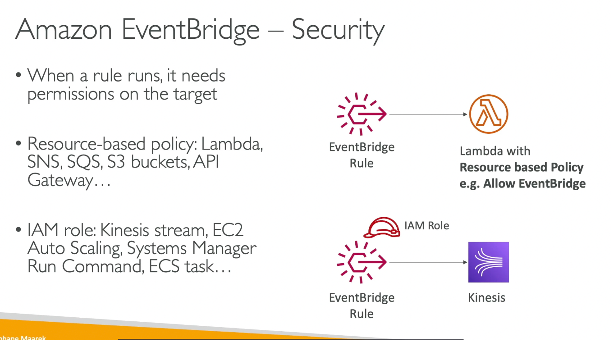

# 287. Organizations 
AWS Organizations là một dịch vụ toàn cầu cho phép bạn quản lý nhiều **AWS accounts** cùng một lúc. Trong đó:
- **Management account** là tài khoản chính của tổ chức.
- Các tài khoản khác tham gia vào tổ chức hoặc được tạo từ tổ chức gọi là **member accounts**.
- **Accounts** có thể chỉ tham gia vào một tổ chức duy nhất.

### Lợi Ích Chính:
1. **Consolidated billing**: Hóa đơn được hợp nhất cho tất cả các tài khoản trong tổ chức, giúp dễ dàng quản lý chi phí. **Payment method** chỉ cần được thiết lập ở **management account** và thanh toán cho toàn bộ chi phí của tổ chức.
2. **Pricing benefits**: Tổ chức sẽ nhận được mức giá ưu đãi từ việc sử dụng chung tài nguyên, ví dụ như **EC2** hoặc **S3**, vì toàn bộ sử dụng từ các tài khoản sẽ được cộng dồn và tính toán tổng cộng, giúp nhận được các **discounts**.
3. **Reserved instances** và **saving plans**: Các tài khoản có thể chia sẻ **reserved instances** và **saving plans** discounts giữa các tài khoản, giúp tiết kiệm chi phí. Nếu một **reserved instance** không được sử dụng trong một tài khoản, các tài khoản khác trong tổ chức có thể tận dụng và hưởng lợi từ việc chia sẻ **discounts**.

### Quản Lý Tài Khoản và Tổ Chức:
- **Root Organizational Unit (OU)** là cấp tổ chức bên ngoài cùng và bao gồm **management account**.
- Bạn có thể tạo thêm các **sub-OUs**, ví dụ như tạo **OU** cho môi trường **dev** và tạo **member accounts** trong **dev OU**, hoặc tạo **OU** cho môi trường **prod** và thêm các **member accounts** vào đó. Bạn hoàn toàn tự do trong việc tạo cấu trúc các **OUs**. Bạn có thể tạo **OU** cho các bộ phận như **HR** hoặc **finance** trong **prod OU**.
- Các **OUs** có thể được phân chia theo:
    - **Business units**: Ví dụ, có thể có **management account**, rồi các **OU** như **sales**, **retail**, **finance**, và mỗi **OU** có các tài khoản riêng.
    - **Environments**: Ví dụ, một **OU** cho **prod**, một **OU** cho **test**, một **OU** cho **dev**, và trong mỗi **OU** có các tài khoản con.
    - **Projects**: Ví dụ, bạn có thể tạo một **OU** cho mỗi dự án và các tài khoản trong đó.
- Bạn có thể kết hợp và lựa chọn cấu trúc phù hợp với nhu cầu của mình.

### Các Ưu Điểm:
1. **Better security**: Nhờ vào việc sử dụng nhiều tài khoản, bạn sẽ có sự phân tách tốt hơn so với việc sử dụng một tài khoản với nhiều **VPC**, vì các tài khoản sẽ được tách biệt hơn.
2. **Enforce tagging standards**: Bạn có thể áp dụng các tiêu chuẩn **tagging** cho mục đích **billing**.
3. **Centralized management**: Bạn có thể bật **CloudTrail** cho tất cả các tài khoản trong tổ chức và gửi các **logs** vào một tài khoản **S3** trung tâm. Ngoài ra, bạn có thể gửi **CloudWatch logs** vào một tài khoản logging trung tâm. Các **cross-account roles** có thể được thiết lập để quản lý quyền admin trên tất cả các tài khoản từ **management account**.
4. **Service Control Policies (SCPs)**: Đây là chính sách **IAM** được áp dụng cho các **OUs** hoặc tài khoản cụ thể, giúp bạn hạn chế những hành động mà người dùng và vai trò có thể thực hiện trong tài khoản. **SCPs** sẽ áp dụng cho tất cả tài khoản trừ **management account**, vì tài khoản này sẽ luôn có quyền **admin** đầy đủ.

# 290. IAM Role and Resouce base policy
- Iam role: assume a role => các permission ban đầu sẽ bị từ bỏ
  - VD: sử dụng account A scan dynamoDB ở account A, write vào S3 ở account B => bắt buộc sử dụng resouce base policy gắn vào S3 bucket policy

# 291. IAM permission boundary 
- Hỗ trợ với users and roles, **not for groups**
- 

