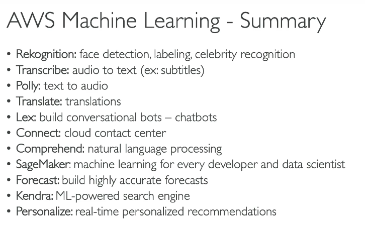
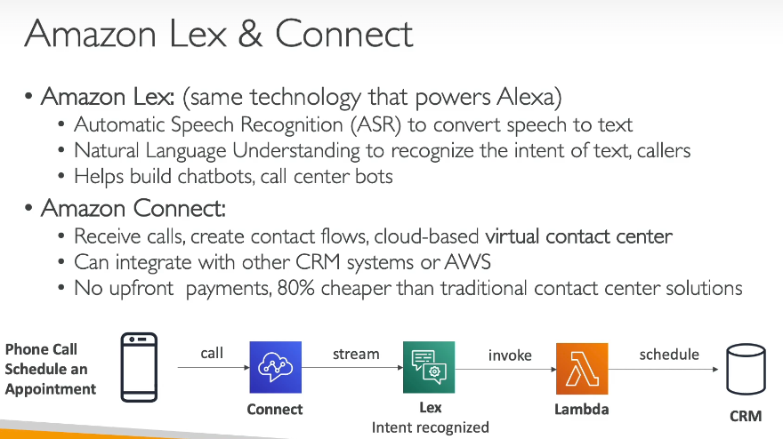
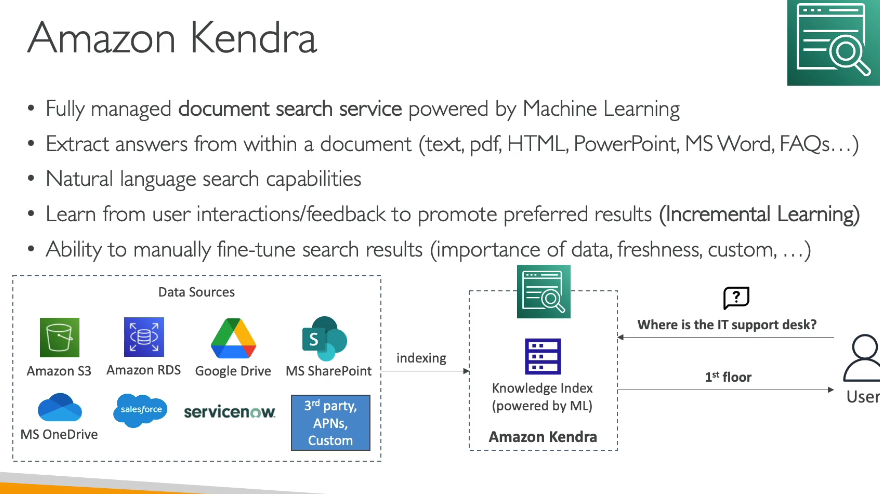
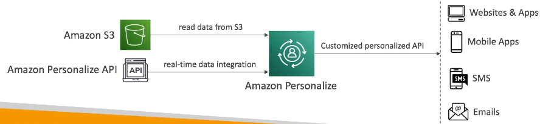
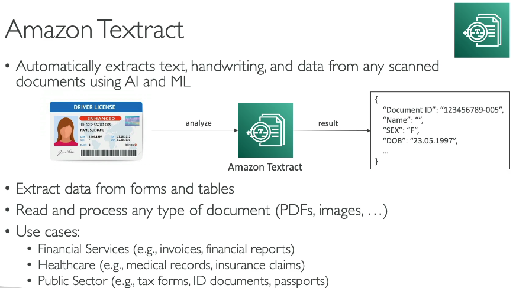

# 258. Rekognition
**-> for image + video** analysis 
- Tìm object, people, text, scenes trong ảnh/video 
- Verify user, đếm số lượng người 
- familar face 
- content moderation (kiểm duyệt nội dung)
  - Phát hiện những thứ không phù hợp, gây khó chịu trong image/video => trải nghiệm an toàn với user
  - Set ngưỡng tối thiểu confidence cho item sẽ được gắn cờ. 
  - có thể sử dụng Amazon Augmented AI (A2I) cho manual review 
  - => image => Rekognition => confidence level and threshould => A2I 

# 259. Transcribe
- Convert speech to text
- Auto remo PII (Personally identifiable information) using Redaction 
- Auto Language identification cho nhiều ngôn ngữ trong audio 

# 260. Polly 
- Text/voice... -> audio giống như ng thật (lifelike speed)
  - Sử dụng tạo app talking 
- Customize phát âm của từ với **Pronunciation lexicon**
  - VD: AWS -> phát âm là amazon web service 
- SynthesizeSpeed: update từ điển
- SSML: custom như nhấn mạnh, thì thầm, ...
# 261. Translate
- localize content 

# 262. Lex + Connect 
 
- Alexa: trợ lý ảo trong nhà/ => build chatbot/caller 
- Auto ASR: speed to text and Underrstanding intent of tex

# 263. Comprehend (hiểu biết)
- For NLP -> xử lý ngôn ngữ tự nhiên 
- Fully managed and serverless 

### amazon comprehend medical 
- input : text 
- dịch vụ cho phép detect các thông tin hữu ích từ những tài liệu y tế 
- cung cấp DetectPHI API 
- Usecase:
  - Store document in S3 -> phân tích realtime sử dụng KDF hoặc amazon trnasscribe to Text => sử dụng ACM 

# 265. SageMaker 
- fully managed service cho phép user build ML models  => labeling, training, deploying.... model in SakeMager 

# 266. Kendra 
- Document search service 

# 267. Personalize
- real-time đề xuất cá nhân hóa 

# 268. Textract 
- tự động extract text, chữ biết tay hoặc any data từ any scan document => textract => json data 

# Amazon Forecast
Amazon Forecast is a fully managed service for time-series forecasting, which might not be a complete solution for detecting fraudulent transactions.
