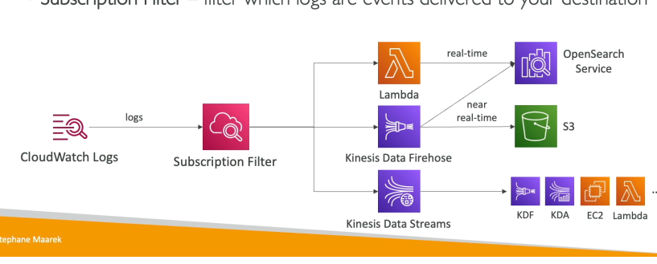

# 272. CloudWatch Metrics
**Amazon CloudWatch** là dịch vụ giúp giám sát và theo dõi các dịch vụ AWS. **CloudWatch Metrics** cung cấp các chỉ số cho mọi dịch vụ trong AWS, giúp bạn theo dõi các hoạt động trong tài khoản của mình.

- **Metrics** là các biến mà bạn muốn giám sát, ví dụ:
    - **EC2 instance**: CPUUtilization, NetworkIn, v.v.
    - **Amazon S3**: Bucket size, v.v.
- **Namespaces**: Mỗi dịch vụ có một namespace riêng biệt, chứa các metric liên quan.
- **Dimensions**: Các thuộc tính của metric (instance id, env, ...), mỗi metric có thể có tối đa **30 dimensions**.
- **Time-based**: Metrics phải có một timestamp. Dữ liệu sẽ được ghi lại theo thời gian.

- Bạn có thể tạo **CloudWatch Dashboards** để xem tất cả metrics theo cách cụ thể.
- **CloudWatch Custom Metrics**: Bạn có thể tạo metric tùy chỉnh. Ví dụ, để theo dõi bộ nhớ (memory usage) của một **EC2 instance**.

### Streaming CloudWatch Metrics

- Bạn có thể **stream** CloudWatch Metrics ra ngoài CloudWatch:
    - Truyền dữ liệu gần như theo thời gian thực (**near real-time**) với độ trễ thấp.
    - Đích đến có thể là **Amazon Kinesis Data Firehose**, và từ đó bạn có thể gửi tới:
        - **Amazon S3**, **Amazon Redshift** (phân tích dữ liệu), **Amazon OpenSearch** (xây dựng dashboard hoặc phân tích dữ liệu).
        - Các dịch vụ của bên thứ ba như **Datadog**, **Dynatrace**, **New Relic**, **Splunk**, **Sumo Logic**, v.v.
        - **Third-party Services**: CloudWatch Metrics có thể gửi trực tiếp tới các nhà cung cấp dịch vụ bên thứ ba (Datadog, Splunk, v.v.) qua **HTTP endpoint integration**.

- **Lọc theo region, dimension, hoặc resource ID**: CloudWatch Metrics cho phép bạn lọc dữ liệu theo các thuộc tính khác nhau để dễ dàng theo dõi các thông tin liên quan.

---

# 273. CloudWatch Logs

- CloudWatch Logs là nơi lý tưởng để lưu trữ các log ứng dụng trong AWS.
- Để sử dụng CloudWatch Logs, bạn cần định nghĩa log groups. Mỗi nhóm log thường đại diện cho một ứng dụng cụ thể.
- Trong mỗi log group, bạn sẽ có nhiều log streams. Các log stream này đại diện cho các phiên log của ứng dụng hoặc các log file, container trong một cluster.

- Bạn có thể định nghĩa log expiration policy, cho phép lưu trữ log vô thời hạn hoặc tùy chỉnh thời gian hết hạn từ 1 ngày đến 10 năm.
- Các log trong CloudWatch Logs được mã hóa mặc định và bạn có thể thiết lập mã hóa riêng bằng KMS nếu muốn.

### Source 
- SDK, CloudWatch Logs Agent và CloudWatch Unified Agent có thể gửi log vào CloudWatch.
- Các dịch vụ như Elastic Beanstalk, ECS, Lambda, VPC Flow Logs, API Gateway, CloudTrail và Route 53 đều có thể gửi log trực tiếp vào CloudWatch Logs.

## Truy vấn và phân tích log

- CloudWatch Logs Insights là công cụ cho phép bạn truy vấn và phân tích log dữ liệu trong CloudWatch Logs.
- Bạn có thể viết truy vấn, chỉ định khung thời gian, và nhận kết quả dưới dạng visualization.
- Visualizations có thể xuất ra dưới dạng kết quả hoặc thêm vào CloudWatch Dashboards để sử dụng lại.
- Có thể lưu truy vấn và thực hiện lại khi cần.

- CloudWatch Logs Insights hỗ trợ các truy vấn đơn giản, ví dụ như tìm các sự kiện gần đây nhất, đếm số lượng lỗi hoặc ngoại lệ trong log, tìm kiếm IP cụ thể, v.v.
- Công cụ cung cấp ngôn ngữ truy vấn chuyên biệt để lọc, tính toán thống kê tổng hợp, và giới hạn số lượng sự kiện.
- CloudWatch Logs Insights là một công cụ truy vấn dữ liệu lịch sử, không phải công cụ tìm kiếm thời gian thực.

## Export log từ CloudWatch Logs
- CW logs có thể gửi logs tới: S3, Kinesis data streams/firehose, Lambda, OpenSearch
- Bạn có thể xuất log theo lô (batch) vào Amazon S3 qua API gọi CreateExportTask. Quá trình xuất có thể mất đến 12 giờ.
- Để truyền tải log theo thời gian thực, bạn cần sử dụng CloudWatch Logs Subscription.
- Các dữ liệu có thể được gửi đến các đích như Kinesis Data Streams, Kinesis Data Firehose, hoặc AWS Lambda.

## CloudWatch Logs Subscription và các dịch vụ đích

- Bạn có thể sử dụng subscription filter để chỉ định loại log sự kiện cần gửi đến đích.
- Một số đích có thể là Kinesis Data Streams, Kinesis Data Firehose, hoặc Lambda.
- Bạn có thể sử dụng Kinesis Data Firehose để gửi log gần như thời gian thực vào Amazon S3, OpenSearch Service, hoặc Lambda.

## Cách thức làm việc với các đích và tài khoản khác

- Để gửi dữ liệu log từ **CloudWatch Logs** trong một tài khoản (gửi) đến một đích trong tài khoản khác (nhận), bạn cần sử dụng **destinations**.
- Các bước cơ bản để thiết lập này như sau:
    1. **Tạo CloudWatch Log Subscription Filter**: Đây là bước đầu tiên để thiết lập việc gửi log đến một đích cụ thể. Subscription filter sẽ chỉ định loại log sự kiện cần gửi đi.
    2. **Tạo Destination**: Đây là điểm đích để gửi dữ liệu log. Đích có thể là một **Kinesis Data Stream**, **Kinesis Data Firehose**, hoặc các dịch vụ như **Lambda**, **Amazon S3**, v.v. Điều quan trọng là destination phải là một **virtual representation** của đích nhận trong tài khoản khác.
    3. **Gán Destination Access Policy**: Bạn cần tạo và gán một **destination access policy** cho phép tài khoản gửi log có quyền gửi dữ liệu vào destination trong tài khoản nhận.
    4. **Tạo IAM Role trong tài khoản nhận**: Tạo một **IAM role** trong tài khoản nhận, cấp quyền cho tài khoản gửi dữ liệu log vào destination (ví dụ: Kinesis Data Stream). IAM role này sẽ cần có quyền gửi dữ liệu vào các dịch vụ nhận và phải có khả năng bị **assumed** bởi tài khoản gửi log.
    5. **Kết nối tài khoản gửi và nhận**: Đảm bảo rằng tài khoản gửi có thể **assume IAM role** trong tài khoản nhận, qua đó có thể gửi log từ CloudWatch Logs vào đích.

### Live Tail: Feature debug for cloudWatch

# 276. Agent

- **CloudWatch Agents** là công cụ giúp gửi logs và metrics từ **EC2 instances** (và cả các máy chủ tại chỗ) lên **CloudWatch**.
- Mặc định, không có log nào từ **EC2 instances** được gửi lên **CloudWatch**. Để làm điều này, bạn cần tạo và khởi chạy một **agent** trên EC2 instance để đẩy các log mà bạn muốn gửi.
- **IAM Role** của EC2 instance phải cho phép nó gửi logs lên **CloudWatch Logs**. Điều này đảm bảo rằng agent có quyền truy cập và gửi dữ liệu.

## Các loại CloudWatch Agents

- Có hai loại **CloudWatch Agents** bạn có thể sử dụng:
    - **CloudWatch Logs Agent**: Đây là phiên bản cũ, chỉ có thể gửi logs lên CloudWatch Logs.
    - **CloudWatch Unified Agent**: 
      - Phiên bản mới hơn, có thể thu thập cả **logs** và **metrics** hệ thống, bao gồm CPU, RAM, hệ thống I/O và các chỉ số khác.
      - Config sử dụng SSM parameter sotre

### Ưu điểm của CloudWatch Unified Agent

- **CloudWatch Unified Agent** có thể thu thập và gửi **metrics hệ thống** như CPU, RAM, Disk, Network, và các **metrics chi tiết** hơn so với CloudWatch Logs Agent.
- **Unified Agent** hỗ trợ cấu hình trung tâm thông qua **SSM Parameter Store**, giúp quản lý và cấu hình đồng bộ các agents dễ dàng.
- CloudWatch Unified Agent mang lại thông tin chi tiết và mức độ chi tiết cao hơn về các metrics hệ thống so với EC2 mặc định, chẳng hạn như:
    - **CPU Metrics**: active, guest, idle, system, user, steal.
    - **Disk Metrics**: free, used, total, IO (read, write, iops).
    - **RAM Metrics**: free, inactive, used, total, cached.
    - **Network Stats**: TCP/UDP connections, network packets, bytes.
    - **Processes**: tổng số tiến trình, dead, blocked, idle, running, sleep.
    - **Swap Space**: mức độ sử dụng swap space, bao gồm free, used, và tỷ lệ phần trăm.

---

# 278. CloudWatch Alarms

- **CloudWatch Alarms** được sử dụng để kích hoạt thông báo từ bất kỳ metric nào.
- Bạn có thể định nghĩa các alarm phức tạp với các tùy chọn như **sampling**, **percentage**, **maximum**, v.v.
- Alarms có ba trạng thái:
    - **OK**: Alarm chưa bị kích hoạt.
    - **INSUFFICIENT_DATA**: Không đủ dữ liệu để xác định trạng thái.
    - **ALARM**: Ngưỡng đã bị vi phạm, và thông báo sẽ được kích hoạt.

- **Period** là khoảng thời gian mà alarm sẽ đánh giá metric. Có thể rất ngắn hoặc rất dài và có thể áp dụng cho các **high-resolution customer metrics** (ví dụ: 10 giây, 30 giây, hoặc bội số của 60 giây).
- Bạn có thể tạo một **CloudWatch Alarm** để giám sát các **status checks** này. Khi **alarm** bị vi phạm, có thể kích hoạt **EC2 Instance Recovery** để di chuyển instance từ máy chủ này sang máy chủ khác.

- Bạn cũng có thể gửi thông báo tới **SNS** khi EC2 instance được phục hồi.

- Bạn có thể tạo alarm từ **CloudWatch Logs Metric Filter**. Khi số lượng log chứa từ khóa cụ thể (ví dụ: “error”) vượt quá ngưỡng, alarm sẽ được kích hoạt và thông báo gửi qua **SNS**.

- Bạn có thể sử dụng lệnh CLI **set alarm states** để thử nghiệm alarm và thông báo mà không cần chờ đạt ngưỡng cụ thể. Điều này giúp kiểm tra xem alarm có kích hoạt đúng hành động cho hạ tầng của bạn hay không.

### CloudWatch Alarms có thể kích hoạt ba hành động chính:
- **EC2 Actions**: Dừng, hủy, khởi động lại, hoặc khôi phục EC2 instances.
- **Auto-Scaling Actions**: Kích hoạt hành động **scale-out** hoặc **scale-in**.
- **SNS Notifications**: Gửi thông báo tới **SNS**, và từ đó có thể kích hoạt **Lambda function** để thực hiện các tác vụ tùy chỉnh.

## Composite Alarms

- **Composite Alarms** cho phép giám sát trạng thái của nhiều alarm khác nhau, mỗi alarm có thể dựa trên các metric khác nhau.
- Bạn có thể sử dụng **AND** hoặc **OR** conditions để kết hợp các alarm và giảm thiểu **alarm noise**.

### Ví dụ:
- **Alarm A**: Giám sát CPU của EC2 instance.
- **Alarm B**: Giám sát IOPS của EC2 instance.
- Một **Composite Alarm** sẽ chỉ được kích hoạt khi **Alarm A** và **Alarm B** đều ở trạng thái **ALARM**.

## EC2 Instance Recovery

- **Status Checks**: Bao gồm:
    - **Instance Status Check**: Kiểm tra trạng thái của EC2 instance.
    - **System Status Check**: Kiểm tra phần cứng nền tảng của EC2 instance.
    - **EBS Status Check**: Kiểm tra tình trạng của các EBS volumes gắn với instance.

# 279. EventBridge
- **Amazon EventBridge** trước đây được gọi là **CloudWatch Events**.
- Với EventBridge, bạn có thể thực hiện nhiều tác vụ, chẳng hạn như lên lịch **cron jobs** trong Cloud, ví dụ: "Mỗi giờ, hãy kích hoạt một Lambda function", và Lambda sẽ thực hiện một script.
- EventBridge không chỉ hỗ trợ lịch trình mà còn có thể phản ứng với **event patterns**.

### Source EventBridge

Các dịch vụ AWS có thể gửi sự kiện vào **EventBridge**, ví dụ:
- **EC2 instances**: Khi EC2 bắt đầu, dừng, hoặc bị hủy.
- **CodeBuild**: Khi một build thất bại.
- **S3**: Khi một đối tượng được tải lên.
- **Trusted Advisor**: Khi có một finding mới về bảo mật.
- **CloudTrail**: Để chặn bất kỳ API call nào trong tài khoản AWS của bạn.

### EventBridge Rules và Filter

- **EventBridge** có thể sử dụng **event rules** để phản ứng với các sự kiện từ dịch vụ AWS. Ví dụ: chỉ nhận các sự kiện từ một **S3 bucket** cụ thể.
- Sự kiện được gửi dưới dạng **JSON document**, chứa các chi tiết về sự kiện, như ID instance, thời gian, IP, v.v.

### Destination EventBridge

- Các sự kiện có thể được gửi tới nhiều đích khác nhau:
    - Kích hoạt **Lambda functions**.
    - Gửi thông báo qua **SNS** hoặc **SQS**.
    - Kích hoạt **AWS Batch** hoặc **ECS task**.
    - Gửi vào **Kinesis Data Stream**.
    - Kích hoạt **Step Functions**, **CodePipeline**, **CodeBuild**, v.v.

### EventBridge Bus

- **Default Event Bus**: Đây là bus mặc định, nhận sự kiện từ các dịch vụ AWS.
- **Partner Event Bus**: Được sử dụng khi có tích hợp giữa AWS và các đối tác bên ngoài (ví dụ: Zendesk, Datadog, Auth0). Các sự kiện từ các đối tác sẽ được gửi vào **partner event bus**.
- **Custom Event Bus**: Bạn có thể tạo **custom event buses** để gửi sự kiện từ các ứng dụng riêng của mình vào. Bạn cũng có thể thiết lập các quy tắc để gửi sự kiện đến các đích khác nhau.

### Quản lý sự kiện và bảo mật

- **Resource-based policies** cho phép quản lý quyền truy cập vào **event bus**. Bạn có thể cấp quyền cho các tài khoản khác để gửi sự kiện vào **central event bus** của tổ chức AWS.
- **Event Archiving** cho phép lưu trữ các sự kiện, bạn có thể chọn giữ lại sự kiện vĩnh viễn hoặc trong một khoảng thời gian xác định. Bạn cũng có thể **replay** các sự kiện đã lưu trữ để kiểm tra lỗi hoặc khắc phục sự cố.

### Schema Registry và Code Generation

- **Schema Registry** giúp EventBridge phân tích các sự kiện và suy ra cấu trúc của chúng. Dựa vào **Schema**, bạn có thể sinh mã nguồn ứng dụng để xử lý các sự kiện, biết trước cấu trúc dữ liệu.
- **Schemas** có thể được phiên bản hóa để hỗ trợ thay đổi theo thời gian.

### Tích hợp và Cross-Account

- Với **cross-account event buses**, bạn có thể thiết lập các chính sách để cho phép các tài khoản khác gửi sự kiện vào event bus của tài khoản chính, giúp tập trung sự kiện từ nhiều tài khoản AWS khác nhau.

---

# 281. CloudWatch Insights and Operational Visibility 
- **CloudWatch Container Insights**: Giám sát các container trên ECS, EKS, Kubernetes trên EC2 và Fargate.
- **CloudWatch Lambda Insights**: Giám sát chi tiết các ứng dụng serverless trên AWS Lambda.
- **CloudWatch Contributor Insights**: Phân tích và tìm kiếm các **top contributors** trong log CloudWatch.
- **CloudWatch Application Insights**: Tạo các dashboard tự động giúp xử lý sự cố cho ứng dụng và các dịch vụ liên quan trên AWS.

### 1. CloudWatch Container Insights

- **CloudWatch Container Insights** là công cụ giúp thu thập, tổng hợp và tóm tắt các chỉ số và log từ các container.
- Hỗ trợ cho các container chạy trên **Amazon ECS**, **Amazon EKS**, **Kubernetes trên EC2** hoặc **Fargate** (cho cả ECS và EKS).
- Sử dụng **CloudWatch container insights** để trích xuất các chỉ số và log chi tiết từ container vào một dashboard trực quan trong CloudWatch.
- Đặc biệt, khi sử dụng trên **Kubernetes**, CloudWatch sử dụng một phiên bản container hóa của các **CloudWatch agents** để phát hiện các container.

### 2. CloudWatch Lambda Insights

- **Lambda Insights** là giải pháp giám sát và xử lý sự cố cho các ứng dụng serverless chạy trên **AWS Lambda**.
- Thu thập các chỉ số hệ thống, bao gồm **CPU time**, **memory**, **disk**, và **network**, cùng với thông tin về **cold starts** và **Lambda worker shutdowns**.
- Được cung cấp dưới dạng một **Lambda layer** và chạy song song với **Lambda function**, tạo một dashboard đặc biệt để theo dõi hiệu suất của các Lambda functions.

### 3. CloudWatch Contributor Insights

- **Contributor Insights** giúp phân tích log và tạo ra các chuỗi thời gian hiển thị dữ liệu đóng góp.
- Ví dụ: bạn có thể xem **top contributors** hoặc tổng số **unique contributors** và mức sử dụng của họ.
- Sử dụng với các log do AWS tạo ra, như **VPC logs** hoặc **DNS logs**.
- Ví dụ: nhận diện **bad hosts** từ **VPC flow logs**, tìm các IP tạo ra lượng traffic lớn trong VPC của bạn, từ đó hiểu rõ hơn về các hành vi xấu hay tốt.

### 4. CloudWatch Application Insights

- **CloudWatch Application Insights** cung cấp các dashboard tự động để hiển thị các vấn đề tiềm ẩn của các ứng dụng được giám sát và giúp cách ly các sự cố đang diễn ra.
- Hỗ trợ ứng dụng chạy trên **Amazon EC2** và các công nghệ như **Java**, **.NET**, **Microsoft IIS**, hoặc các cơ sở dữ liệu cụ thể.
- Liên kết với các dịch vụ AWS khác như **EBS**, **RDS**, **ELB**, **ASG**, **Lambda**, **SQS**, **DynamoDB**, **S3**, **ECS**, **EKS**, **SNS**, hoặc **API Gateway**.
- Tự động tạo các dashboard hiển thị vấn đề liên quan đến các dịch vụ, giúp giảm thời gian xử lý sự cố và bảo trì ứng dụng.
- Dùng **SageMaker machine learning** để phân tích và đưa ra các cảnh báo, sau đó gửi đến **Amazon EventBridge** và **SSM OpsCenter**.

---

# 282. CloudTrail 
### 1. Tổng Quan về CloudTrail

- **CloudTrail** cung cấp khả năng quản lý, tuân thủ và kiểm toán cho các tài khoản AWS của bạn.
- **CloudTrail** được bật mặc định và ghi lại tất cả các sự kiện và API calls thực hiện trong tài khoản AWS của bạn, bao gồm các hành động từ console, SDK, CLI, và các dịch vụ khác của AWS.
- Logs có thể được gửi vào **CloudWatch Logs** hoặc **Amazon S3** và có thể cấu hình để lưu trữ trên tất cả các khu vực hoặc một khu vực riêng biệt.
- Các sự kiện trong **CloudTrail** mặc định được lưu trữ trong 90 ngày, sau đó sẽ bị xóa. Nếu bạn muốn lưu trữ các sự kiện lâu dài (hơn 90 ngày), bạn cần gửi chúng vào **S3** và sử dụng **Athena** để phân tích lại các sự kiện khi cần.

### 2. Các Loại Sự Kiện trong CloudTrail
#### 2.1. **Management Events**
- **Management Events** ghi lại các thao tác thực hiện trên các tài nguyên trong tài khoản AWS của bạn, ví dụ như khi cấu hình bảo mật hoặc tạo subnet.
- Các sự kiện này mặc định được ghi lại và bao gồm:
    - **Read Events**: Không thay đổi tài nguyên, như liệt kê người dùng IAM.
    - **Write Events**: Thay đổi tài nguyên, ví dụ như xóa DynamoDB table.

#### 2.2. **Data Events**
- **Data Events** ghi lại các hoạt động cấp đối tượng như **GetObject**, **PutObject**, hoặc **DeleteObject** trên **Amazon S3**.
- Vì là các thao tác có thể có tần suất cao, mặc định chúng không được ghi lại. Tuy nhiên, bạn có thể cấu hình để ghi lại các sự kiện này.
- Ghi lại các hoạt động gọi **Invoke API** khi một Lambda function được gọi, giúp bạn hiểu tần suất hoạt động của Lambda functions.

#### 2.3. **CloudTrail Insights Events**
- **CloudTrail Insights** giúp phân tích các sự kiện để phát hiện các hoạt động bất thường trong tài khoản AWS của bạn, như sự thay đổi trong việc cung cấp tài nguyên, vượt giới hạn dịch vụ, hay các hoạt động IAM bất thường.

### CloudTrail Insights
- **CloudTrail Insights** cần được kích hoạt và có phí. Nó sẽ phân tích các sự kiện để phát hiện các hoạt động không bình thường và tạo ra các **Insight Events**.
- Ví dụ về các hoạt động bất thường có thể bao gồm:
    - Phân phối tài nguyên không chính xác.
    - Vượt quá giới hạn dịch vụ AWS.
    - Các hành động IAM đột ngột tăng vọt.
---

# 285. AWS Config

### 1. Tổng Quan về AWS Config

- **AWS Config** là một dịch vụ giúp bạn kiểm tra, ghi nhận và đảm bảo tính tuân thủ các cấu hình của tài nguyên trong AWS, dựa trên các quy tắc mà bạn thiết lập.
- Bạn có thể theo dõi sự thay đổi cấu hình của tài nguyên theo thời gian, giúp bạn dễ dàng quay lại và xác định sự cố trong cơ sở hạ tầng của mình khi cần thiết.

**Ví dụ về những câu hỏi AWS Config có thể giúp bạn trả lời**:
- **SSH access không bị giới hạn đối với security groups của tôi?**
- **Các bucket của tôi có đang có quyền truy cập công khai không?**
- **Cấu hình ALB của tôi có bị thay đổi theo thời gian không?**

- **Config** là dịch vụ theo khu vực, vì vậy bạn cần cấu hình nó cho tất cả các khu vực nếu cần thiết.
- Bạn có thể tổng hợp dữ liệu từ nhiều khu vực và tài khoản vào một nơi duy nhất, hoặc lưu trữ cấu hình của tất cả tài nguyên vào **Amazon S3** để phân tích sau này bằng công cụ như **Athena**.
### 2. Config Rule

- AWS cung cấp hơn **75 quy tắc** mà bạn có thể sử dụng để kiểm tra tính tuân thủ của các tài nguyên trong AWS.
- Bạn cũng có thể tạo **quy tắc riêng** của mình bằng cách sử dụng **Lambda function**.

**Các quy tắc của AWS Config**:
- Các quy tắc này **không ngăn chặn hành động** xảy ra, mà chỉ đánh giá và cảnh báo về tính tuân thủ của tài nguyên.
- Các quy tắc có thể được đánh giá dựa trên sự thay đổi cấu hình của tài nguyên hoặc theo **khoảng thời gian định kỳ**.

### 3. Các Loại Quy Tắc trong AWS Config

- **Quy tắc quản lý của AWS (AWS Managed Config Rules)**: Có sẵn hơn 75 quy tắc mà AWS đã tạo sẵn cho bạn sử dụng.
- **Quy tắc tự tạo (Custom Config Rules)**: Bạn có thể tạo quy tắc của riêng mình, sử dụng **Lambda function** để đánh giá tính tuân thủ.

**Ví dụ về quy tắc tự tạo**:
- Đánh giá xem các **EBS volumes** có phải là loại **gp2** không.
- Đánh giá xem các **EC2 instances** trong tài khoản phát triển có phải loại **t2.micro** không.

### 4. Lưu Trữ và Phân Tích Dữ Liệu

- AWS Config lưu trữ dữ liệu cấu hình trong **Amazon S3** sau 90 ngày để bạn có thể phân tích sau này bằng các công cụ như **Athena**.
- Bạn cũng có thể sử dụng **EventBridge** để kích hoạt các sự kiện và thông báo khi tài nguyên không tuân thủ quy tắc.

### 5. Remediation (Xử Lý Lỗi)

- Mặc dù AWS Config không thể ngừng các hành động không tuân thủ, bạn có thể **tự động xử lý các tài nguyên không tuân thủ** bằng cách sử dụng **SSM Automation Documents**.
    - Ví dụ, bạn có thể tạo một tài liệu tự động để **vô hiệu hóa IAM access keys** nếu chúng quá hạn (hơn 90 ngày).

- Hành động **remediation** có thể bao gồm **retry** (thử lại) nếu tài nguyên vẫn không tuân thủ sau khi thực hiện remediation lần đầu.

### 6. Cảnh Báo và Thông Báo

- **SNS** có thể được sử dụng để gửi thông báo về trạng thái tuân thủ của các tài nguyên AWS.
- Bạn cũng có thể sử dụng **EventBridge** để kích hoạt các sự kiện tùy chỉnh và gửi thông báo khi có thay đổi trạng thái tuân thủ của tài nguyên.

