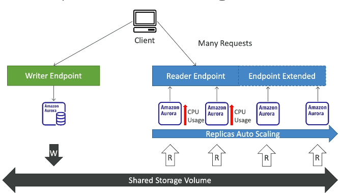

# 89. RDS Read Replicas & Multi AZ
#### **Read Replicas**
- Mục đích: Giúp scale reads, mở rộng khả năng đọc của hệ thống.
- Cơ chế:
    - Asynchronous replication từ Master database instance.
    - Dữ liệu có thể có độ trễ nhẹ gọi là eventually consistent.
- Sử dụng:
    - Tối ưu cho các truy vấn SELECT, chỉ hỗ trợ đọc dữ liệu. Không hỗ trợ INSERT, UPDATE, DELETE -> not change database
    - Có thể sử dụng cho các trường hợp chạy báo cáo hoặc analytics mà không làm slow down database
    - Có thể promted 1 replica làm DB chính 
- Hỗ trợ tối đa 15 Read Replicas
- Hỗ trợ triển khai trong cùng Availability Zone, cross Availability Zone, hoặc cross Region.
  - Network cost (thường CÓ khi data di chuyển từ AZ -> AZ khác, exception thường có với các managed service):
    - Data transfer to same REGION is  free but cross REGION isn't free

#### **Multi AZ**
- Mục đích: Đảm bảo Disaster Recovery, increase availability!
- Cơ chế:
    - Synchronous replication giữa Master database và Standby instance trong Availability Zone khác.
    - Cung cấp 1 DNS name sử dụng để automatic failover khi master DB gặp disaster  
    - VD: loss of AZ, loss of network, instance or storage failure 
    - Tự động chuyển đổi (No manual) miễn là hệ thống trying to connect DB 
- Sử dụng:
    - Standby database chỉ hoạt động như bản dự phòng, không thể read/write dữ liệu và không sử dụng cho mục đích scaling
    - Read Replicas có thể setup như 1 Multi AZ for DR 
- Chuyển đổi từ Single AZ sang Multi AZ là một thao tác zero downtime. Khi lựa chọn option này, AWS RDS tự động thực hiện snapshot và thiết lập Standby database.

#### **So sánh Read Replicas và Multi AZ**
- Read Replicas dùng để scale reads, hỗ trợ đọc dữ liệu từ các Replica, sử dụng asynchronous replication.
- Multi AZ dùng cho mục đích tăng tính sẵn sàng và Disaster Recovery, Standby database không hỗ trợ đọc hay ghi, sử dụng synchronous replication.
- Read Replica có thể được cấu hình như Multi AZ nếu cần. 

# 92. Amazon Aurora
#### Tổng quan
- Proprietary AWS Technology: Công nghệ độc quyền của AWS, tương thích với PostgreSQL và MySQL.
- Cloud-Optimized: Hiệu suất gấp 5x MySQL RDS và 3x PostgreSQL RDS nhờ các tối ưu hóa.
- Hỗ trợ tối đa 15 Read Replicas, tốc độ replication dưới 10ms, các Read Replica auto scaling
- Cả master và read replicas sử dụng chung storage volume. Shared storage volume auto expanding 10G->128TB
- Failover nhanh chóng:Auto chuyển đổi trong vòng dưới 30s
- High Availability: Lưu trữ 6 bản sao dữ liệu trên 3 AZ.

#### Tính năng lưu trữ
- Auto-Expanding Storage: Lưu trữ tự động mở rộng.
- Self-Healing: Sửa lỗi tự động thông qua peer-to-peer replication.
- Striped Storage: Dữ liệu được lưu trữ trên hàng trăm volume, giảm rủi ro hỏng hóc.

### Aurora DB Cluster 

#### Writer Endpoint
- Writer Endpoint là điểm kết nối (DNS name) dành riêng cho việc ghi (write). Nó luôn trỏ tới **master instance** của Aurora DB cluster, nơi sẽ nhận tất cả các yêu cầu ghi dữ liệu. 
- Nếu master instance gặp sự cố hoặc cần chuyển đổi (failover), Writer Endpoint sẽ tự động chuyển hướng đến instance mới trở thành master mà không cần sự can thiệp thủ công từ người dùng. Quá trình failover diễn ra nhanh chóng (thường trong vòng dưới 30 giây). Điều này đảm bảo ứng dụng luôn có thể ghi dữ liệu mà không gặp gián đoạn đáng kể. 
- Các ứng dụng yêu cầu ghi dữ liệu cần kết nối với Writer Endpoint để đảm bảo tất cả các thao tác ghi (INSERT, UPDATE, DELETE) đều được thực hiện trên master instance.

#### Reader Endpoint
- Reader Endpoint là điểm kết nối (DNS name) dành cho việc đọc (read). Nó hỗ trợ kết nối đến các **read replicas** của Aurora DB cluster, không phải là master instance.
- Load Balancing: Khi một ứng dụng kết nối tới Reader Endpoint, Aurora sẽ tự động phân phối các yêu cầu đọc giữa các read replicas. Điều này giúp giảm tải cho master instance và cải thiện hiệu suất của các truy vấn SELECT.
Lưu ý, LB hoạt động ở connection level _not_ statement level 
- Reader Endpoint giúp tối ưu hóa việc đọc dữ liệu từ Aurora DB cluster. Các ứng dụng chỉ thực hiện thao tác đọc có thể kết nối tới Reader Endpoint, làm giảm tác động lên master instance và cải thiện khả năng mở rộng hệ thống đọc.

#### Tính năng chính
- Automatic Failover
- Backup and Recovery
- Isolation and Security
- Industry Compliance
- Auto-Scaling Read Replicas
- Automated Patching with Zero Downtime
- Backtrack: Khôi phục dữ liệu tại bất kỳ thời điểm nào mà không cần backup.

#### Sử dụng
- Phù hợp cho ứng dụng yêu cầu hiệu năng cao, khối lượng dữ liệu lớn.
- Thích hợp cho các hệ thống cần scaling reads với độ trễ thấp và high availability.  

### Aurora More

- Replica Auto Scaling: giúp tự động điều chỉnh số lượng read replicas khi có lượng truy cập đọc cao, giúp giảm tải CPU. Khi có nhiều yêu cầu đọc, Aurora sẽ tự động thêm các replicas mới và mở rộng **Reader Endpoint** để phân phối lưu lượng truy cập, giúp giảm tải cho các instance hiện tại.

    

- Custom Endpoints cho phép bạn tạo ra các điểm kết nối dành riêng cho một tập hợp con các Aurora instances 
  - VD: instances có hiệu suất mạnh hơn, giúp tối ưu hóa cho các tác vụ đặc biệt như các truy vấn phân tích. Khi tạo **Custom Endpoints**, **Reader Endpoint** có thể không còn được sử dụng nữa.

- Aurora Serverless: cung cấp khả năng tự động mở rộng và giảm dung lượng DB dựa trên mức độ sử dụng thực tế.
  - Phù hợp với các workloads không ổn định hoặc không thể dự đoán. Bạn chỉ phải trả tiền cho những instances thực sự được sử dụng, giúp tiết kiệm chi phí.
  - Client giao tiếp với Proxy Fleet managed by Aurora 

- Aurora Global Database cho phép tạo các replica giữa các vùng khác nhau, giúp giảm độ trễ và hỗ trợ phục hồi thảm họa. Bạn có thể có một vùng chính (primary region) xử lý đọc và ghi, cùng với tối đa 5 vùng phụ (secondary regions) chỉ đọc. Phục hồi thảm họa có thể được thực hiện trong vòng ít hơn 1 phút.

- Aurora có tích hợp với các dịch vụ machine learning như **SageMaker** và **Comprehend**, cho phép thực hiện các dự đoán qua SQL mà không cần có kinh nghiệm về machine learning. Các tính năng này có thể sử dụng cho phát hiện gian lận, nhắm mục tiêu quảng cáo, phân tích cảm xúc và đề xuất sản phẩm.

# 95. RDS Backup and Monitoring 

#### **Automated Backups**
- RDS:
  - Hệ thống thực hiện full backup hàng ngày trong backup window.
  - Transaction logs được backup mỗi 5 phút, cho phép point-in-time recovery (khôi phục tại bất kỳ thời điểm nào) lên tới 5 phút trước thời điểm hiện tại.
  - Thời gian lưu trữ backup có thể cấu hình từ 1 đến 35 ngày. Nếu muốn vô hiệu hóa, bạn chỉ cần đặt giá trị lưu trữ là 0.
- Aurora:
  - Tương tự RDS nhưng không thể vô hiệu hóa. 
  - Hỗ trợ point-in-time recovery trong khoảng thời gian lưu trữ (1–35 ngày).
#### **Manual Snapshots**
- Được tạo thủ công bởi người dùng và có thể lưu trữ vô thời hạn.
- Lý tưởng khi bạn cần lưu giữ lâu dài trạng thái cụ thể của database hoặc khôi phục chính xác trong tương lai.
- Ví dụ: Nếu bạn biết database chỉ sử dụng 2 giờ mỗi tháng, bạn có thể:
  - Tạo một snapshot thủ công sau khi sử dụng xong.
  - Xóa database gốc để tiết kiệm chi phí.
  - Khi cần dùng lại, chỉ cần restore từ snapshot. 
  - Chi phí lưu trữ snapshot thấp hơn nhiều so với duy trì database.

#### **Restore Options**
- **Restore từ Automated Backups hoặc Manual Snapshots**:
  - Khi restore, luôn tạo ra một database mới để đảm bảo dữ liệu khôi phục không ảnh hưởng database hiện tại.

- **Restore từ Amazon S3**:
  - Backup database on-premises, tải lên Amazon S3
  - Tạo một RDS mới hoặc Aurora cluster từ file backup:
    - Với RDS MySQL, chỉ cần file backup thông thường.
    - Với Aurora MySQL, cần dùng Percona XtraBackup để tạo file backup, sau đó tải lên S3 trước khi khôi phục.

#### **Aurora Database Cloning**
- Cho phép tạo một Aurora database cluster mới từ một database hiện có.
- Thay vì sao chép toàn bộ dữ liệu như snapshot và restore, cloning sử dụng cơ chế copy-on-write, ban đầu chia sẻ dữ liệu với database gốc.
- Khi có cập nhật, dữ liệu mới được lưu riêng, đảm bảo sự độc lập giữa database gốc và bản clone.

#### **Lợi ích chính**
- Automated backups: Quản lý backup tự động, dễ dàng point-in-time recovery
- Manual snapshots: Lưu trữ lâu dài, tối ưu chi phí lưu trữ
- Restore linh hoạt: Từ S3, backups hoặc snapshots
- Cloning: Tạo nhanh môi trường kiểm thử từ production

# 96. RDS Security
#### **Encryption at Rest**
- Dữ liệu được mã hóa trên volume sử dụng KMS (Key Management Service).
- Mã hóa được thiết lập tại thời điểm khởi tạo database.
- Nếu master database không mã hóa, các read replica cũng không thể mã hóa.
- Để mã hóa database chưa mã hóa, cần:
  1. Tạo snapshot từ database hiện tại.
  2. Restore snapshot thành database mã hóa.

#### **In-Flight Encryption**
- Dữ liệu truyền tải giữa client và database được mã hóa mặc định.
- Client phải sử dụng TLS root certificates từ AWS để đảm bảo kết nối an toàn.

#### **Authentication**
- Hỗ trợ xác thực bằng username/password truyền thống.
- Có thể sử dụng IAM roles để xác thực, thay thế username/password.
- EC2 instances với IAM roles có thể kết nối trực tiếp đến database.

#### **Network Access Control**
- Truy cập mạng được kiểm soát qua security groups.
- Có thể giới hạn port, IP, hoặc security groups cụ thể.

#### **SSH Access**
- RDS và Aurora không hỗ trợ SSH access (do là dịch vụ managed).
- Trường hợp cần thiết, có thể sử dụng RDS Custom từ AWS.

#### **Audit Logs**
- Có thể kích hoạt Audit Logs để theo dõi các truy vấn và hoạt động database.
- Logs mặc định sẽ bị xóa sau một thời gian.
- Để lưu trữ lâu dài, gửi logs đến CloudWatch Logs.  

# 97. Amazon RDS Proxy 

RDS Proxy là một dịch vụ fully managed database proxy cho Amazon RDS, giúp cải thiện hiệu năng và quản lý kết nối đến cơ sở dữ liệu. Thay vì để từng ứng dụng trực tiếp kết nối đến RDS database, các ứng dụng sẽ kết nối đến RDS Proxy, nơi quản lý và pooling các kết nối này.

#### **Lợi ích chính**

**Connection Pooling**
  - RDS Proxy quản lý và chia sẻ các connection đến database.
  - Giảm số lượng kết nối trực tiếp đến database, giúp giảm tải cho tài nguyên như CPU, RAM, và tránh tình trạng timeout.

**Failover Management**
  - RDS Proxy hỗ trợ failover giữa primary instance và standby instance, giảm thời gian failover lên đến 66%.
  - Proxy xử lý failover tự động, ứng dụng không cần quản lý failover thủ công.

**IAM Authentication**
  - RDS Proxy cho phép sử dụng IAM authentication để kiểm soát truy cập vào database.
  - Kết hợp với AWS Secrets Manager để lưu trữ thông tin xác thực một cách an toàn.

**Compatibility**
  - Hỗ trợ các engine như MySQL, PostgreSQL, MariaDB, Microsoft SQL Server, và Aurora.
  - Không cần thay đổi mã nguồn, chỉ cần điều chỉnh điểm kết nối từ database trực tiếp sang Proxy.

**Enhanced Security**
  - RDS Proxy chỉ hoạt động trong VPC, không thể truy cập từ internet.

#### **Ứng dụng với AWS Lambda**
- Lambda functions, với khả năng mở rộng nhanh chóng, có thể tạo ra hàng trăm hoặc hàng nghìn kết nối đến database.
- RDS Proxy pooling các kết nối từ Lambda functions, giảm gánh nặng lên RDS database và ngăn chặn các vấn đề như connection timeout.

#### **Tóm tắt**
- RDS Proxy giúp tối ưu hóa connection pooling, giảm thời gian failover, và hỗ trợ IAM authentication.
- Đây là một giải pháp phù hợp cho các hệ thống sử dụng nhiều Lambda functions hoặc có yêu cầu bảo mật cao trong VPC.  

# 98. ElasticCache 

Là dịch vụ cung cấp bộ nhớ đệm được quản lý cho Redis và Memcached, hai công nghệ cơ sở dữ liệu 
trong bộ nhớ với hiệu suất cao và độ trễ thấp  
Cache lưu trữ kết quả của các truy vấn phổ biến
 
**Cơ chế hoạt động**:
- **Cache hit**: Nếu kết quả truy vấn đã có trong cache, hệ thống sẽ lấy kết quả trực tiếp từ ElastiCache mà không cần truy vấn lại cơ sở dữ liệu.
- **Cache miss**: Nếu kết quả không có trong cache, hệ thống sẽ truy vấn cơ sở dữ liệu và lưu kết quả vào cache cho lần truy vấn tiếp theo.

ElastiCache giúp bạn làm cho ứng dụng trở nên **stateless** bằng cách lưu trữ trạng thái của ứng dụng
trong ElastiCache. AWS quản lý các tác vụ bảo trì như hệ điều hành, vá lỗi, tối ưu hóa, cấu hình, giám sát, khôi phục sau sự cố và sao lưu.

**Redis vs Memcached**:
- **Redis** hỗ trợ **multi-availability zone** với **auto-failover** và khả năng tạo **read replicas** để mở rộng khả năng đọc và đảm bảo tính sẵn sàng cao. Redis còn hỗ trợ **AOF persistence** (tính bền vững dữ liệu) và tính năng sao lưu và phục hồi dữ liệu trên phiên bản mã nguồn mở.
- **Memcached** sử dụng nhiều **nodes** để phân chia dữ liệu (sharding), nhưng không hỗ trợ tính năng **high availability** hay **replication**. Nó cũng có kiến trúc **multi-thread**, giúp cải thiện hiệu suất.

Cả Redis và Memcached đều có ưu điểm và nhược điểm riêng, tùy vào từng tình huống sử dụng mà bạn sẽ lựa chọn công nghệ phù hợp.

