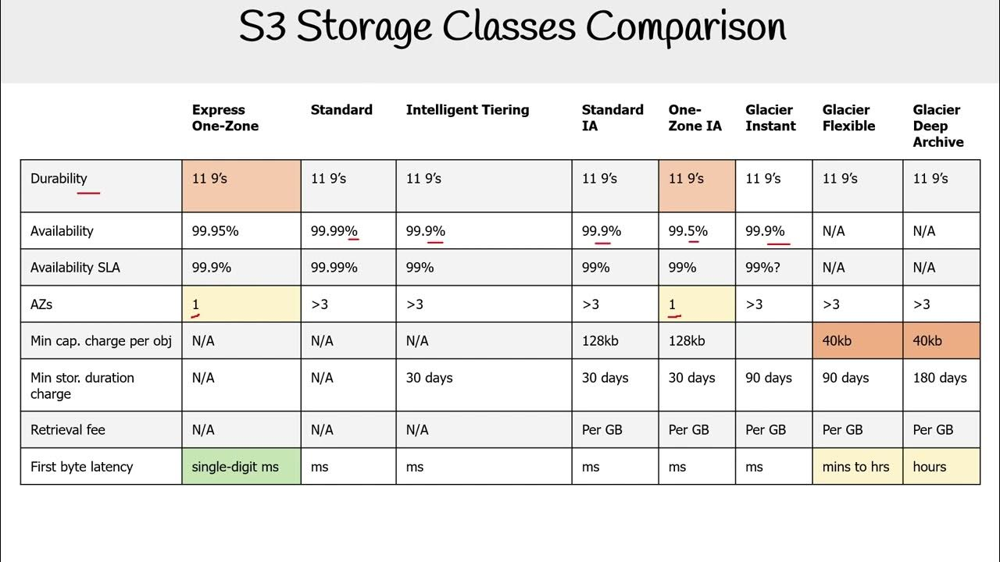

# 131. S3 Security

**User-Based**: 
  - IAM policies để cấp quyền cho các API calls mà người dùng IAM cụ thể có thể thực hiện.

**Encryption keys**: để mã hóa các đối tượng.

**Resource-Based Security**: 
- Bucket policies (phổ biến) để áp dụng các quy tắc phạm vi rộng, có thể gán trực tiếp từ S3 Console. Ví dụ:
    - Một người dùng cụ thể hoặc người dùng từ tài khoản khác (cross-account) có thể truy cập vào S3 Buckets của bạn.
    - Đây là cách làm cho S3 Buckets trở thành công khai.
- Ví dụ về Bucket Policy cho Public Access:
  - Người dùng trên worldwide web muốn truy cập vào các tệp trong S3 Buckets của bạn. Bạn sẽ gắn S3 Bucket policy cho phép truy cập công khai.
  - Sau khi chính sách này được gắn vào S3 Bucket, người dùng có thể truy cập vào bất kỳ đối tượng nào trong đó.

- Object Access Control List:Cung cấp bảo mật chi tiết hơn cho từng đối tượng và có thể tắt tính năng này. Nếu quản lý ở cấp Bucket, bạn có thể dùng Buckets ACL, nhưng ít phổ biến và có thể tắt đi.

- IAM principle có thể truy cập vào một S3 object nếu IAM permissions hoặc resource policies cho phép và không có explicit deny.
- Nếu có một người dùng IAM trong tài khoản của bạn và muốn truy cập Amazon S3, bạn có thể gán IAM permissions cho người dùng đó thông qua chính sách. Nếu chính sách cho phép, người dùng sẽ có thể truy cập S3 Buckets.
- Nếu bạn có một EC2 instance và muốn cấp quyền truy cập từ EC2 instance vào S3 Buckets, cần sử dụng IAM roles thay vì IAM users.

- Cross-Account Access:
    - Nếu có một IAM user trong tài khoản AWS khác, bạn cần tạo S3 Bucket policy cho phép quyền truy cập Cross-Account Access. Người dùng sẽ có thể thực hiện API calls vào S3 Buckets của bạn.

- Block Public Access settings:
    - AWS cung cấp cài đặt này như lớp bảo mật để ngăn ngừa rò rỉ dữ liệu.
    - Nếu bạn bật các cài đặt này, S3 Bucket của bạn sẽ không bao giờ trở thành công khai dù chính sách S3 Bucket có cho phép.
    - Nếu bạn chắc chắn rằng không có S3 Buckets nào của bạn cần công khai, có thể thiết lập ở cấp tài khoản.

# 140. S3 Storage Classes

### **Amazon S3 Standard-General Purpose (S3 Standard)**
- Đây là lớp lưu trữ mặc định trong Amazon S3, được sử dụng cho dữ liệu truy cập thường xuyên.
- S3 Standard có độ bền cao với "11 nines" (99.999999999%), nghĩa là trung bình mỗi 10 triệu đối tượng lưu trữ, sẽ có một đối tượng bị mất mỗi 10.000 năm.
- Lớp này có **availability** là 99.99%, với **low latency** và **high throughput**.
- Usecase: phân tích dữ liệu lớn, ứng dụng di động, game, phân phối nội dung.

### **Amazon S3 Infrequent Access (S3-IA)**

- Dành cho dữ liệu ít được truy cập nhưng cần truy cập nhanh khi cần.
- Giá thấp hơn S3 Standard nhưng có phí khi truy xuất dữ liệu.
- **S3 Standard-IA**:
  - Availability là 99.9%.
  - Use case: disaster recovery, backups
- **S3 One Zone-IA**
  - Có độ bền cao nhưng chỉ trong một khu vực (AZ) duy nhất
  - **Availability** là 99.5%.
  - Thích hợp cho các bản sao lưu phụ hoặc dữ liệu có thể tái tạo.

### **Amazon S3 Glacier Storage Classes**
- Cost thấp -> phù hợp với archiving/backup
- Price = storage + retrieval cost 

- **Amazon S3 Glacier Instant Retrieval**: 
  - Dữ liệu có thể truy xuất trong vài mili giây 
  - Phù hợp với dữ liệu cần truy cập thỉnh thoảng (ví dụ: mỗi quý). 
  - Thời gian lưu trữ tối thiểu là 90 ngày.

- **Amazon S3 Glacier Flexible Retrieval**: 
  - Truy xuất dữ liệu trong khoảng thời gian từ 1 đến 12 giờ, tùy chọn (Expedited, Standard, Bulk).
  - Thời gian lưu trữ tối thiểu là 90 ngày.

- **Amazon S3 Glacier Deep Archive**: 
  - Lưu trữ dài hạn với chi phí thấp nhất
  - truy xuất dữ liệu trong khoảng thời gian từ 12 giờ đến 48 giờ. 
  - Thời gian lưu trữ tối thiểu là 180 ngày.

### **Amazon S3 Intelligent-Tiering**
- Tự động di chuyển object giữa các tầng lưu trữ dựa trên mẫu sử dụng.
- Không cần can thiệp của người dùng để tiết kiệm chi phí.
- Các tầng lưu trữ:
    - **Frequent Access**: Tầng truy cập thường xuyên mặc định.
    - **Infrequent Access**: Dành cho đối tượng không được truy cập trong vòng 30 ngày.
    - **Archive Instant Access**: Dành cho đối tượng không được truy cập trong vòng 90 ngày.
    - **Archive Access**: Tầng lưu trữ dài hạn, có thể cấu hình từ 90 đến hơn 700 ngày.
    - **Deep Archive Access**: Dành cho đối tượng không được truy cập trong vòng 180 đến hơn 700 ngày.

### **Lưu ý về Giá cả**
- Các lớp lưu trữ trong Amazon S3 có mức chi phí khác nhau, phụ thuộc vào nhu cầu sử dụng và truy xuất dữ liệu.
- Những lớp lưu trữ có **availability** thấp hơn (như Glacier) thường có chi phí lưu trữ thấp hơn nhưng sẽ có phí truy xuất cao hơn.