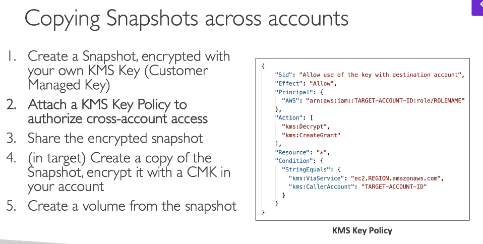

# 299. KMS 
- Able to audit KMS Key usage per API call using CloudTrail
- Region scope 
- Integrate: EBS, S3, RDS, RDS, SSM,... 
- Automatic key rotation:
  - AWS managed KMS key: auto every 1 year 
  - Customer managed KMS key: must be enabled => auto or on-demand 
  - Imported KMS key: manual rotation possible using alias

