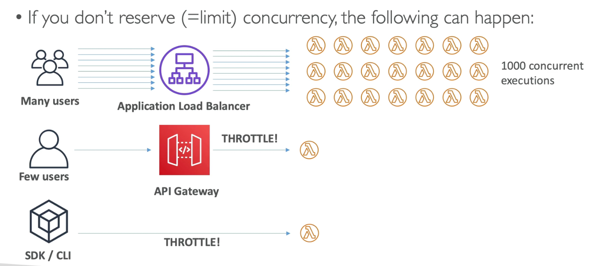
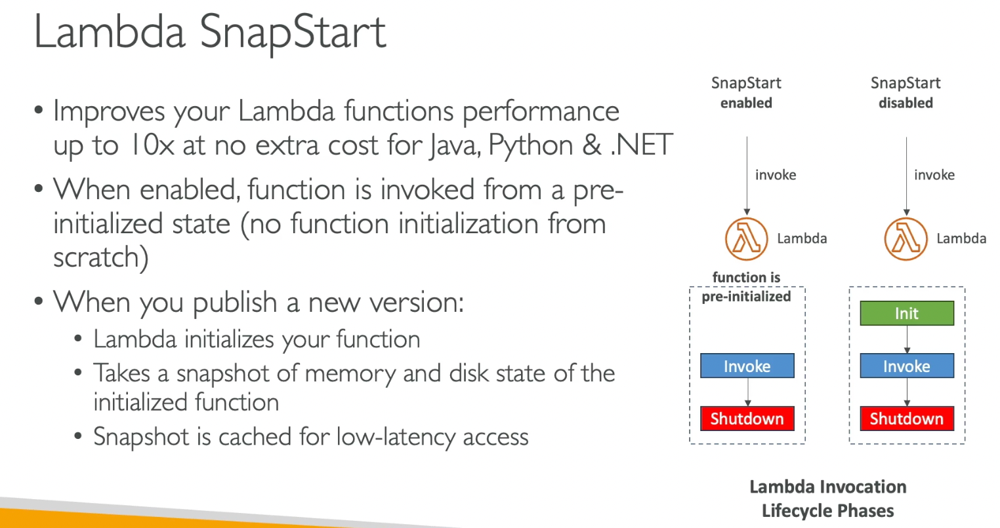
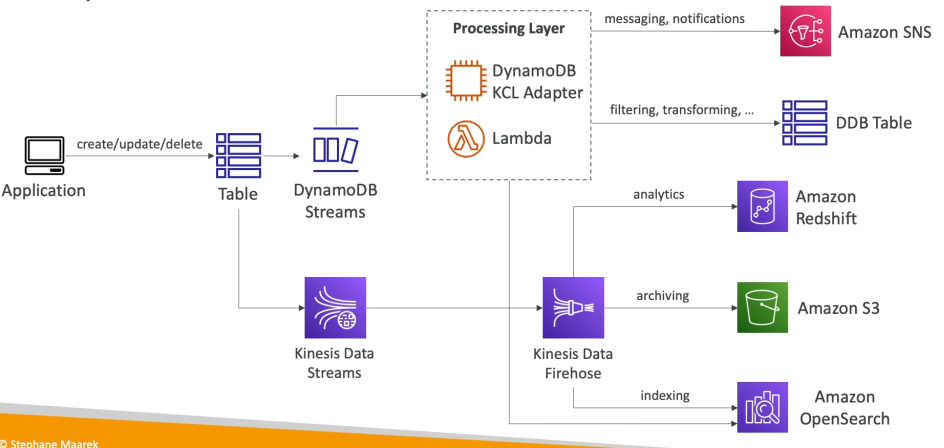

# 215. Lambda
#### **Serverless**
- Không cần quản lý máy chủ, chỉ cần cấp phát mã nguồn và Lambda sẽ chạy.
- Thực thi có giới hạn thời gian, tối đa 15 phút.
- Lambda chạy theo yêu cầu (on-demand), chỉ tính phí khi hàm được gọi và không chạy khi không sử dụng.

#### **Auto Scaling**
- Lambda tự động mở rộng khi cần thêm các phiên bản hàm.
- Tự động điều chỉnh số lượng Lambda function instances khi có yêu cầu.

#### **Pricing**
- Bạn trả tiền cho số lần gọi (invocations) và thời gian chạy (compute time) của Lambda.
- 1 triệu lần gọi và 400,000 giây tính toán miễn phí mỗi tháng.
- Sau đó, bạn trả thêm phí cho mỗi triệu yêu cầu (20 cent) và 1 USD cho 600,000 gigabyte-seconds.
- Phí tính theo mili giây.

#### **Supported Languages**
- Hỗ trợ nhiều ngôn ngữ lập trình như Node.js, Python, Java, C# (cho .NET Core và PowerShell), Ruby.
- Hỗ trợ nhiều ngôn ngữ khác qua custom runtime API, ví dụ như Rust và Golang.

#### **Container Support**
- Lambda hỗ trợ chạy các container (container image) qua Lambda Runtime API.
- Tuy nhiên, nếu cần chạy Docker images, tốt hơn là sử dụng ECS hoặc Fargate thay vì Lambda (đặc biệt trong môi trường thi exam).

#### **Integrations with AWS Services**
Lambda có thể tích hợp với rất nhiều dịch vụ AWS khác, ví dụ:

- **API Gateway**: Tạo REST API và gọi Lambda khi có yêu cầu từ người dùng.
- **Kinesis**: Lambda sẽ xử lý và biến đổi dữ liệu khi có dữ liệu mới được truyền qua Kinesis.
- **DynamoDB**: Lambda có thể được kích hoạt khi có thay đổi trong bảng DynamoDB, ví dụ khi có thêm, sửa hoặc xóa dữ liệu.
- **S3**: Lambda sẽ tự động được gọi khi có tệp mới được tải lên S3, ví dụ: xử lý hình ảnh, chuyển đổi tệp, v.v.
- **CloudFront (Lambda@Edge)**: Lambda sẽ chạy ở các điểm phân phối (edge locations) của CloudFront, giúp xử lý yêu cầu người dùng gần với họ hơn.
- **CloudWatch Events / EventBridge**: Lambda có thể phản ứng với các sự kiện trong hạ tầng AWS của bạn, như khi có thay đổi trong **CodePipeline** hoặc trạng thái EC2.
- **CloudWatch Logs**: Lambda có thể ghi log và truyền tải dữ liệu log đến các hệ thống khác để theo dõi hoặc phân tích.
- **SNS**: Lambda có thể được kích hoạt để phản hồi thông báo từ SNS (Simple Notification Service), ví dụ như khi có một tin nhắn hoặc sự kiện.
- **SQS**: Lambda có thể xử lý các tin nhắn từ các hàng đợi SQS (Simple Queue Service), giúp tự động hóa xử lý công việc.
- **Cognito**: Lambda có thể được kích hoạt khi có sự kiện liên quan đến người dùng trong **Cognito**, như khi người dùng đăng nhập hoặc đăng ký.

#### **Example Use Cases**
- **Serverless Thumbnail Creation**:
    - Tạo thumbnails tự động khi có hình ảnh mới được tải lên S3.
    - S3 event notification sẽ kích hoạt Lambda.
    - Lambda tạo ảnh thu nhỏ và tải lại vào S3.
    - Có thể lưu trữ thêm metadata của ảnh vào DynamoDB.

- **Serverless Cron Job**:
    - Thực hiện các công việc định kỳ mà không cần sử dụng máy chủ.
    - Sử dụng CloudWatch Events hoặc EventBridge để tạo cron job và gọi Lambda.
    - Ví dụ: Tạo công việc chạy mỗi giờ mà không cần EC2.

#### **Lambda Pricing Breakdown**
- Bạn trả tiền theo số lần gọi và thời gian chạy của Lambda.
- Miễn phí: 1 triệu yêu cầu và 400,000 gigabyte-seconds mỗi tháng.
- Phí bổ sung: 20 cent cho mỗi triệu yêu cầu và 1 USD cho 600,000 gigabyte-seconds.
- Lambda tính phí theo mili giây, và nếu bạn dùng nhiều bộ nhớ, bạn sẽ có thêm thời gian thực thi.

---

# 217. Lambda Limits
#### **Execution Limits**

- **Memory Allocation**: Từ 128 MB đến 10 GB, tăng theo bội số 64 MB.
    - Khi tăng bộ nhớ, Lambda sẽ tự động cấp thêm vCPU để xử lý.

- **Execution Time**: Tối đa 900 giây (15 phút).
    - Nếu công việc cần thời gian dài hơn, Lambda không phải là lựa chọn phù hợp.

- **Environment Variables**: Tối đa 4 KB.
    - Đây là dung lượng giới hạn cho các giá trị bạn lưu trữ trong biến môi trường.

- **Temporary Space**: Tối đa 10 GB trong thư mục `/tmp`.
    - Dùng để lưu trữ tạm thời các tệp lớn trong quá trình thực thi.

- **Concurrent Executions**: Tối đa 1000 thực thi đồng thời.
    - Có thể yêu cầu tăng giới hạn này nếu cần.
    - Nên sử dụng **Reserved Concurrency** để đảm bảo số lượng thực thi đồng thời ổn định.

#### **Deployment Limits**

- **Compressed Zip Size**: Tối đa 50 MB.
- **Uncompressed Size**: Tối đa 250 MB.
    - Nếu cần sử dụng tệp lớn hơn, bạn có thể lưu trữ tệp trong **Temporary Space**.

#### **Lưu ý quan trọng**:

- Nếu yêu cầu công việc cần **30 GB Memory**, **30 minutes execution time**, hoặc tệp lớn như **3 GB**, Lambda không phải là lựa chọn phù hợp.
- Hiểu rõ các giới hạn này sẽ giúp bạn quyết định liệu Lambda có phù hợp với một tác vụ cụ thể hay không.

---

# 218. Lambda Concurrency

### **Concurrency**

- Khi số lần gọi (invocations) Lambda tăng, số lượng concurrent executions cũng tăng. Lambda có thể mở rộng (scale) rất nhanh và dễ dàng.

- **Reserved Concurrency**: Bạn có thể đặt giới hạn số lượng concurrent executions cho mỗi Lambda function, gọi là reserved concurrency.
    - Ví dụ, bạn có thể giới hạn một Lambda function chỉ được phép có tối đa 50 concurrent executions.
    - Nếu vượt quá giới hạn này, sẽ xảy ra throttling (giới hạn tốc độ).

- **Throttle**: Khi vượt quá giới hạn concurrency:
    - Với synchronous invocation, Lambda trả về lỗi 429 (throttle error).
    - Với asynchronous invocation, Lambda sẽ tự động thử lại và chuyển sang DLQ (Dead Letter Queue) nếu không thành công sau nhiều lần thử.

- **Tăng giới hạn concurrency**: Nếu bạn cần hơn 1000 concurrent executions, bạn có thể mở một yêu cầu hỗ trợ (support ticket) để yêu cầu tăng giới hạn.

### **Vấn đề khi không đặt giới hạn Concurrency**

- Nếu không đặt reserved concurrency, ví dụ:
    - Một Application Load Balancer kết nối với một Lambda function.
    - Một ứng dụng khác kết nối với API Gateway, cũng gọi một Lambda function khác.
    - Một ứng dụng sử dụng SDK và CLI để gọi Lambda function.

- Khi tất cả các yêu cầu này có tần suất thấp, mọi thứ sẽ hoạt động tốt. Tuy nhiên, nếu bạn có một chiến dịch khuyến mãi và lượng người dùng tăng đột biến:
    - Application Load Balancer sẽ gọi rất nhiều Lambda functions. Lambda sẽ tự động mở rộng lên đến 1000 concurrent executions.
    - Vấn đề là tất cả concurrent executions này có thể chỉ đến từ một ứng dụng (ví dụ Application Load Balancer), trong khi các ứng dụng khác như API Gateway và CLI sẽ bị throttled.

- **Concurrency Limit** áp dụng cho tất cả các functions trong tài khoản AWS của bạn, vì vậy nếu một function vượt qua giới hạn, các function khác có thể bị throttled.

### **Asynchronous Invocation và Throttling**

- Ví dụ với S3 event notifications: Khi bạn tải tệp lên S3, một sự kiện tạo ra sẽ gọi Lambda function.
    - Nếu có rất nhiều tệp được tải lên cùng lúc, số lượng concurrent executions của Lambda sẽ tăng lên nhanh chóng.
    - Nếu Lambda không có đủ concurrency sẵn có để xử lý tất cả các yêu cầu, các yêu cầu bổ sung sẽ bị throttled.

- Tuy nhiên, vì đây là asynchronous invocation, khi xảy ra throttling hoặc lỗi hệ thống (lỗi 429 và lỗi từ dãy mã lỗi 500), Lambda sẽ đưa sự kiện vào hàng đợi sự kiện (event queue).
    - Lambda sẽ thử chạy lại function trong tối đa 6 giờ.
    - Các lần thử lại này sẽ có khoảng thời gian giữa các lần thử theo hình thức tăng dần theo cấp số nhân (exponentially backoff), bắt đầu từ 1 giây và tối đa là 5 phút.

### **Cold Starts và Provisioned Concurrency**

- **Cold Start**: Khi Lambda khởi động một instance mới, mã của bạn sẽ phải được tải và tất cả các mã ngoài hàm xử lý (handler) sẽ được thực thi.
    - Nếu quá trình khởi tạo này tốn nhiều thời gian (ví dụ, mã có nhiều thư viện phụ thuộc, kết nối cơ sở dữ liệu, gọi SDK), lần gọi đầu tiên có thể có độ trễ cao.
    - Điều này có thể ảnh hưởng đến trải nghiệm người dùng, ví dụ, nếu người dùng phải chờ 3 giây cho phản hồi, điều này có thể gây khó chịu.

- **Provisioned Concurrency**: Để tránh cold start, bạn có thể sử dụng provisioned concurrency.
    - Đây là cách bạn đặt trước số lượng concurrent executions mà Lambda sẽ có sẵn trước khi function được gọi, giúp giảm độ trễ của các yêu cầu.
    - Bạn có thể sử dụng Application Auto Scaling để quản lý provisioned concurrency, ví dụ như theo lịch hoặc mục tiêu xác định.

- **Cải tiến VPC**: Trước đây, khi chạy Lambda trong VPC, việc khởi động function mất rất nhiều thời gian. Tuy nhiên, từ tháng 10 và tháng 11 năm 2019, AWS đã có một bài viết mô tả cách giảm đáng kể cold start khi Lambda chạy trong VPC.

### SnapStart

### **Tóm tắt**

- Reserved Concurrency giúp giới hạn số lượng concurrent executions của từng Lambda function.
- Provisioned Concurrency giúp giảm cold start và đảm bảo độ trễ thấp cho các yêu cầu.
- Throttling xảy ra khi vượt quá giới hạn concurrency và Lambda sẽ xử lý lại các sự kiện asynchronous trong vòng 6 giờ.

---

# 221. Lambda@Edge & CloudFront Functions
### Customization At The Edge
- Chúng ta thường triển khai các functions và ứng dụng của mình trong một region cụ thể, nhưng đôi khi, thông qua **CloudFront**, các **Edge locations** sẽ phân phối nội dung của bạn đến người dùng.
- Các ứng dụng hiện đại đôi khi cần thực thi một số logic tại Edge trước khi dữ liệu đến ứng dụng chính.

Các **Edge Functions** là một đoạn mã mà bạn viết và gắn vào **CloudFront distributions** của bạn.
- Mục tiêu là chạy các functions này gần người dùng để giảm độ trễ (latency) trong một số trường hợp.

**CloudFront** có hai loại functions:
1. **CloudFront Functions**
2. **Lambda@Edge**

Với các **Edge Functions**, bạn không cần quản lý bất kỳ máy chủ nào và chúng được triển khai toàn cầu.
- Bạn chỉ trả tiền cho những gì bạn sử dụng và chúng hoàn toàn **serverless**.

### Các trường hợp sử dụng **Edge Functions**:
- **Website Security** và **Privacy**
- **Dynamic Web Applications** tại Edge
- **Search Engine Optimization (SEO)**
- **Intelligent Routing** qua các **Origins** và **Data Centers**
- **Bot Mitigation** tại Edge
- **Real-time Image Transformation** tại Edge
- **A/B Testing**, **User Authentication and Authorization**, **User Prioritization**, **User Tracking and Analytics**, v.v.

---

### **CloudFront Functions**

Các **CloudFront Functions** là functions nhẹ, viết bằng **JavaScript**.
- **CloudFront Functions** được sử dụng để chỉnh sửa **viewer request** và **viewer response**.
- Chúng rất phù hợp cho các tuỳ chỉnh CDN với tần suất cao, yêu cầu độ trễ thấp, với thời gian khởi tạo (startup time) dưới **một mili giây** và khả năng xử lý hàng triệu yêu cầu mỗi giây.

Các **CloudFront Functions** chỉ có thể thay đổi **viewer request** và **viewer response**.
- **Viewer request** là sau khi **CloudFront** nhận được yêu cầu từ người dùng.
- **Viewer response** là trước khi **CloudFront** gửi phản hồi lại người dùng.

**CloudFront Functions** là một tính năng gốc của **CloudFront** và mã nguồn được quản lý trực tiếp từ trong **CloudFront**.

---

### **Lambda@Edge**

**Lambda@Edge** có khả năng thay đổi tất cả các loại yêu cầu và phản hồi của **CloudFront**, bao gồm:
1. **Viewer request**: Trước khi **CloudFront** gửi yêu cầu tới **Origin**.
2. **Origin request**: Trước khi **CloudFront** gửi yêu cầu đến máy chủ **Origin**.
3. **Origin response**: Sau khi **CloudFront** nhận được phản hồi từ **Origin**.
4. **Viewer response**: Trước khi **CloudFront** gửi phản hồi lại người dùng.

- **Lambda@Edge** có thể viết bằng **Node.js** hoặc **Python**, và có thể mở rộng lên tới hàng nghìn yêu cầu mỗi giây.
- Bạn tạo function của mình trong **region** **us-east-1**, nơi bạn quản lý **CloudFront distributions**. Sau đó, **CloudFront** sẽ sao chép function này tới tất cả các vị trí của nó trên toàn cầu.

---

### So sánh **CloudFront Functions** và **Lambda@Edge**

| Tiêu chí                      | **CloudFront Functions**           | **Lambda@Edge**                    |
|-------------------------------|------------------------------------|------------------------------------|
| **Hỗ trợ runtime**             | **JavaScript**                     | **Node.js** và **Python**          |
| **Quy mô**                     | Hàng triệu yêu cầu mỗi giây       | Hàng nghìn yêu cầu mỗi giây       |
| **Kích hoạt tại**              | Chỉ **viewer request** và **viewer response** | **Viewer request**, **Origin request**, **Origin response**, **Viewer response** |
| **Thời gian thực thi tối đa**  | Dưới **một mili giây**             | **5-10 giây**                     |

---

### Các trường hợp sử dụng **CloudFront Functions**:

- **Cache Key Normalization**: Chuyển đổi các thuộc tính yêu cầu để tạo **cache key** tối ưu.
- **Header Manipulation**: Chỉnh sửa hoặc xóa các HTTP headers trong yêu cầu và phản hồi.
- **URL Rewrites hoặc Redirects**: Thực hiện các chuyển hướng hoặc thay đổi URL.
- **Authorization**: Xác thực và tạo JWT tokens để cho phép hoặc từ chối yêu cầu.

Các chức năng này có thể thực hiện trong thời gian dưới **một mili giây**.

### Các trường hợp sử dụng **Lambda@Edge**:

- **Đọc và thay đổi body của HTTP request**.
- **Truy cập hệ thống tệp tin** hoặc kết nối với các dịch vụ ngoài để xử lý dữ liệu phức tạp.
- **Sử dụng thư viện bên ngoài** như AWS SDK để tích hợp với các dịch vụ AWS khác.

**Lambda@Edge** có thể thực hiện các logic phức tạp hơn, vì thời gian thực thi có thể kéo dài đến **10 giây**.

---

# 222. Lambda in VPC

Khi bạn triển khai một **Lambda function**, theo mặc định, nó sẽ được triển khai ngoài **VPC** của bạn.
- Thực tế, Lambda sẽ được triển khai trong một **VPC** của AWS.
- Điều này có nghĩa là **Lambda** không thể truy cập vào các tài nguyên bên trong **VPC** của bạn.

Ví dụ:
- Nếu bạn triển khai một **RDS database**, một **ElastiCache cache**, hoặc một **internal load balancer**, thì **Lambda function** của bạn sẽ không thể truy cập vào các tài nguyên này.

Tuy nhiên, nếu Lambda cần truy cập vào các API công cộng trên internet, hoặc **DynamoDB** (vì **DynamoDB** là tài nguyên công cộng của AWS), thì Lambda sẽ hoạt động bình thường.

Nhưng nếu bạn có một **RDS** database riêng tư, thì kết nối sẽ không hoạt động.

---

### Lambda trong VPC

Nếu bạn muốn **Lambda function** truy cập vào tài nguyên trong **VPC** của bạn, bạn cần triển khai **Lambda** trong chính **VPC** đó.
- Khi đó, bạn cần chỉ định **VPC ID**, các **subnets** mà bạn muốn triển khai và đính kèm một **security group** cho **Lambda function** của bạn.

Khi làm như vậy, **Lambda function** sẽ có một **elastic network interface** (ENI) trong các **subnets** của bạn và sẽ có khả năng truy cập vào các tài nguyên trong **VPC**, ví dụ như **Amazon RDS**.

---

### Trường hợp sử dụng chính: Lambda với **RDS Proxy**

Một trong những trường hợp sử dụng lớn của **Lambda** trong **VPC** là kết hợp với **RDS proxy**.
- Trong trường hợp này, bạn có một **RDS database** trong **private subnet** và các **Lambda functions** sẽ truy cập vào nó.

Tuy nhiên, nếu các **Lambda functions** truy cập trực tiếp vào **RDS database**, điều này có thể gây ra vấn đề lớn.
- Khi có quá nhiều **Lambda functions** xuất hiện và biến mất liên tục, bạn có thể gặp phải tình trạng quá tải kết nối tới **RDS database**.
- Điều này có thể dẫn đến **timeouts** và các vấn đề về kết nối.

### Giải pháp: **RDS Proxy**

Giải pháp là triển khai **RDS Proxy**, giúp **proxy** này quản lý và kết nối với **RDS database** bằng cách tối ưu hóa số lượng kết nối.
- Các **Lambda functions** giờ đây sẽ kết nối tới **RDS Proxy**, và **RDS Proxy** sẽ kết nối với **RDS database**.

### Ba lợi ích của **RDS Proxy**:

1. **Cải thiện khả năng mở rộng**: Bằng cách **pooling** và chia sẻ các kết nối cơ sở dữ liệu.
2. **Cải thiện khả năng sẵn sàng**: Trong trường hợp **failover**, **RDS Proxy** giúp giảm thời gian failover lên tới **66%** và duy trì các kết nối.
3. **Xác thực IAM**: Bạn có thể sử dụng **IAM authentication** tại **RDS Proxy** và lưu trữ các thông tin xác thực trong **Secrets Manager**.

### Điều kiện kết nối Lambda với **RDS Proxy**

Để **Lambda function** kết nối được với **RDS Proxy**, bạn cần triển khai **Lambda** trong **VPC**, vì **RDS Proxy** không thể truy cập công khai.
- Nếu bạn triển khai **Lambda** ngoài **VPC**, nó sẽ không thể kết nối với **RDS Proxy** vì **RDS Proxy** không có địa chỉ công khai.

---

# 223. RDS - Invoking Lambda & Event Notifications 

Có một sự tích hợp chặt chẽ giữa **RDS**, **Aurora**, và **Lambda** trong một số trường hợp. Cụ thể, bạn có thể kích hoạt các hàm **Lambda** từ trong chính **database** của mình. Điều này cho phép bạn xử lý các sự kiện dữ liệu xảy ra trong **database**. Một số dịch vụ hỗ trợ tính năng này, ví dụ như **RDS for PostgreSQL** và **Aurora MySQL**.

#### VD
1. **User** chèn dữ liệu sự kiện vào bảng đăng ký của bạn.
2. **RDS** được cấu hình để tự động kích hoạt một hàm **Lambda** khi có sự thay đổi.
3. Hàm **Lambda** có thể gửi một email chào mừng tới **user**, và **user** sẽ nhận được email.

Tuy nhiên, quy trình này cần phải được thiết lập từ trong **database** (không phải từ AWS Console). Khi thực hiện, **RDS** là dịch vụ gọi hàm **Lambda**, vì vậy bạn cần đảm bảo đã cấp quyền cho phép lưu lượng vào từ **RDS** đến **Lambda**, có thể thông qua các cách như sử dụng **Invoke**, **NAT Gateway**, hoặc **VPC endpoints**. **Network connectivity** là yếu tố quan trọng.

### Các yêu cầu về quyền:
- **Database instance** RDS cần có chính sách **IAM** phù hợp để có quyền gọi hàm **Lambda**.
- Điều này khác với việc sử dụng **RDS Event Notifications**, là những thông báo về trạng thái **database instance**, chẳng hạn như khi **database instance** được tạo hoặc khởi động lại. Tuy nhiên, thông báo này **không liên quan đến dữ liệu** trong **database**.

### RDS Event Notifications:
- Những thông báo này cung cấp thông tin về **database instance** nhưng không liên quan đến các sự kiện dữ liệu trong bảng.
- Bạn có thể đăng ký nhận các sự kiện về **instance** RDS, bản sao lưu, nhóm tham số, nhóm bảo mật, proxy, hoặc phiên bản công cụ tùy chỉnh.
- Các sự kiện này có độ trễ tối đa 5 phút và có thể gửi đến **SNS** hoặc **EventBridge**.
- Từ **SNS**, bạn có thể gửi đến **SQS** hoặc **Lambda**. Từ **EventBridge**, bạn có thể gửi đến nhiều đích khác nhau, bao gồm cả **Lambda**.

### Lưu ý quan trọng:
- **RDS Event Notifications** không cung cấp thông tin về các sự kiện dữ liệu trong **database**, bạn phải sử dụng phương pháp tích hợp **Lambda** trực tiếp để xử lý các sự kiện dữ liệu.

# 224. DynamoDB
- **DynamoDB** là một cơ sở dữ liệu hoàn toàn được quản lý (fully managed), có tính sẵn sàng cao và sao lưu dữ liệu qua nhiều **AZ** (Availability Zones).
- Đây là một cơ sở dữ liệu **Cloud-native** được AWS phát triển, sử dụng mô hình **NoSQL** thay vì mô hình cơ sở dữ liệu quan hệ như **RDS** hay **Aurora**. DynamoDB hỗ trợ **transaction** nhưng không phải là cơ sở dữ liệu quan hệ.

### Tính năng của DynamoDB

- **Scalability:** DynamoDB có khả năng mở rộng để xử lý các khối lượng công việc khổng lồ, có thể đáp ứng hàng triệu yêu cầu mỗi giây, hàng tỷ dòng dữ liệu và hàng trăm terabyte bộ nhớ.
- **Performance:** DynamoDB có **performance** rất nhanh, với thời gian truy vấn trong khoảng một chữ số mili giây (**single-digit millisecond performance**), đồng thời duy trì tính ổn định cao.
- **Security:** DynamoDB tích hợp hoàn toàn với **IAM** (Identity and Access Management) để quản lý bảo mật, phân quyền và quản trị.
- **Cost-efficient:** Không cần bảo trì hay vá lỗi, luôn sẵn sàng hoạt động mà không cần phải cấu hình hay provision cơ sở dữ liệu.

### Cấu trúc bảng trong DynamoDB

- **Bảng dữ liệu:** DynamoDB không yêu cầu bạn phải tạo cơ sở dữ liệu, mà chỉ cần tạo các **table**. Mỗi **table** sẽ có **primary key** (khóa chính) mà bạn quyết định khi tạo bảng.
- **Primary Key:** Có thể có **partition key** (khóa phân vùng) và **sort key** (khóa sắp xếp) tùy chọn, chúng cùng nhau tạo thành khóa chính.
- **Items:** Mỗi **table** có thể chứa vô số **items**, và mỗi **item** có thể có nhiều **attributes** (tương tự như cột trong các cơ sở dữ liệu quan hệ).
- **Attributes:** Các **attributes** có thể thêm vào theo thời gian mà không cần yêu cầu trước. Điều này là một điểm khác biệt lớn so với các cơ sở dữ liệu quan hệ (như **Aurora**, **RDS**), nơi việc thêm cột mới khá phức tạp.

### Các lớp bảng trong DynamoDB

- **Standard table class:** Dành cho dữ liệu truy cập thường xuyên.
- **Infrequent Access (IA) table class:** Dành cho dữ liệu ít được truy cập.

### Kích thước mục dữ liệu

- Mỗi **item** trong DynamoDB có thể có kích thước tối đa là **400 KB**. DynamoDB không được thiết kế để lưu trữ các đối tượng rất lớn.

### Các loại dữ liệu trong DynamoDB

- DynamoDB hỗ trợ các kiểu dữ liệu sau:
    - **Scalar types:** String, Number, Binary, Boolean, Null.
    - **Collection types:** List, Map, Set.

### Chế độ cấp phát dung lượng (Capacity Modes)

- **Provisioned Mode:**
    - Bạn cần dự báo trước dung lượng đọc và ghi (**RCU** - Read Capacity Units và **WCU** - Write Capacity Units). Bạn trả tiền cho số lượng **RCU** và **WCU** đã cấp phát.
    - Có thể sử dụng **Auto Scaling** để tự động điều chỉnh dung lượng theo mức độ tải.
    - Thích hợp cho các ứng dụng có tải ổn định và có thể dự đoán được.

- **On-Demand Mode:**
    - DynamoDB tự động điều chỉnh dung lượng đọc và ghi theo nhu cầu.
    - Bạn chỉ trả tiền cho những gì sử dụng thực tế (mỗi lần đọc và ghi).
    - Thích hợp cho các ứng dụng có tải không ổn định, hoặc có sự gia tăng đột ngột trong nhu cầu.

### Lựa chọn giữa Provisioned và On-Demand Mode

- **Provisioned Mode** phù hợp nếu:
    - Tải ứng dụng có thể dự đoán và ổn định.
    - Bạn muốn tiết kiệm chi phí với kế hoạch dung lượng dựa trên nhu cầu cố định.

- **On-Demand Mode** phù hợp nếu:
    - Ứng dụng có khối lượng công việc không thể dự đoán, hoặc có sự gia tăng đột ngột.
    - Bạn chỉ muốn trả tiền cho những **transactions** thực tế mà không phải lo lắng về việc dự báo dung lượng.

### Lưu ý khi chọn DynamoDB

- Nếu ứng dụng của bạn có thể từ **1,000 transactions** tăng lên **1 triệu transactions trong một phút**, chế độ **Provisioned Mode** sẽ không đủ nhanh để mở rộng và **On-Demand Mode** là lựa chọn tối ưu.
- Nếu bạn có một ứng dụng chỉ thực hiện vài **transactions** mỗi ngày, chế độ **On-Demand Mode** cũng là sự lựa chọn tốt, vì bạn chỉ trả tiền cho các **transactions** thực tế.

### Kết luận

DynamoDB là lựa chọn lý tưởng khi cần một cơ sở dữ liệu có thể mở rộng nhanh chóng, linh hoạt và chi phí thấp, đặc biệt là trong các tình huống yêu cầu thay đổi nhanh chóng về cấu trúc dữ liệu hoặc khối lượng công việc không ổn định.

---

# 226. DynamoDB Advanced Feature

### DynamoDB Accelerator (DAX)
_Microsenconds latency for cached data_. 
- **DAX** là một bộ nhớ đệm in-memory hoàn toàn được quản lý, có tính sẵn sàng cao, giúp giảm độ trễ đọc cho DynamoDB.
- Khi bạn có rất nhiều yêu cầu đọc từ bảng **DynamoDB**, có thể tạo một **DAX cluster** để giải quyết vấn đề nghẽn cổ chai trong việc đọc dữ liệu.
- **DAX** không yêu cầu thay đổi bất kỳ logic ứng dụng nào vì nó tương thích với các API hiện có của DynamoDB.
- Thời gian lưu trữ dữ liệu trong cache mặc định là 5 phút, nhưng có thể điều chỉnh theo nhu cầu.

#### DAX vs. ElastiCache

- **DAX** được sử dụng cho việc cache các đối tượng đơn lẻ hoặc truy vấn, bao gồm cả **scanned queries**. Trong khi đó, **ElastiCache** thường dùng cho việc lưu trữ các kết quả tổng hợp hoặc các phép tính lớn từ DynamoDB.
- **DAX** và **ElastiCache** không thay thế lẫn nhau mà bổ sung cho nhau.

### Stream Processing trên DynamoDB

- **DynamoDB Streams** cho phép bạn theo dõi mọi thay đổi trên bảng, bao gồm **create**, **update**, và **delete**. Điều này rất hữu ích cho các trường hợp như:
    - Gửi email chào mừng khi có người dùng mới.
    - Thực hiện phân tích dữ liệu theo thời gian thực.
    - Cập nhật bảng dữ liệu khác hoặc sao chép dữ liệu giữa các vùng (cross-region replication).
    - Gọi **Lambda** khi có thay đổi dữ liệu.

#### Các lựa chọn cho Stream Processing

- **DynamoDB Streams** có **retention** trong vòng 24 giờ, phù hợp với các tác vụ đơn giản và sử dụng **Lambda triggers**.
- Nếu bạn cần giữ dữ liệu lâu hơn hoặc cần khả năng xử lý phức tạp, có thể sử dụng **Kinesis Data Streams**, với thời gian lưu trữ lên đến 1 năm và khả năng mở rộng cho nhiều người tiêu dùng (consumers).
- **Kinesis Data Streams** hỗ trợ nhiều cách xử lý dữ liệu, bao gồm **Kinesis Data Analytics**, **Glue Streaming ETLs**, và **Kinesis Data Firehose**.

### Global Tables trong DynamoDB

- **Global Tables** cho phép sao chép bảng DynamoDB qua nhiều vùng (regions). Ví dụ, có thể có một bảng ở **US-East-1** và một bảng ở **AP-Southeast-2**, với khả năng đọc và ghi ở bất kỳ vùng nào.
- Để sử dụng **Global Tables**, bạn phải kích hoạt **DynamoDB Streams** vì nó là cơ sở hạ tầng cho việc sao chép dữ liệu giữa các vùng.

### Time To Live (TTL)

- **TTL** cho phép tự động xóa các mục trong bảng khi chúng hết hạn. Ví dụ, bạn có thể lưu trữ dữ liệu session và tự động xóa sau một thời gian nhất định (ví dụ, sau 2 giờ) nếu không có yêu cầu mới.
- Các trường hợp sử dụng **TTL** phổ biến bao gồm:
    - Quản lý phiên làm việc trên web (web session handling).
    - Tuân thủ các quy định pháp lý (xóa dữ liệu sau 2 năm).

### Backups and Recovery 

- DynamoDB cung cấp các lựa chọn sao lưu như **Point-in-Time Recovery (PITR)** và sao lưu theo yêu cầu (On-Demand Backups):
    - **PITR** có thể sao lưu và phục hồi dữ liệu trong vòng 35 ngày.
    - **On-Demand Backups** có thể được sao lưu bất cứ lúc nào và sẽ được giữ cho đến khi bạn xóa chúng.
    - Các sao lưu không ảnh hưởng đến **performance** của bảng DynamoDB.

- **AWS Backup Service** giúp quản lý sao lưu với các chính sách vòng đời cho các bản sao lưu và hỗ trợ sao chép sao lưu giữa các vùng cho mục đích khôi phục sau thảm họa.

### Tích hợp DynamoDB với Amazon S3

- Bạn có thể xuất bảng DynamoDB vào **S3** để phân tích dữ liệu hoặc sao lưu:
    - **Export** có thể được thực hiện tại bất kỳ thời điểm nào trong vòng 35 ngày nhờ **PITR**.
    - Việc xuất không ảnh hưởng đến dung lượng đọc của bảng hoặc **performance**.
    - Dữ liệu xuất ra có thể ở định dạng **DynamoDB JSON** hoặc **ION**.
- Bạn cũng có thể nhập dữ liệu từ **S3** vào DynamoDB mà không làm tiêu tốn dung lượng ghi.

### Các tính năng khác

- **DynamoDB** còn hỗ trợ nhiều cách xử lý dữ liệu phức tạp như:
    - **Kinesis Data Analytics** cho phân tích theo thời gian thực.
    - **Amazon Redshift** cho phân tích dữ liệu lớn.
    - **Amazon OpenSearch** cho tìm kiếm và chỉ mục dữ liệu.

# 227. API Gateway
- **API Gateway** là dịch vụ serverless của AWS cho phép tạo các **REST APIs** mà khách hàng có thể truy cập công khai.
- Nó giúp **proxy** các yêu cầu từ khách hàng đến các **Lambda functions**, cho phép triển khai ứng dụng serverless mà không cần quản lý hạ tầng.

#### 2. Các Tính Năng của API Gateway

- **Authentication** và **authorization** cho các API.
- **Usage plans**, **development stages**, và khả năng **versioning** API (ví dụ: từ phiên bản 1 lên 2 mà không làm gián đoạn dịch vụ).
- **Request throttling** để giới hạn số lần yêu cầu từ khách hàng, bảo vệ API khỏi việc bị lạm dụng.
- **Swagger** và **OpenAPI 3.0** hỗ trợ để nhập khẩu và xuất khẩu các API định nghĩa.
- **Request and response validation** giúp đảm bảo rằng các yêu cầu và phản hồi là hợp lệ.
- **SDK generation** cho việc tích hợp với các ứng dụng của bên thứ ba và **API specification**.

#### 3. Cách API Gateway Tích Hợp với Các Dịch Vụ AWS

- **Lambda Functions**: Phương pháp phổ biến nhất để **expose REST APIs** thông qua **Lambda functions**, tạo ra một ứng dụng hoàn toàn serverless.
- **HTTP Endpoints**: **API Gateway** cũng có thể tích hợp với các endpoint HTTP từ các dịch vụ khác như **Application Load Balancer** hoặc các API HTTP khác trong môi trường của bạn.
- **AWS Services**: Bạn cũng có thể expose các dịch vụ AWS như **Step Functions**, **SQS** thông qua **API Gateway** mà không cần cấp quyền truy cập trực tiếp vào các dịch vụ này.

#### 4. Ví dụ về Sử Dụng API Gateway với Dịch Vụ AWS

- **Kinesis Data Streams**:
  - Bạn có thể cấu hình **API Gateway** để nhận các yêu cầu HTTP từ khách hàng và chuyển tiếp chúng đến **Kinesis Data Streams** mà không cần khách hàng truy cập trực tiếp vào **AWS credentials**.
  - Sau đó, **Kinesis Data Streams** có thể gửi dữ liệu đến **Kinesis Data Firehose** và lưu trữ vào **Amazon S3**.

#### 5. Các Loại Triển Khai API Gateway (Endpoint Types)

- **Edge-Optimized**:
  - Dành cho các khách hàng toàn cầu.
  - Yêu cầu được định tuyến qua các **CloudFront Edge Locations** để giảm độ trễ và tối ưu hiệu suất.
  - Dù được triển khai ở một vùng cụ thể, nhưng khách hàng toàn cầu có thể truy cập hiệu quả thông qua các **Edge locations**.

- **Regional**:
  - Dành cho các khách hàng trong cùng một vùng với **API Gateway**.
  - Nếu không sử dụng **CloudFront**, bạn có thể kiểm soát chiến lược phân phối và các thiết lập nền tảng thông qua **platform distribution**.

- **Private**:
  - **Private API Gateway** chỉ có thể truy cập từ trong **VPC**.
  - Dùng **VPC interface endpoints** (ENIs) để bảo mật và kiểm soát quyền truy cập.

#### 6. Bảo Mật trên API Gateway

- **IAM Roles**: Đối với các ứng dụng nội bộ trên **EC2 instances** muốn truy cập vào API Gateway.
- **Amazon Cognito**: Dùng cho các người dùng bên ngoài như ứng dụng di động hoặc web để xác thực và phân quyền.
- **Custom Authorizer**: Một **Lambda function** dùng để thực hiện các logic xác thực tùy chỉnh.
- **HTTPS Security**: Bảo mật qua **ACM (AWS Certificate Manager)**, cho phép sử dụng **custom domain names**.
  - Với **Edge-Optimized endpoint**, chứng chỉ SSL phải ở **us-east-1**, còn với **Regional endpoint**, chứng chỉ có thể ở cùng vùng với API Gateway.

#### 7. Cấu hình DNS

- Nếu bạn sử dụng **custom domain**, bạn cần cấu hình **CNAME** hoặc **A-alias** record trong **Route 53** để trỏ tới **API Gateway**.

---
