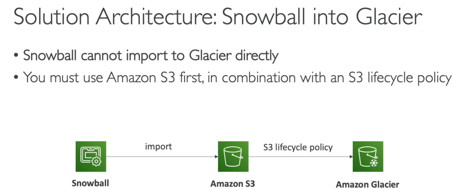

# 173. AWS Snowball
- **AWS Snowball** là một thiết bị di động, bảo mật cao, giúp thu thập, xử lý và di chuyển dữ liệu vào/ra AWS. Đây là giải pháp lý tưởng khi cần di chuyển khối lượng dữ liệu lớn (ví dụ: petabytes) nhưng gặp phải các vấn đề về băng thông và kết nối mạng.
- Snowball có hai loại thiết bị chính:
    - **Edge Storage Optimized**: Thiết bị này chuyên dùng cho lưu trữ dữ liệu, với dung lượng lên đến **210 terabytes**.
    - **Edge Compute Optimized**: Thiết bị này chuyên cho tính toán và chỉ có dung lượng lưu trữ là **28 terabytes**.

### Sử Dụng AWS Snowball cho Di Chuyển Dữ Liệu

- Việc truyền tải dữ liệu qua mạng có thể gặp nhiều vấn đề như băng thông thấp, kết nối không ổn định, hoặc chi phí mạng cao. Ví dụ, nếu bạn truyền 100 terabytes qua kết nối **1Gbps**, sẽ mất khoảng **12 ngày**.
- Trong trường hợp này, **AWS Snowball** là giải pháp hữu ích vì nó không yêu cầu sử dụng băng thông của bạn. Bạn chỉ cần:
    - Nhận một thiết bị Snowball vật lý.
    - Tải dữ liệu lên thiết bị.
    - Gửi thiết bị lại cho AWS.
    - AWS sẽ xử lý và chuyển dữ liệu lên các dịch vụ như **Amazon S3**.

### Sử Dụng AWS Snowball cho Edge Computing

- Một ứng dụng khác của **AWS Snowball** là **Edge Computing**, khi bạn cần xử lý dữ liệu ngay tại các điểm biên (edge) mà không có kết nối mạng ổn định hoặc băng thông lớn.
- Ví dụ: Các thiết bị có thể được sử dụng trong môi trường không có internet hoặc băng thông hạn chế, như các trạm khai thác mỏ, tàu trên biển, hoặc xe tải đang di chuyển.
- **Edge Compute Optimized** là loại thiết bị Snowball thích hợp cho các tác vụ tính toán, vì nó có khả năng chạy **EC2 instances** hoặc **Lambda functions** trực tiếp trên thiết bị.
    - Bạn có thể **tiền xử lý dữ liệu**, **máy học** hoặc **chuyển mã phương tiện** ngay trên thiết bị trước khi gửi về AWS.

### Kết Luận

- **AWS Snowball** giúp giải quyết các vấn đề khi cần di chuyển dữ liệu lớn mà không thể sử dụng kết nối mạng thông thường.
- **Edge Computing** trên Snowball cũng rất hữu ích khi xử lý dữ liệu ở các địa điểm xa xôi, không có kết nối internet ổn định.
- Tóm lại, AWS Snowball là công cụ tuyệt vời cho cả **data migration** và **edge computing** trong các tình huống cần xử lý dữ liệu lớn hoặc ở vùng không có kết nối mạnh mẽ.

--- 

# 176. Amazon FSx

Amazon FSx cho phép bạn triển khai các hệ thống tệp hiệu suất cao của bên thứ ba trên AWS dưới dạng *fully managed service*. Điều này tương tự như cách RDS cho phép bạn triển khai MySQL hoặc PostgreSQL, nhưng thay vì cơ sở dữ liệu, FSx chuyên về các hệ thống tệp.

FSx hỗ trợ các hệ thống tệp khác nhau, bao gồm:

1. FSx cho Windows File Server
2. FSx cho Lustre
3. FSx cho NetApp ONTAP
4. FSx cho OpenZFS

### 1. FSx cho Windows File Server

- Đây là dịch vụ Windows File Server được quản lý hoàn toàn, hỗ trợ giao thức SMB và Windows NTFS.
- Tính năng đặc biệt:
  - Tích hợp với Microsoft Active Directory để bảo mật người dùng.
  - Hỗ trợ ACL (Danh sách kiểm soát truy cập) và user quotas.
  - Có thể gắn kết FSx trên các Linux EC2 instances.
  - Hỗ trợ kết nối với Windows File Server tại *on-premises* thông qua tính năng DFS (Distributed File System).
- Hiệu suất: Có thể mở rộng lên hàng chục gigabyte mỗi giây, hàng triệu IOPS và hàng trăm petabyte dữ liệu.
- Lưu trữ:
  - SSD: Cho các workload yêu cầu độ trễ thấp và hiệu suất cao, như cơ sở dữ liệu, xử lý phương tiện, phân tích dữ liệu.
  - HDD: Dành cho các workload rộng hơn, chẳng hạn như thư mục chính (home directories) hoặc CMS.
- Khả năng truy cập: Có thể truy cập từ cơ sở hạ tầng *on-premises* qua kết nối riêng tư, và có thể cấu hình Multi-AZ cho độ sẵn sàng cao.
- Sao lưu: Dữ liệu được sao lưu hàng ngày lên Amazon S3 cho mục đích phục hồi sau thảm họa.

### 2. FSx cho Lustre

- Lustre là hệ thống tệp phân tán dùng cho các ứng dụng tính toán hiệu suất cao (HPC) và máy học (ML).
- Tính năng đặc biệt:
  - Hỗ trợ các ứng dụng như xử lý video, mô phỏng tài chính, thiết kế điện tử tự động.
  - Có khả năng mở rộng cao với hàng trăm gigabyte dữ liệu mỗi giây, hàng triệu IOPS và độ trễ sub-millisecond.
  - Tích hợp liền mạch với Amazon S3, cho phép bạn đọc dữ liệu từ S3 như một hệ thống tệp và ghi kết quả tính toán từ FSx về S3.
  - Có thể sử dụng từ VPN/Direct connect 
- Lưu trữ:
  - SSD: Dành cho các workload yêu cầu độ trễ thấp, IOPS cao.
  - HDD: Dành cho các workload yêu cầu thông lượng cao và thao tác file tuần tự lớn.
- Các tùy chọn triển khai file system:
  - **Scratch File System**: Lưu trữ tạm thời, không có sao lưu, nhưng tối ưu hóa hiệu suất. Phù hợp với các workload ngắn hạn: Đây là lựa chọn lý tưởng cho các tác vụ tạm thời như phân tích dữ liệu, tính toán mô phỏng, hay các công việc không đòi hỏi bảo vệ dữ liệu lâu dài, optimize const 
  - **Persistent File System**: Lưu trữ lâu dài với sao lưu và tính sẵn sàng cao. Đây là lựa chọn phù hợp cho các tác vụ cần tính ổn định cao và không chấp nhận mất mát dữ liệu. Ví dụ như các ứng dụng tính toán khoa học, phân tích dữ liệu lớn, hay các hệ thống yêu cầu xử lý và lưu trữ dữ liệu lâu dài.

### 3. FSx cho NetApp ONTAP

- FSx cho NetApp ONTAP cung cấp một hệ thống tệp ONTAP được quản lý trên AWS.
- Tính năng đặc biệt:
  - Tương thích với các giao thức NFS, SMB và iSCSI.
  - Phù hợp để di chuyển các workload đang chạy trên hệ thống ONTAP hoặc NAS tại *on-premises* vào AWS.
  - Tính năng tự động điều chỉnh dung lượng lưu trữ, sao lưu, và sao chép dữ liệu.
  - Hỗ trợ các tính năng như nén dữ liệu, deduplication và **point-in-time cloning** cho phép bạn dễ dàng sao chép nhanh các hệ thống tệp để thử nghiệm hoặc tạo môi trường staging.
- Tương thích với nhiều hệ điều hành và dịch vụ như Linux, Windows, macOS, VMware Cloud on AWS, WorkSpaces, AppStream, EC2, ECS và EKS.

### 4. FSx cho OpenZFS

- FSx cho OpenZFS là một hệ thống tệp OpenZFS được quản lý trên AWS, tương thích với giao thức NFS.
- Tính năng đặc biệt:
  - Thích hợp để di chuyển các workload đang chạy trên ZFS vào AWS.
  - Hiệu suất cao với khả năng mở rộng lên đến 1 triệu IOPS và độ trễ dưới 0.5 ms.
  - Hỗ trợ các tính năng như sao lưu, nén dữ liệu và **point-in-time cloning**.
  - Tuy nhiên, không hỗ trợ tính năng deduplication như FSx cho NetApp ONTAP.

---

