# 319. CIDR, Private vs Public IP
### 1. Tổng Quan về CIDR

- **CIDR (Classless Inter-Domain Routing)** là một phương pháp để phân bổ địa chỉ IP và phân chia các dải địa chỉ trong mạng.
- **CIDR** giúp định nghĩa phạm vi các địa chỉ IP mà bạn có thể sử dụng trong AWS, và chúng ta đã thấy nó khi thiết lập các **quy tắc security group** hoặc cấu hình mạng trong AWS.

CIDR bao gồm 2 thành phần chính:
- **Địa chỉ IP cơ sở**: Đây là địa chỉ bắt đầu của dải IP, ví dụ như `10.0.0.0` hoặc `192.168.0.0`.
- **Subnet Mask**: Chỉ định số bit có thể thay đổi trong địa chỉ IP. Số này được thể hiện sau dấu "/" trong CIDR, ví dụ: `/8`, `/16`, `/24`.

Subnet mask giúp xác định các phần của địa chỉ IP có thể thay đổi (tạo thành các dải IP):

- **/32**: Đại diện cho **1 địa chỉ IP duy nhất** (không thay đổi gì).
- **/31**: Đại diện cho **2 địa chỉ IP** (ví dụ từ `192.168.0.0` đến `192.168.0.1`).
- **/30**: Đại diện cho **4 địa chỉ IP**.
- **/29**: Đại diện cho **8 địa chỉ IP**.
- **/28**: Đại diện cho **16 địa chỉ IP**.
- **/24**: Đại diện cho **256 địa chỉ IP**.
- **/16**: Đại diện cho **65,536 địa chỉ IP**.
- **/0**: Đại diện cho **tất cả các địa chỉ IP**.

### Public vs Private IP Addresses

Có hai loại địa chỉ IP trong không gian **IPv4**:
- **Private IPs**: Các dải địa chỉ được sử dụng cho các mạng nội bộ, không thể truy cập trực tiếp từ Internet.
- **Public IPs**: Các địa chỉ này có thể truy cập được từ Internet và được IANA phân bổ cho các tổ chức sử dụng trên toàn cầu.

---
# 323. Subnet
- **Subnet** là một phần dải địa chỉ IPv4 trong VPC của bạn.
- Khi bạn tạo một subnet trong AWS, **AWS sẽ giữ lại 5 địa chỉ IP: 4 đầu tiên và 1 cuối cùng** trong mỗi subnet. Những địa chỉ này không thể được sử dụng cho các **EC2 instance** hoặc các tài nguyên khác.

Ví dụ, nếu bạn có một **CIDR block 10.0.0.0/24**, thì các địa chỉ IP sau sẽ bị **AWS** giữ lại:
- **.0**: Đây là địa chỉ mạng.
- **.1**: Địa chỉ này dành riêng cho **VPC router**.
- **.2**: Dành riêng cho **Amazon DNS**.
- **.3**: Được AWS dự trữ cho **sử dụng trong tương lai**.
- **.255**: Đây là **broadcast address**, nhưng vì AWS không hỗ trợ broadcast trong VPC, địa chỉ này cũng bị **AWS** giữ lại.

# 329. NAT Instance 
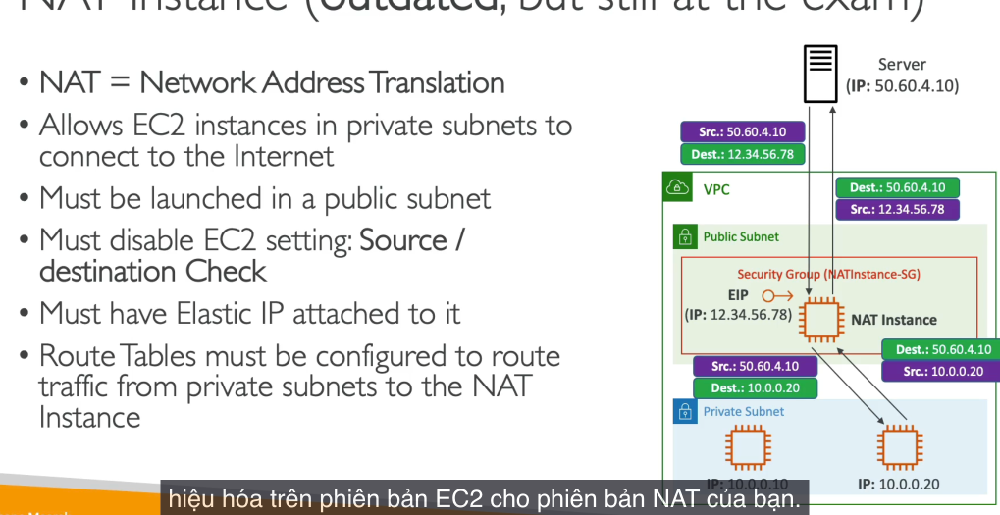

--- 

# 333. NACL vs Security Group 
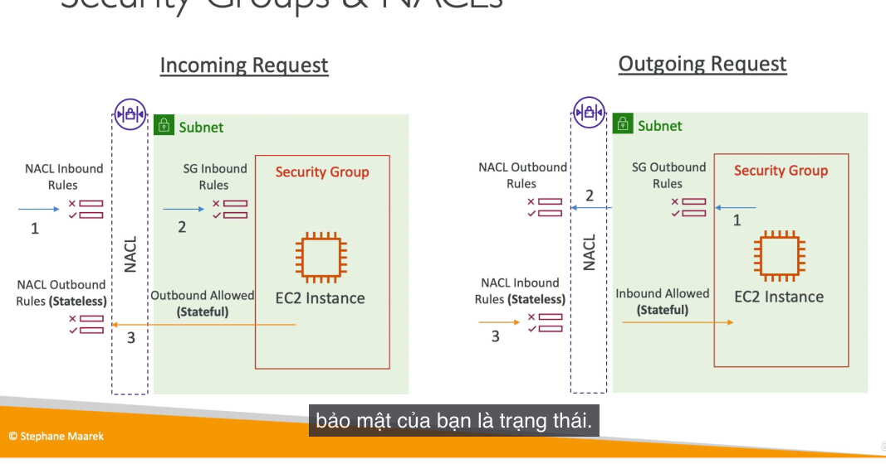. 

- **NACL** là **stateless**, có nghĩa là mỗi yêu cầu đến và đi đều cần phải kiểm tra các quy tắc riêng biệt (inbound và outbound).
- **Security Group** là **stateful**, có nghĩa là khi một yêu cầu được phép vào, thì phản hồi từ EC2 instance sẽ tự động được phép đi ra mà không cần kiểm tra các quy tắc outbound.

### Giới Thiệu về NACLs

- **Network ACLs** giống như một **tường lửa** kiểm soát lưu lượng vào và ra của subnet.
- Mỗi **subnet** sẽ có một **NACL** riêng và mỗi **subnet mới** sẽ được gán **NACL mặc định**.
- NACL Rules: 
  - Quy tắc của **NACL** có số từ 1 đến 32,000. Quy tắc có số nhỏ hơn sẽ có **độ ưu tiên cao hơn**. 
  - **Quy tắc đầu tiên khớp** sẽ quyết định việc cho phép hay từ chối yêu cầu.
  - AWS khuyến nghị thêm các quy tắc với khoảng cách 100 (ví dụ: 100, 200, 300...) để dễ dàng bổ sung quy tắc sau này.

- NACL default: cho phép tất cả các yêu cầu vào và ra
- NACL thích hợp để block specific IP ở subnet level 

### Ephemeral Ports

Khi **client** kết nối đến **server**, nó sẽ mở một cổng tạm thời (ephemeral port) để nhận phản hồi từ **server**. Cổng này chỉ tồn tại trong suốt thời gian kết nối.
- **Windows** sử dụng phạm vi cổng từ **49,152 đến 65,535** cho các ephemeral ports.
- **Linux** sử dụng phạm vi từ **32,768 đến 60,999**.

####  Ephemeral Ports với NACLs

- Khi **client** kết nối đến **database** trong một **private subnet**, **NACLs** cần phải cho phép **outbound TCP** trên cổng **3306** (cổng MySQL).
- **NACL** của **DB subnet** cần phải cho phép **inbound TCP** trên cổng **3306** từ **Web subnet**.
- Tuy nhiên, khi **database** gửi lại phản hồi cho **client**, vì **client** sử dụng **ephemeral ports**, **NACL** của **DB subnet** cần cho phép **outbound TCP** trên cổng **ephemeral** (từ 1024 đến 65,535) đến **Web subnet**.
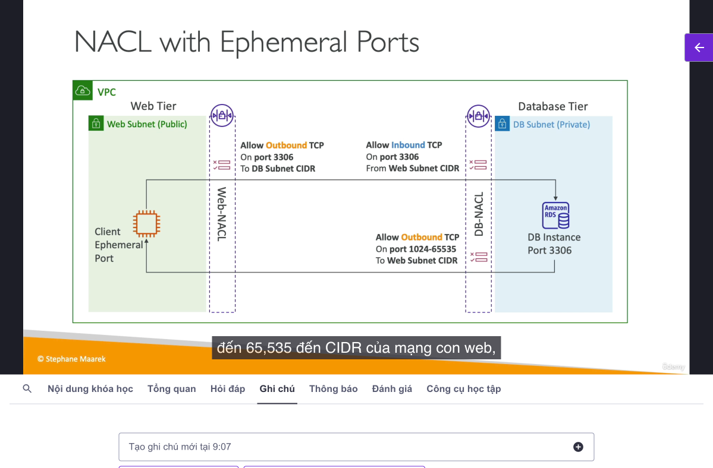
### So sánh
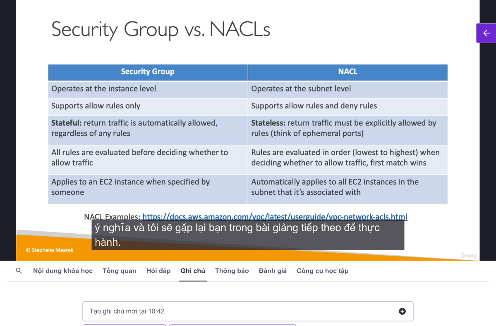

# 335. VPC Peering 

- Ý tưởng của **VPC Peering** là bạn có thể kết nối các **VPC** với nhau qua mạng AWS, dù chúng có thể ở các khu vực khác nhau, các tài khoản khác nhau, hoặc thậm chí trong cùng một tài khoản.
- Mục đích: **Các VPC này hoạt động như thể chúng nằm trong cùng một mạng.** Điều này rất hữu ích khi bạn muốn chia sẻ tài nguyên giữa các VPC khác nhau mà không cần phải di chuyển dữ liệu qua internet.
- Khi bạn kết nối hai **VPC**, các **CIDR blocks** của chúng phải không được overlap. Nếu **CIDR** của hai **VPC** trùng lặp, chúng sẽ không thể giao tiếp với nhau.
- **Cập nhật các bảng định tuyến** trong các **subnet** của mỗi **VPC**. Điều này rất quan trọng để đảm bảo rằng các **instance** trong các **VPC** khác nhau có thể giao tiếp được với nhau.
- Giống như **Security Groups**, bạn có thể tham chiếu đến **Security Groups** của một **VPC Peered** trong cùng một khu vực mà không cần phải sử dụng **CIDR** hoặc **IP address**. Điều này giúp việc cấu hình bảo mật trở nên linh hoạt và dễ dàng hơn.
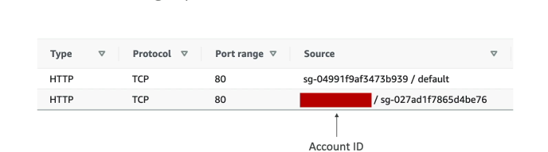
---
# 337. VPC Endpoint
- **VPC Endpoints** giúp các instance trong VPC truy cập dịch vụ AWS như DynamoDB, S3, CloudWatch mà không cần qua internet công cộng.
- **AWS PrivateLink** được sử dụng để cung cấp private network giữa VPC và các dịch vụ AWS.
- **VPC Endpoints** giúp loại bỏ sự cần thiết của **NAT Gateway** và **Internet Gateway**, giảm chi phí và cải thiện hiệu suất mạng.

### Các loại VPC Endpoints
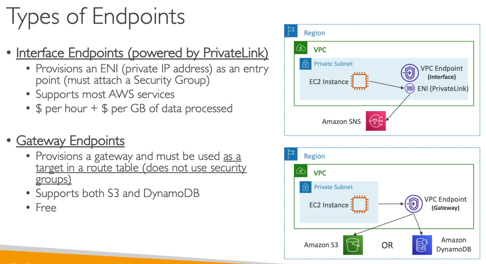

1. **Interface Endpoints**:
    - Cung cấp 1 ENI (private IP address) như một điểm entry (must attach 1 **Security Groups**)
    - Hỗ trợ hầu hết các dịch vụ AWS.
    - Tính phí theo giờ và theo dung lượng dữ liệu xử lý.

2. **Gateway Endpoints**:
    - Cung cấp **Gateway** trong **Route Table**.
    - Không sử dụng **Security Groups**, không có địa chỉ IP.
    - Hỗ trợ hai dịch vụ duy nhất: **Amazon S3** và **DynamoDB**.
    - Miễn phí và tự động mở rộng.

### Nên sử dụng Endpoint nào cho Amazon S3?
- Gateway Endpoints là giải pháp được ưu tiên cho việc truy cập Amazon S3 trong hầu hết các tình huống.
    - Vì Gateway Endpoints miễn phí và tự động mở rộng, chúng là sự lựa chọn tốt nhất cho Amazon S3 và DynamoDB.
- Interface Endpoints có thể được sử dụng nếu bạn cần kết nối từ on-premise (Site to Site VPN or Direct Connect), hoặc khác VPC, hoặc khác region

# 339. VPC Flow Logs 
- VPC Flow Logs cho phép ghi lại thông tin về lưu lượng IP vào và ra từ các interface trong VPC.
- Các Flow Logs có thể được ghi lại ở ba cấp độ: VPC, subnet, hoặc Elastic Network Interface (ENI).
- Flow Logs rất hữu ích để giám sát và khắc phục sự cố kết nối trong VPC.
- VPC Flow Logs có thể được dùng để phát hiện các mẫu sử dụng bất thường, hành vi quản lý, hoặc các cuộc tấn công như Port Scans.
- Để truy vấn Flow Logs, có thể sử dụng Athena on S3 hoặc CloudWatch Logs Insights 

- VPC Flow Logs có thể được gửi đến các dịch vụ như Amazon S3, CloudWatch Logs, và Kinesis Data Firehose.
- Capture thông tin network từ AWS managed: ELB, RDS, ElastiCache, Redshift, WorkSpaces, NAT Gateway, Transit Gateway...

### Syntax 
- Source Address và Destination Address giúp nhận diện các địa chỉ IP gặp sự cố.
- Source Port và Destination Port giúp xác định các cổng gặp sự cố.
- Action cho biết request success/failure theo Security Groups (SG) hoặc Network Access Control Lists (NACL).

### Sử dụng Flow Logs để khắc phục sự cố với Security Groups và NACL
- NACL là stateless còn Security Groups là stateful.
- Ví dụ, nếu có một inbound reject, có thể là do NACL hoặc Security Group từ chối yêu cầu.
- Nếu có inbound accept và outbound reject, vấn đề chỉ có thể là do NACL, vì Security Group sẽ tự động cho phép outbound khi inbound được chấp nhận.

### Cấu hình và phân tích VPC Flow Logs
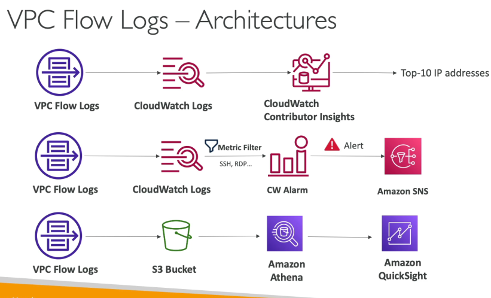

- CloudWatch Logs có thể nhận VPC Flow Logs và sử dụng CloudWatch Contributor Insights để tìm các địa chỉ IP đóng góp nhiều nhất vào lưu lượng mạng trong VPC.
- Metric Filter có thể được thiết lập để tìm các giao thức như SSH hoặc RDP, và kích hoạt cảnh báo khi có lượng giao thức này bất thường.
- Dữ liệu Flow Logs có thể được lưu trữ trong S3 và sử dụng Amazon Athena để phân tích bằng SQL, hoặc Amazon QuickSight để trực quan hóa dữ liệu.

# 341. Site to Site VPN
Là kết nối giữa VPC và data center (on-premise) thông qua một kết nối riêng nhưng vẫn ở mạng công cộng.

Thành phần: 
- **Customer Gateway (CGW):** Phần mềm hoặc thiết bị vật lý ở trung tâm dữ liệu của bạn.
- **VPN Gateway (VGW):** Cổng kết nối VPN trên VPC của AWS.
  - **Virtual Private Gateway (VGW):** VPN concentrator trên AWS, tạo và gắn vào VPC.

#### Cách thiết lập Site-to-Site VPN
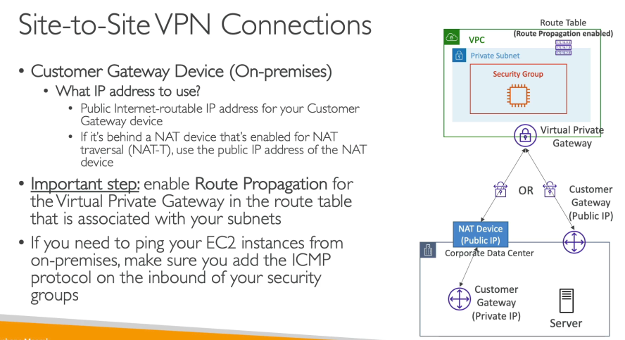

- **Kết nối qua Public Internet:** Kết nối site-to-site VPN sẽ được thiết lập qua internet công cộng nhưng vẫn được mã hóa.
- **Các địa chỉ IP sử dụng cho CGW:**
    - Nếu CGW có IP công cộng, sử dụng địa chỉ IP công cộng.
    - Nếu CGW có IP riêng, có thể sử dụng địa chỉ IP của NAT device có hỗ trợ NAT-T.

#### Cấu hình liên kết VPN
- Đảm bảo **route propagation** được kích hoạt trong VPC và các subnets để kết nối hoạt động.
- Để **ping EC2 instances** từ on-premises, cần đảm bảo ICMP được bật trong inbound security group.

### AWS VPN CloudHub
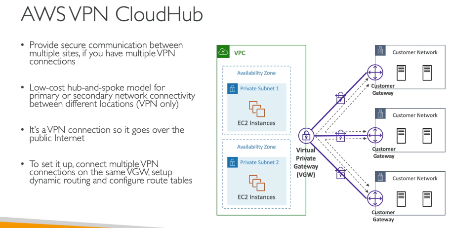

- **AWS VPN CloudHub:** Giải pháp cho phép kết nối nhiều trung tâm dữ liệu (CGWs) với nhau qua một VGW duy nhất trong VPC.
- **Mô hình hub-and-spoke:** Dùng VPN để kết nối các mạng khách hàng với nhau, qua public internet nhưng được mã hóa.
- **Cấu hình:** Tạo nhiều kết nối VPN site-to-site qua cùng một VGW, bật dynamic routing và cấu hình route tables.

### Các câu hỏi có thể xuất hiện trong bài thi
- Kết nối VPN sẽ không hoạt động cho đến khi **route propagation** được bật trong VPC.
- Để ping từ on-premises đến EC2, cần phải mở **ICMP** trong security group.

--- 

# 343. Direct Connect 

**Direct Connect (DX)**: Cung cấp 1 dedicated private connection từ remote network vào VPC, không đi qua internet công cộng.
- **Use case**:
    - **Tăng băng thông** và **giảm chi phí** khi làm việc với bộ dữ liệu lớn.
    - **Trải nghiệm mạng ổn định** nhờ kết nối riêng, không đi qua internet công cộng.
    - **Hỗ trợ môi trường hybrid**: Kết nối giữa trung tâm dữ liệu on-premise và đám mây AWS.
    - Hỗ trợ cả **IPv4** và **IPv6**.
### **Diagram**:
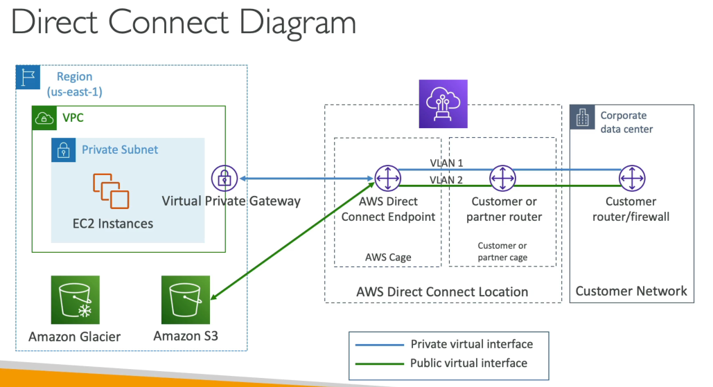 

- **AWS Direct Connect Location**: Vị trí vật lý nơi thiết lập kết nối Direct Connect.
- **Virtual Private Gateway (VGW)**: Gateway riêng của VPC để kết nối với mạng on-premise.
- **Public VIF (Virtual Interface)**: Kết nối đến các dịch vụ công cộng AWS như Amazon S3, Amazon Glacier.
- **Private VIF**: Kết nối đến các tài nguyên riêng trong VPC, ví dụ như EC2 Instances.
 
#### Direct Connect Gateway
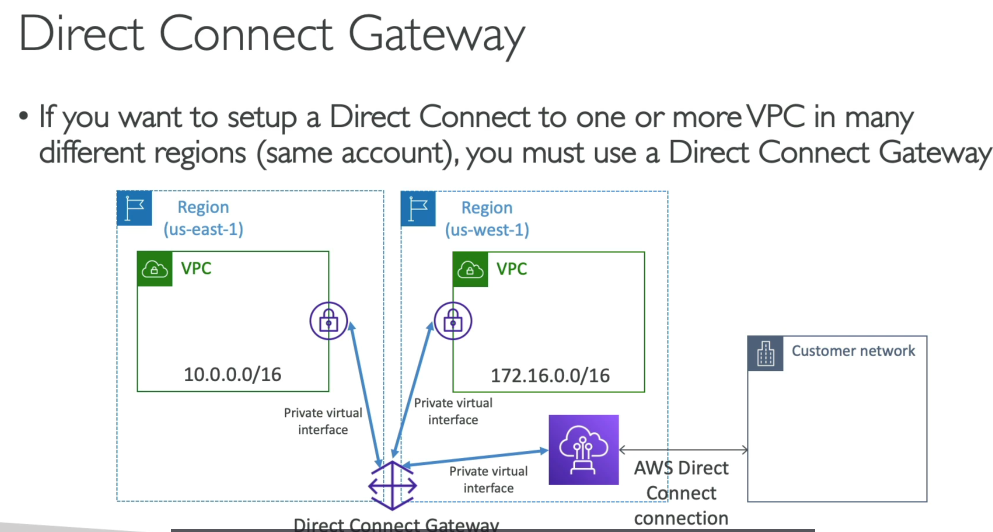 
- Setup khi cần 1 DC connect 1 hoặc nhiều VPC khác region, cùng account 
- **Quy trình kết nối**:
    - **Kết nối tới AWS**: Sử dụng Direct Connect để kết nối với các VPC trong các khu vực khác nhau thông qua **Direct Connect Gateway**.
    - **Tạo kết nối**: Sử dụng **private VIF** để kết nối tới các VPC trong khu vực.

### **Connection Type**:
- Cả hai loại kết nối đều có thể thay đổi dung lượng (chẳng hạn như tăng từ 1 Gbps lên 10 Gbps) trong các khu vực hỗ trợ.
- Dễ dàng thêm hoặc bớt dung lượng kết nối tùy theo nhu cầu thực tế của doanh nghiệp.
- Cả hai loại kết nối đều có thời gian thiết lập lâu, thường từ một tháng trở lên. Điều này cần được cân nhắc khi có yêu cầu khẩn cấp về việc truyền tải dữ liệu nhanh chóng.

#### **Dedicated Connection**:
- Tốc độ có thể là 1 Gbps, 10 Gbps hoặc 100 Gbps.
- Cung cấp cổng Ethernet vật lý dành riêng cho khách hàng. 
- Cần yêu cầu AWS và thiết lập qua **AWS Direct Connect Partner**.
- Kết nối này phù hợp với các doanh nghiệp cần băng thông lớn và ổn định.

#### **Hosted Connection**:
- Cung cấp nhiều lựa chọn tốc độ: từ 15 Mbps, 500 Mbps, lên đến 10 Gbps.
- Cũng phải yêu cầu thông qua **AWS Direct Connect Partners**.
- Linh hoạt hơn Dedicated Connection vì có thể thay đổi dung lượng khi cần thiết (ví dụ: thêm hoặc giảm dung lượng kết nối theo nhu cầu).
- Phù hợp với các doanh nghiệp muốn kết nối nhanh chóng và linh hoạt hơn.

## **Mã hóa**:
- **Direct Connect không cung cấp mã hóa in-transit**.
- **VPN** có thể được sử dụng kết hợp với Direct Connect để mã hóa dữ liệu (IPsec encryption).

### **Resiliency**:
- **High Resiliency**: Sử dụng nhiều kết nối Direct Connect tại các vị trí khác nhau để có khả năng dự phòng.
- **Maximum Resiliency**: Sử dụng hai vị trí Direct Connect, mỗi vị trí có hai kết nối độc lập để đạt mức độ phục hồi tối đa.

### Backup:
- In case DX fail:
  - Set up secondary DX connection => more expensive
  - Using a Site-to-site VPN connection => ok, vì public internet sẽ ít mất mạng hơn 

# 345. Transit Gateway
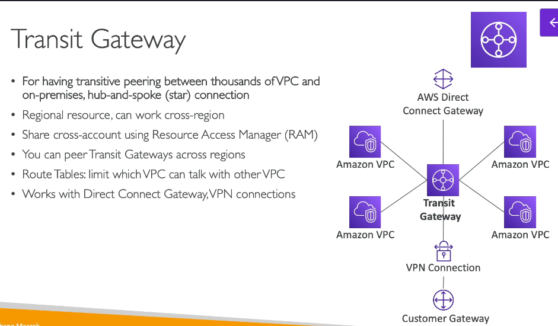

- Transit Gateway giúp kết nối các VPC một cách dễ dàng mà không cần phải peering từng VPC với nhau.
- Transit Gateway cho phép kết nối trực tiếp Direct Connect Gateway, site-to-site VPN, và các kết nối khác vào Transit Gateway.
- Tất cả các VPC có thể giao tiếp với nhau thông qua Transit Gateway.

- Transit Gateway là regional resource, nhưng có thể hoạt động cross-region.
- Share cross-account sử dụng Resource Access Manager.

- Route tables cho Transit Gateway để kiểm soát những VPC có thể giao tiếp với nhau.
    - Bạn có toàn quyền kiểm soát việc định tuyến lưu lượng trong Transit Gateway, giúp bảo mật mạng tốt hơn.

### Các trường hợp sử dụng Transit Gateway
#### Hỗ trợ IP Multicast
- Transit Gateway là dịch vụ duy nhất trong AWS hỗ trợ IP multicast, nếu bạn gặp câu hỏi về IP multicast trong kỳ thi, Transit Gateway là dịch vụ bạn cần sử dụng.

#### Tăng băng thông kết nối VPN site-to-site bằng ECMP
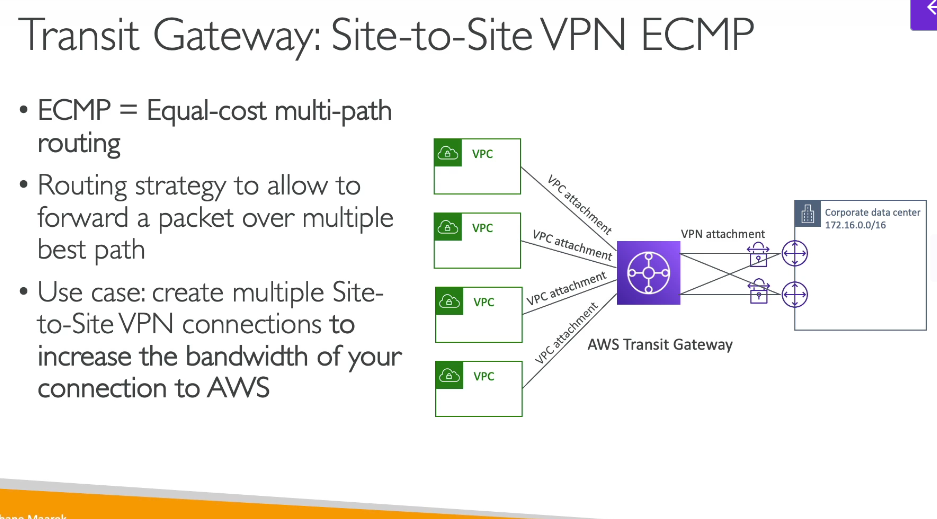
- **ECMP** (Equal-Cost Multi-Path Routing) là chiến lược định tuyến cho phép chuyển tiếp gói tin qua nhiều đường đi tối ưu.
- Bạn có thể sử dụng nhiều kết nối VPN site-to-site để tăng băng thông kết nối với AWS thông qua **Transit Gateway**.

### Chia sẻ kết nối Direct Connect giữa các tài khoản
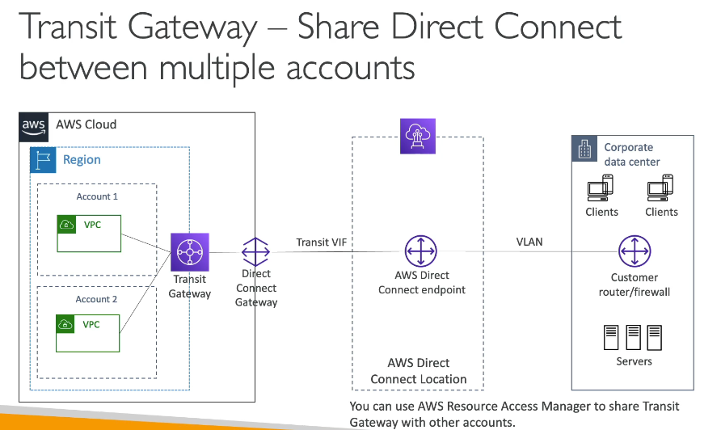 
- Bạn có thể chia sẻ kết nối Direct Connect giữa nhiều tài khoản và VPC thông qua Transit Gateway.
- Các kết nối này giúp tiết kiệm chi phí và cải thiện khả năng mở rộng, đặc biệt khi có nhiều tài khoản hoặc VPC cần sử dụng kết nối Direct Connect chung.

# 346.VPC Traffic Mirroring 
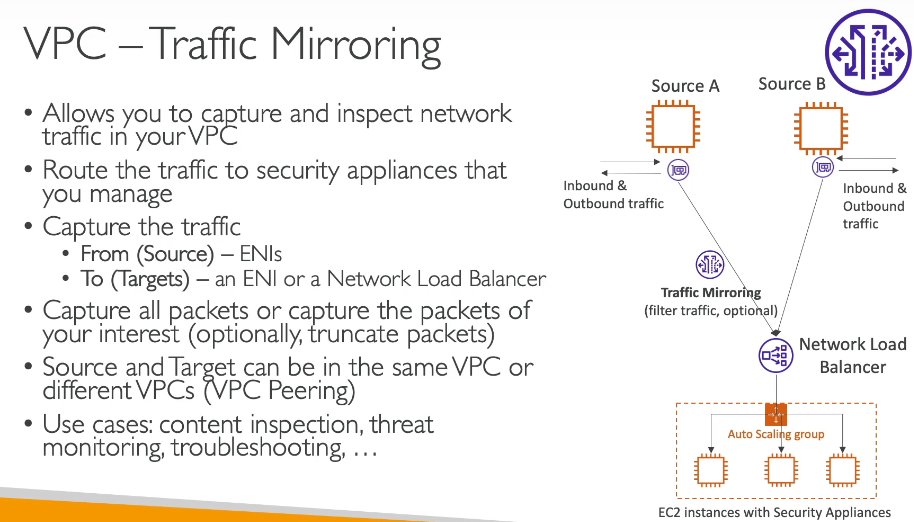

# 347. IPv6 for VPC 
IPv4 không thể disable cho VPC & subnets
- Khi không thể launch new instance => hết IPv4 => Tạo new IPv4 CIDR trong subnet 

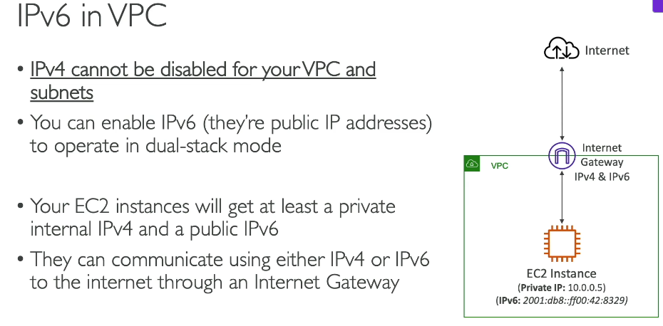

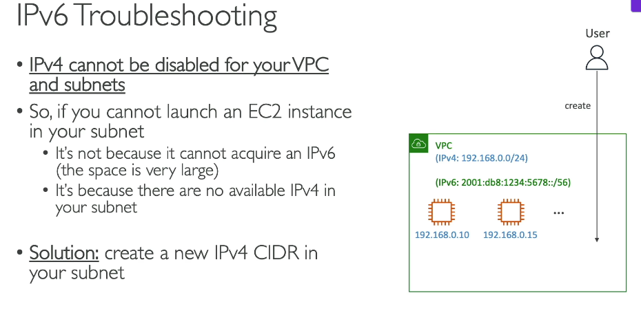

# 349. Egress only Internet Gateway 
- Sử dụng cho IPv6 only (simply NAT but for IPv6) 
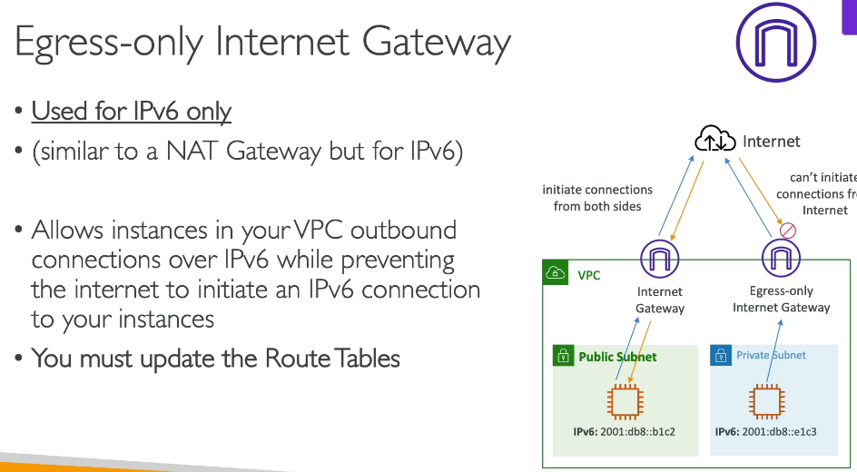 

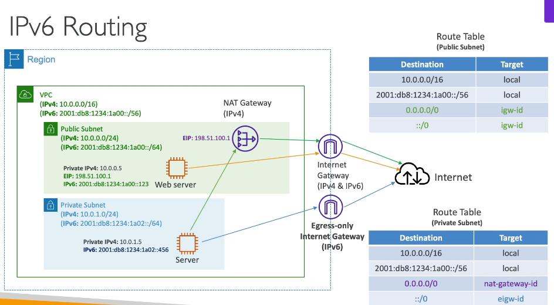 

